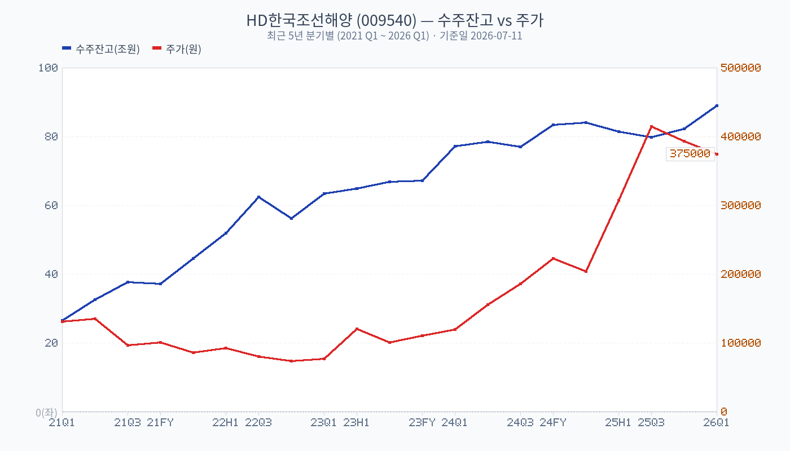
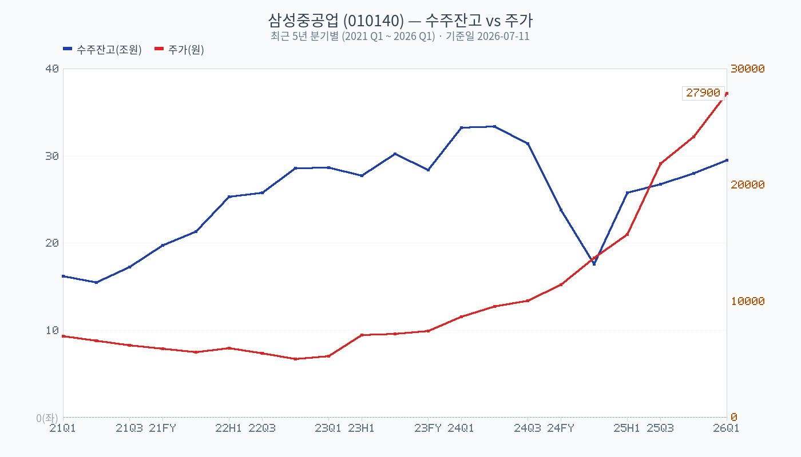
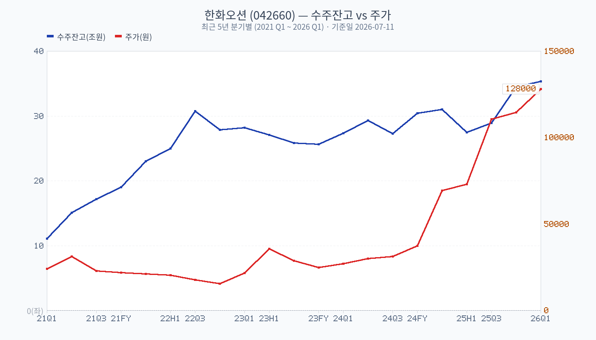
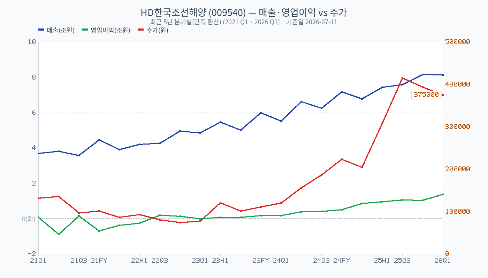
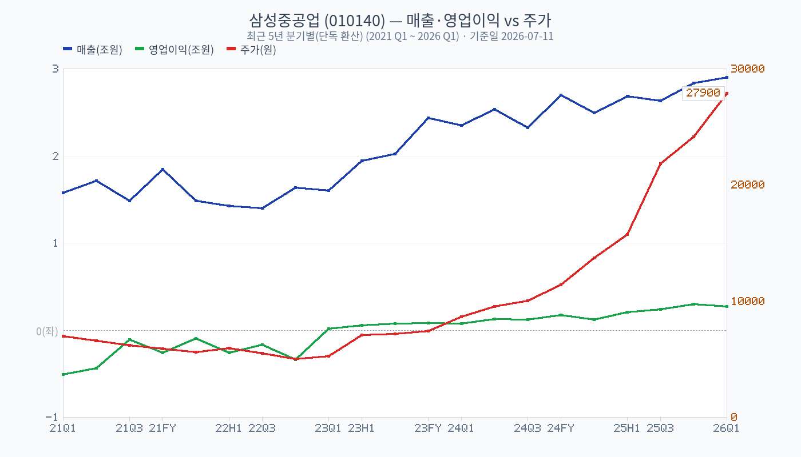
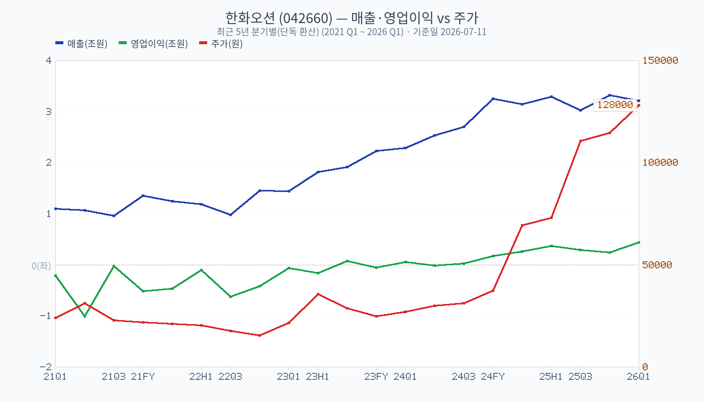

# 조선 3사 | 수주잔고 2.6~3년치, 주가는 이미 3~4배 뛰었는데 아직 자리가 남았을까 | 2026-07-11

지난 5년간 HD한국조선해양·삼성중공업·한화오션 주가는 각각 **+198%, +349%, +342%** 올랐습니다.

이미 많이 오른 주식을 지금 들여다보는 게 맞는지 궁금해서, DART 공시 원문을 직접 뜯어 세 회사의 수주잔고·가동률·영업이익률을 최근 5년 분기별로 전부 모아봤습니다. 그리고 그 숫자들을 같은 기간 주가와 나란히 놓고 봤습니다.

결론부터 말하면, [red: 이번 사이클은 단순한 주가 랠리가 아니라 실제 수주잔고·가동률·마진이 함께 올라온 드문 구간입니다.] 다만 회사마다 속도와 리스크가 다르고, 공시상 확인이 안 되는 부분(수주처 실명, 한화오션 방산 마진 등)도 분명히 있습니다.

---

## 1. 수주잔고부터 보자 — 3사 모두 2026년 1분기에도 계속 쌓였다

세 회사의 최신 사업보고서·분기보고서(2025년 12월 결산 + 2026년 1분기)를 기준으로 한 공식 수주잔고입니다.

| 회사 | 2025.12월말 | 2026.03월말(최신) | 매출 대비 커버리지 |
| --- | ---: | ---: | --- |
| HD한국조선해양(009540) | 82.24조원 | **89.09조원** | 약 2.98년치 |
| 삼성중공업(010140) | 28.03조원(누계표) | **29.52조원** | 약 2.77년치 |
| 한화오션(042660) | 34.50조원(전년比 +13.3%) | **35.37조원** | 약 2.77년치 |

세 회사 모두 1분기 만에 잔고가 더 늘었습니다. HD한국조선해양은 조선 부문에서만 3개월간 신규계약 12.2조원을 새로 쌓으면서 잔고가 +8.3% 증가했습니다.

아래 6개 차트는 각 회사의 수주잔고(파란선, 좌축)와 주가(빨간선, 우축)를 최근 5년 분기별로 겹쳐본 것입니다.

[brown: 세 차트 모두 수주잔고가 먼저 반등하고 주가가 뒤따라 오르는 패턴이 뚜렷합니다. 특히 2023~2024년 구간에서 수주잔고가 먼저 꺾여 올라간 뒤, 주가는 2024년 하반기부터 본격적으로 반응했습니다.] 다만 삼성중공업 차트에서 2024년 말~2025년 초 구간에 수주잔고가 한 번 크게 꺾이는 지점이 보이는데, 이는 실적 악화가 아니라 이 회사가 수주잔고를 **누계(inception-to-date) 방식**으로 공시하면서 집계 기준을 보고서마다 재설정하는 것으로 보이는 공시상 특성입니다. 기초-신규-매출인식-기말 형태의 표준 증감표를 쓰는 HD한국조선해양·한화오션과는 표 구조 자체가 다릅니다.

---

## 2. 매출·영업이익도 같이 돌아섰다 — 적자에서 두 자릿수 마진으로

수주잔고가 쌓이는 것과 별개로, 실제로 배를 지어서 돈을 버는 마진이 개선되고 있는지가 더 중요합니다. 아래는 분기별 매출·영업이익(단독 환산)과 주가를 겹친 차트입니다.

2021~2022년에는 세 회사 모두 영업손실(녹색선이 0 아래) 구간이 길게 이어졌습니다. 후판 가격 급등, 저가 수주 물량 소화, 인건비 상승이 겹친 시기였습니다. 그 구간을 지나 2023년 하반기부터 순차적으로 흑자 전환했고, 2025년 연간 기준 영업이익률은 이렇게 나옵니다.

| 회사 | 2025년 연결 영업이익률 | 2024년 | 핵심 부문 마진 |
| --- | ---: | ---: | --- |
| HD한국조선해양 | **13.04%** | 5.62% | 조선 13.24%, 엔진 26.81% |
| 삼성중공업 | **8.10%** | 5.08% | 조선해양 7.56% |
| 한화오션 | **9.13%** | 2.21% | 상선 10.97% |

[red: 세 회사 모두 1년 만에 영업이익률이 1.5~4배 뛰었습니다.] 특히 한화오션은 2021~2023년 3년 연속 적자였다가 2024년 흑자 전환 이후 2025년 9%대까지 개선됐습니다.

---

## 3. 가동률이 100%를 넘는다는 게 무슨 뜻일까

DART 사업보고서에는 부문별 가동률 표가 있는데, HD한국조선해양 조선(상선) 106.0%·엔진기계 111.5%, 삼성중공업 조선 111% 등 100%를 넘는 숫자가 나옵니다.

[brown: 이건 설비의 물리적 한계를 초과해서 돌렸다는 뜻이 아니라, 연초에 세운 "정상조업도" 계획 대비 실제로 더 많이 건조했다는 뜻입니다.] 삼성중공업 사업보고서는 아예 표 제목을 "가동률(실적/목표)"라고 명시하고 있습니다. 잔업·특근 확대, 3교대 확대, 건조 사이클 단축으로 계획을 초과 달성한 결과입니다.

반대로 HD한국조선해양의 해양플랜트 부문은 49.3%로 조선·엔진 대비 크게 낮습니다. 같은 회사 안에서도 조선업 슈퍼사이클과 무관한 사업부는 여전히 부진하다는 뜻입니다.

---

## 4. 수주처는 누구인가 — DART가 말해주지 않는 부분

셋 다 "얼마나" 수주했는지는 상세히 공시하지만, "누구한테서" 수주했는지는 대부분 공개하지 않습니다. 최근 12개월치 `단일판매·공급계약체결` 공시 132건을 전부 열어봤는데, 실제 선주사명이 나오는 경우는 드물고 대부분 "아시아 소재 선사", "오세아니아 지역 선주"처럼 지역명으로만 익명 처리돼 있었습니다.

[blue: 즉 "이 회사가 최근 어떤 대형 해운사로부터 수주했다"는 식의 스토리는 DART만으로는 검증하기 어렵습니다.] 예외적으로 실명이 확인된 경우는 있었습니다 — HD한국조선해양 계열은 한국중부발전·한국서부발전(화력발전소 저탄장 공사, 조선이 아닌 건설 수주), HMM·KSS해운 등 국내 해운사, 필리핀 국방부·방위사업청(함정). 한화오션은 인도네시아 국방부(잠수함), HMM·양밍해운(컨테이너선), 극지연구소(쇄빙연구선) 등입니다. 삼성중공업은 10% 이상 매출 고객이 "고객1~고객4"로 전부 익명 처리돼 있어 실명이 사실상 확인되지 않습니다.

---

## 5. 그래서 지금 봐도 되는 자리인가

세 가지를 같이 보고 내린 판단입니다.

[red: 수주잔고·가동률·마진이 동시에 개선되고 있다는 점에서 이번 사이클은 숫자로 뒷받침되는 상승입니다.] 2028~2029년 인도 예정 물량이 최근 1년 신규 계약의 절반 이상을 차지하고 있어, 최소 2~3년치 매출은 이미 확보된 상태입니다.

[blue: 다만 세 회사 다 이미 5년 전 대비 3~4배 오른 뒤라는 점, 그리고 신조선가·환율이라는 두 변수가 지금 수준에서 꺾이면 밸류에이션 눌림이 올 수 있다는 점은 리스크로 남습니다.] 한화오션의 경우 "해양 및 특수선" 부문 안에 방산(특수선) 마진이 숨어 있어 공시만으로는 분리해서 볼 수 없다는 점도 감안해야 합니다.

[brown: 개인적으로는 신규 진입보다 실적 발표 때마다 수주잔고 증감·가동률·부문별 마진을 분기 단위로 계속 확인하면서 대응하는 쪽이 맞다고 봅니다.] 이 글은 매수·매도를 권하는 글이 아니라, 공시 원문을 기준으로 세 회사를 같은 잣대로 비교해본 자료입니다.

---

## 출처

- [HD한국조선해양 사업보고서(2025.12)](https://dart.fss.or.kr/dsaf001/main.do?rcpNo=20260320001032) — DART, 2026-03-20 제출
- [HD한국조선해양 분기보고서(2026.03)](https://dart.fss.or.kr/dsaf001/main.do?rcpNo=20260515001799) — DART, 2026-05-15 제출
- [삼성중공업 사업보고서(2025.12)](https://dart.fss.or.kr/dsaf001/main.do?rcpNo=20260312001037) — DART, 2026-03-12 제출
- [삼성중공업 분기보고서(2026.03)](https://dart.fss.or.kr/dsaf001/main.do?rcpNo=20260515002303) — DART, 2026-05-15 제출
- [한화오션 [기재정정]사업보고서(2025.12)](https://dart.fss.or.kr/dsaf001/main.do?rcpNo=20260317000644) — DART, 2026-03-17 제출
- [한화오션 분기보고서(2026.03)](https://dart.fss.or.kr/dsaf001/main.do?rcpNo=20260513000552) — DART, 2026-05-13 제출
- OpenDART `list.json`(pblntf_ty=I) 최근 12개월 `단일판매ㆍ공급계약체결` 공시 132건 전수 조회
- OpenDART `fnlttSinglAcntAll.json` 분기별 재무제표(2021~2026년 21개 보고서 기준)
- Yahoo Finance 주가 데이터(2020-07 ~ 2026-07, 주간 종가)
- 상세 회사별 수치·Source Map: `analysis-example/kr-sector/shipbuilding/조선3사-수주현황-DART분석.md`

※ 기준일: 2026-07-11 (수주잔고는 2026-07-11 1차 갱신분, 2026.03월말 분기보고서 반영)

※ 본 글은 정보 제공 목적이며 특정 종목의 매수·매도를 권유하지 않습니다. 실제 투자 판단에는 최신 가격, 실적 공시, 정책 변화, 개별 기업 실적을 별도로 확인해야 합니다.
