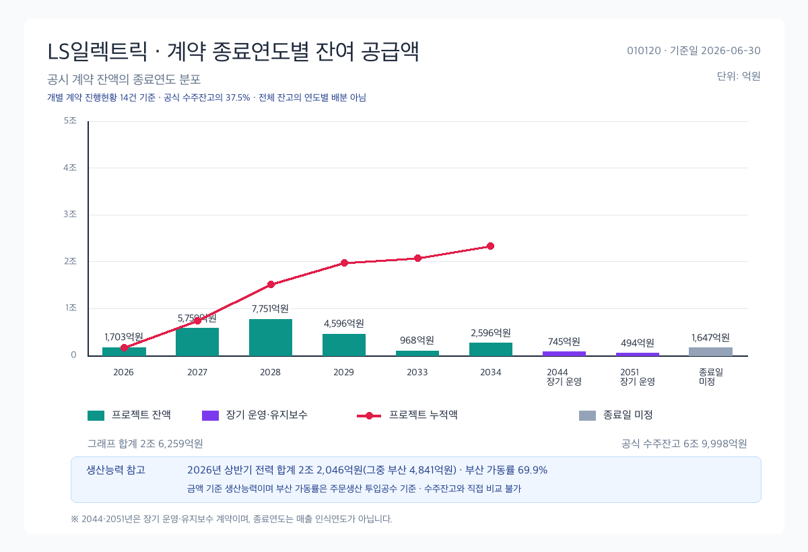
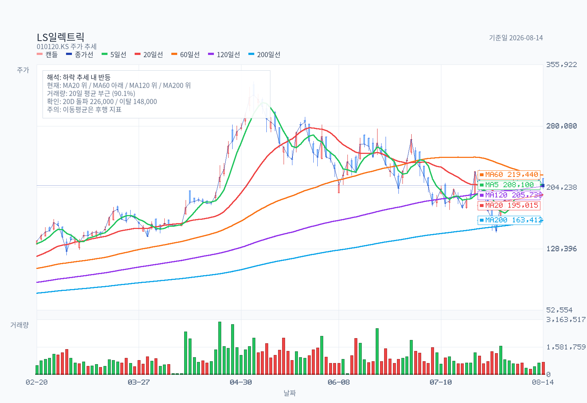
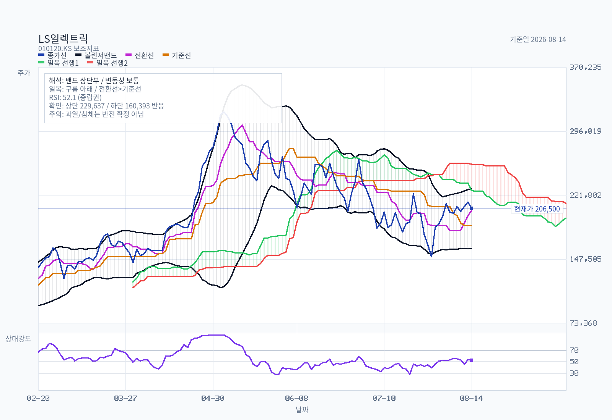
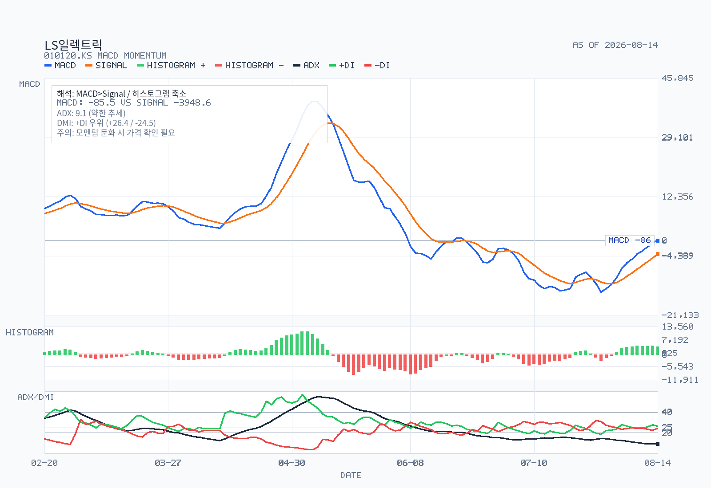
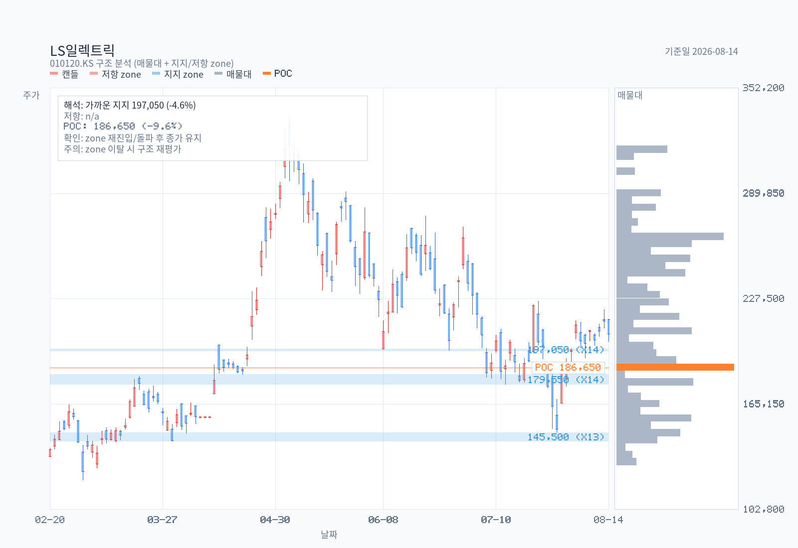

# LS일렉트릭 (010120) 결정 메모

- 기준일: 2026-08-16
- 최근 업데이트일: 2026-08-16
- 시세 기준일: 2026-08-14 종가
- 재무 기준일: 2026-06-30 (반기보고서, 접수일 2026-08-14, 접수번호 20260814003088)
- 출력 모드: full memo
- 대상 증권: LS일렉트릭 보통주 (KOSPI 010120), 우선주 없음, 사업회사

## Decision Frame

1. **핵심 질문은 "실적이 꺾였나"가 아니라 "얼마나 앞당겨 반영했나"다.** 2Q26은 매출 1조 5,770억(+32.2%), 영업이익 1,785억(+64.4%), OPM 11.32%로 분기 최고였다. 주가는 5월 7일 고점(장중 335,000원) 대비 38% 낮은 206,500원이다. 실적과 주가가 반대로 움직였다는 사실 자체가 이 메모의 출발점이다.
2. **이번 조정은 이익 훼손이 아니라 배수 되돌림이다.** PBR은 2023년말 1.25배에서 2026-08-14 14.85배까지 갔다. 고점(318,500원) 기준 PBR은 22배 수준이었다. 이익이 아니라 배수가 먼저 빠졌다.
3. **가장 큰 미검증 변수는 백로그의 손익 전환 시점이다.** 북미 3대 계약 9,491억원의 누적 공급 인식액은 2.37억원, 진행률 0.025%다. 즉 상반기의 +32.7% 성장은 이 계약들이 **반영되기 전** 숫자다. 상방도 여기 있고, 리스크도 여기 있다.
4. **회사가 증설에 돈을 쓰지 않고 있다 — 적어도 공시상으로는.** 수주잔고는 +39.6% 늘었는데 1H26 유형자산 취득은 864억으로 전년 동기 대비 -16.5%다. LS증권 리포트는 2028년·2030년 2단계 증설 계획을 서술하지만 **반기보고서에는 금액·시점이 없다.** 계획이 공시로 확인되기 전까지 캐파는 성장률의 상한이다.
5. **셀사이드는 12개월간 단 한 번도 목표주가를 낮추지 않았다.** 57개 리포트, 13개사, 중립·매도 0건, 하향 0건. 그리고 2026-07 상향분은 이익이 아니라 **적용 배수 상향**(IBK 48.5→68.2배, SK 50→60배)으로 만들어졌다. 만장일치 강세는 정보가 아니라 포지셔닝 신호로 읽어야 한다.
6. **지금 시점의 판단**: 사업은 확인됐고 가격은 확인되지 않았다. 아래 `Structured Stance` 참조.

## Summary

LS일렉트릭은 2026년 상반기에 매출 2조 9,536억(+32.7%), 영업이익 3,051억(+55.7%), OPM 10.33%를 기록했고, 성장의 94.6%가 전력부문 단독에서 나왔으며 매출 증가액의 51.1%가 북미에서 나왔다. 별도 수주잔고는 6조 9,998억으로 연초 대비 +39.6%, Book-to-Bill 2.34배다. 사업의 방향성은 공시로 확인된다. 문제는 가격이다. 시가총액 30조 9,750억은 TTM PER 91.86배, 2026E PER 57.0배, PBR 14.85배이며, 동종 HD현대일렉트릭(TTM 36.80배)의 2.5배다. 고점 대비 38% 하락했음에도 여전히 2029년 전후의 이익을 정상 배수로 미리 반영한 수준(본 메모 계산, 가정은 `Current Valuation Snapshot` 참조)으로 읽힌다. 가장 강세인 LS증권조차 자사 목표주가 350,000원이 2028년 예상이익 기준 PER 67배, 글로벌 피어 대비 83% 할증임을 리포트에 명시했다 — **밸류에이션이 부담이라는 사실 자체에는 셀사이드도 이견이 없다.** 기준일 2026-08-16 현재 스탠스는 **관찰 유지 — 지금은 추격하지 않음**이다.

## Business and Thesis

LS일렉트릭(엘에스일렉트릭주식회사, 1974년 7월 24일 설립)은 전력기기·전력시스템을 만드는 사업회사다. 최대주주는 ㈜LS로 지분 48.46%를 보유한다.

공시상 보고부문은 **전력 / 자동화 / 금속 / IT** 4개다. 시장에서 흔히 쓰는 "전력기기 vs 전력인프라" 구분은 **보고부문 단위로 분리 공시되지 않는다**(전력부문 1개로 통합). 판매처 표에서만 `전력-수배전` / `전력-인프라`로 간접 노출된다.

핵심 논리는 세 겹이다.

- **1겹 (확인됨)**: 북미 전력망 노후 교체 + AI 데이터센터 전력 수요로 전력기기 수요가 구조적으로 늘고 있다. 공시 원문: "북미 시장에서는 노후 전력망 교체 및 Grid Modernization을 위한 Utility 투자 확대가 지속되고 있으며, AI 인프라 및 데이터센터 중심의 대규모 전력 인프라 투자가 증가하고 있습니다."
- **2겹 (부분 확인)**: 회사가 이 수요를 실제로 수주로 전환하고 있다. 별도 수주잔고 6조 9,998억(+39.6%), LS파워솔루션(변압기) 잔고 5,775억(+161.7%)이 근거다. 2025년 데이터센터 관련 매출 약 5,468억원이 공시에 직접 명시돼 있다(2025년 연결매출의 11.0%).
- **3겹 (미확인)**: 이 수주가 지금의 밸류에이션을 정당화할 만한 이익률과 속도로 손익에 꽂힌다. 이 부분이 아직 증명되지 않았고, 이 메모의 유보 근거다.

회사는 데이터센터를 "중점 성장사업"으로 명시하고, "전력설비 공급 중심의 사업에서 나아가 전력·냉각·운영을 통합한 데이터센터 솔루션 사업으로 확장"하겠다고 밝혔다. 이는 공시 문구이지 실적이 아니다.

## Revenue Mix

### 부문별 (1H26, 연결조정 전, 단위: 백만원)

| 보고부문 | 1H26 매출 | 1H25 매출 | YoY | 1H26 영업이익 | OPM |
|---|---:|---:|---:|---:|---:|
| 전력 | 3,273,963 | 2,316,244 | **+41.3%** | 283,290 | 8.65% |
| 자동화 | 283,183 | 289,595 | **-2.2%** | 8,160 | 2.88% |
| 금속 | 362,876 | 321,763 | +12.8% | 11,531 | 3.18% |
| IT | 81,320 | 61,631 | +31.9% | 3,892 | 4.79% |
| 부문 합계 | 4,001,342 | 2,989,233 | +33.9% | 306,873 | 7.67% |
| 연결조정 | (1,047,792) | (764,107) | - | (1,786) | - |
| **연결 합계** | **2,953,550** | **2,225,126** | **+32.7%** | **305,087** | **10.33%** |

- 매출 증가액 1,012,109백만원 중 **957,719백만원(94.6%)이 전력부문**이다. 성장은 사실상 단일 부문 이벤트다.
- **자동화는 3년째 사실상 정체·역성장**이다(2024년 590,160 → 2025년 579,190 → 1H26 연율 566,366). 공시가 밝힌 사유: "글로벌 전기차 수요 둔화(캐즘) 장기화에 따라 완성차 및 이차전지 관련 전방산업의 신규 공장 증설(CAPEX)이 지연 또는 축소".
- 부문 매출은 내부거래 제거 전이며 연결조정이 부문합계의 26.2%로 크다. 부문 비중을 연결 매출 대비로 직접 읽으면 안 된다.

### 지역별 (1H26, 연결조정 전, 단위: 백만원)

| 지역 | 1H26 | 비중 | 1H25 | 비중 | YoY |
|---|---:|---:|---:|---:|---:|
| 한국 | 1,571,372 | 39.3% | 1,246,046 | 41.7% | +26.1% |
| **북미** | **1,434,424** | **35.9%** | 917,245 | 30.7% | **+56.4%** |
| 기타아시아 | 572,096 | 14.3% | 458,293 | 15.3% | +24.8% |
| 유럽 | 228,802 | 5.7% | 179,578 | 6.0% | +27.4% |
| 중국 | 146,836 | 3.7% | 126,122 | 4.2% | +16.4% |
| 기타 | 47,812 | 1.2% | 61,949 | 2.1% | -22.8% |

- 매출 증가액의 **51.1%가 북미**다. 북미 비중 30.7% → 35.9%(+5.2%p).
- 판매법인으로도 확인된다: LS ELECTRIC America 1H26 매출 660,247백만원(2025년 연간 830,814, 2024년 504,111). 반기 만에 전년 연간의 79.5%.
- LS ELECTRIC 별도 수출 비중 49.3%(1,100,192 / 2,230,008). 2025년 44.6%, 2024년 42.3%에서 상승.

### 고객 집중도

전력-인프라 최대 매출처는 **LS ELECTRIC AMERICA INC. 41.7%**인데, 이는 **자사 미국 판매법인**이며 최종 고객이 아니다. 연결에서 제거되는 내부거래이므로 외부 고객 집중도로 읽으면 안 된다. 다만 북미 최종수요 노출도가 전력-인프라의 절반 가까이라는 신호로는 유효하다. 외부 고객으로는 LG에너지솔루션 8.5%, 삼성SDI 7.6%, 카페스(KAPES) 4.9%, 한국전력공사 2.7%다.

**미공시**: 전력기기 vs 전력인프라 분리 손익, 사업부문별 시장점유율(공정거래법상 정보공유 제한으로 기재 생략 — 공시 명시), 1H26 데이터센터 매출.

## What The Latest Results Say

반기보고서가 3개월 컬럼과 누적 컬럼을 모두 직접 공시해, 2분기 단독은 유도 계산 없이 원문 그대로다.

### 2Q26 단독 (직접 공시, 단위: 백만원)

| 항목 | 2Q26 | 2Q25 | YoY |
|---|---:|---:|---:|
| 매출 | 1,576,998 | 1,193,042 | +32.2% |
| 매출총이익 | 339,392 | 256,756 | +32.2% |
| 영업이익 | **178,520** | 108,598 | **+64.4%** |
| 영업이익률 | **11.32%** | 9.10% | +2.22%p |
| 분기순이익 | 115,838 | 67,258 | +72.2% |

### 반기 누적

| 항목 | 1H26 | 1H25 | YoY | 2025년 연간 |
|---|---:|---:|---:|---:|
| 매출 | 2,953,550 | 2,225,126 | +32.7% | 4,965,799 |
| 매출총이익률 | 21.40% | 21.68% | **-0.28%p** | - |
| 판관비 | 326,866 | 286,552 | +14.1% | - |
| 영업이익 | 305,087 | 195,907 | +55.7% | 426,407 |
| 영업이익률 | 10.33% | 8.80% | +1.53%p | 8.59% |
| 지배주주순이익 | 239,063 | - | - | 286,623 |

**마진 개선의 정체 — 이 메모에서 가장 중요한 한 줄**: 매출총이익률은 오히려 **0.28%p 하락**했다. OPM이 1.53%p 개선된 것은 판관비 증가율(+14.1%)이 매출 증가율(+32.7%)을 크게 밑돌아 **판관비율이 12.88% → 11.07%로 떨어진 영업 레버리지** 때문이다. 즉 지금의 마진 개선은 "고부가 초고압 변압기 믹스 개선"이 아니라 **고정비 희석**이다. 믹스 개선이 진짜라면 매출총이익률이 먼저 올라야 하는데 아직 그 신호는 없다. (비율은 본 메모 계산)

### 진도율과 컨센서스 정합성

1H26 영업이익 3,051억은 이미 2025년 연간(4,264억)의 **71.5%**다. 컨센서스 2026E 영업이익 7,165억을 기준으로 역산하면 2H26에 요구되는 실적은 다음과 같다(본 메모 계산).

| 항목 | 1H26 실적 | 2H26 컨센 역산 | 2H25 실적 | 2H26 YoY |
|---|---:|---:|---:|---:|
| 매출 | 29,536억 | 35,443억 | 27,407억 | +29.3% |
| 영업이익 | 3,051억 | 4,114억 | 2,305억 | **+78.5%** |
| OPM | 10.33% | **11.61%** | 8.41% | - |

컨센서스는 하반기에 OPM 11.61%를 추가로 요구한다. 2Q26 실적(11.32%)이 이미 그 근처이므로 불가능한 수준은 아니지만, **여유가 없다**. 2Q26은 컨센(매출 1조 4,974억 / 영업이익 1,607억)을 매출 +5.3%, 영업이익 +11.1% 상회했는데, 그럼에도 주가는 반응하지 않았다.

### 재무상태 — 성장의 청구서

| 항목 | 2026-06-30 | 2025-12-31 | 증감 |
|---|---:|---:|---:|
| 자산총계 | 5,985,475 | 4,956,680 | +20.8% |
| 매출채권 | 1,404,903 | 982,452 | **+43.0%** |
| 재고자산 | 735,001 | 552,890 | +32.9% |
| 현금및현금성자산 | 672,434 | 762,717 | **-11.8%** |
| 유동부채 | 2,881,580 | 1,864,660 | **+54.5%** |
| 부채총계 | 3,785,909 | 2,815,381 | +34.5% |
| 자본총계 | 2,199,566 | 2,141,299 | +2.7% |
| 부채비율(계산) | **172.1%** | 131.5% | +40.6%p |

매출채권 증가율(+43.0%)이 매출 증가율(+32.7%)을 상회하고 현금은 줄었다. 유동부채 +54.5%는 대형 수주에 따른 계약부채(선수금) 성격일 가능성이 높지만 — 2026-05-14 정정 공시가 "선급금 무→유"로 바뀐 점이 방증 — **반기보고서 요약재무정보 레벨에서 계약부채 단독 분해는 확인되지 않았다**. 선수금이면 성장 가시성의 근거이고, 매입채무·차입이면 운전자본 부담이다. 이 구분이 아직 안 된다는 점은 정직하게 남겨둔다.

참고 차입 구조: 단기차입금 572,320백만원(전기말 302,193), 유동성장기차입금 169,011백만원(전기말 267,188).

### Capex — 수주와 반대로 가는 지표

| 항목 | 1H26 | 1H25 | 증감 |
|---|---:|---:|---:|
| 유형자산의 취득 | 86,445 | 103,473 | **-16.5%** |
| 무형자산의 취득 | 4,770 | 3,616 | +31.9% |

수주잔고 +39.6% 국면에서 유형 capex가 -16.5%다. 부산사업장 제2생산동(약 1,008억원 투자, 초고압 변압기 대응)이 2025년 10월 준공되며 대형 투자 사이클이 일단락된 영향으로 보이지만, **향후 증설의 금액·시점·capacity는 공시되지 않았다**. 공시 문구는 "시장 수요 및 수주 상황에 따라 탄력적으로 추진할 계획"이라는 정성 서술에 그친다. 북미 현지 생산공장 신설 계획·투자규모도 본 반기보고서에서 확인되지 않는다.

### 수주 (기준일 2026-06-30)

LS ELECTRIC 별도 (단위: 억원)

| 부문 | 이월 잔액 | 당기 수주 | 기납품 | 수주잔고 |
|---|---:|---:|---:|---:|
| 전력 T&D | 48,902 | 34,293 | 14,299 | **68,896** |
| 철도 | 1,153 | 201 | 414 | 940 |
| 자동화 | 99 | 183 | 120 | 162 |
| **합계** | **50,154** | **34,677** | **14,833** | **69,998** |

- 잔고 약 **7.0조원**, 연초 대비 **+39.6%**. Book-to-Bill **2.34배**(본 메모 계산).
- 잔고의 **98.4%가 전력 T&D 단일 항목**. 자동화 잔고 162억은 사실상 무의미하다.
- 별도 잔고 ÷ 별도 1H26 매출 연율화(44,600억) = 약 **1.57년** 커버리지(본 메모 계산, 공시 KPI 아님).

주요 종속회사 (단위: 억원)

| 법인 | 품목 | 이월 | 당기수주 | 수주잔고 |
|---|---|---:|---:|---:|
| LS이모빌리티솔루션 | EV Relay 외 | 11,500 | 1,440 | 12,179 |
| **LS파워솔루션** | **변압기 외** | 2,207 | **4,288** | **5,775 (+161.7%)** |
| LS ELECTRIC Vietnam | 배전반 외 | 448 | 1,144 | 962 |
| LS메탈 | STS관 | 368 | 679 | 666 |
| LS Energy Solutions | ESS 외 | 112 | 112 | 178 |

LS파워솔루션(2024년 9월 지분 51% 인수)이 초고압 변압기 사이클을 가장 직접적으로 보여준다. 반면 LS이모빌리티솔루션 잔고 1조 2,179억은 규모는 크나 공시 주석이 "거래상대방(완성차업체)의 생산계획 및 시장 상황에 따라 조정될 수 있습니다"라고 명시한 **확정성이 낮은 잔고**다.

### 대형 계약의 진행률 — 아직 시작도 안 했다

단위: 백만원, 기준일 2026-06-30

| 계약 | 공시일 | 계약금액 | 누적 공급 | 진행률 |
|---|---|---:|---:|---:|
| 북미 신재생 PJT (초대형 IOU, 초고압변압기) | 2025.11.26 | 459,803 | 237 | **0.05%** |
| 북미 데이터센터용 연료전지 전력설비 | 2026.05.14 | 318,965 | 0 | **0.0%** |
| 북미 데이터센터 전력설비 공급 | 2026.04.13 | 170,289 | 0 | **0.0%** |
| 동해안-동서울 HVDC 변환설비 (KAPES) | 2024.12.02 | 561,000 | 0 | **0.0%** |
| 동해안~신가평 HVDC (KAPES) | 2018.01.17 | 212,580 | 51,962 | 24.4% |
| Widow Hill BESS (영국) | 2024.01.03 | 121,729 | 38,510 | 31.6% |
| 왕신 연료전지 발전설비 | 2022.11.21 | 164,730 | 0 | **NTP 미수령, 착공 미진행** |

**핵심**: 북미 3대 계약 합계 949,057백만원(약 9,491억) 중 누적 공급 인식은 237백만원, **0.025%**다. 상반기의 +32.7% 성장과 북미 +56.4%는 이 계약들이 **반영되기 전** 숫자다. 이건 양날이다 — 위로는 아직 반영 안 된 성장이 남아 있다는 뜻이고, 아래로는 **인식 시점이 통제 불가**라는 뜻이다. 실제로 왕신 연료전지(2022년 공시, 1,647억)는 4년 가까이 NTP 미수령으로 착공조차 못 했고, Widow Hill BESS는 계약기간이 2025-03-31 → 2025-12-31 → 2027-02-28로 두 차례 연장됐다.

## DART Recheck

| 주장 | 상태 | 확인값 또는 판단 | 출처 | 비고 |
|---|---|---|---|---|
| 상반기 성장은 북미 전력 인프라가 견인했다 | **confirmed** | 북미 917,245 → 1,434,424백만원(+56.4%), 매출 증가액의 51.1% | 반기보고서 주석 4. 영업부문 > 지역별 매출 | 내부거래 제거 전 |
| 마진 개선은 믹스가 아니라 영업 레버리지다 | **confirmed** | 매출총이익률 21.68%→21.40%(하락), 판관비율 12.88%→11.07% | 연결 포괄손익계산서 | 비율은 계산치 |
| 대형 북미 계약의 매출 인식은 아직 시작되지 않았다 | **confirmed** | 3건 949,057백만원 중 누적 공급 237백만원(0.025%) | XI. 단일판매·공급계약 진행 현황 | 동해안-동서울 HVDC 5,610억도 누적 0 |
| 수주잔고 급증으로 성장 가시성이 올라갔다 | **confirmed** | 별도 잔고 50,154 → 69,998억(+39.6%), B/B 2.34배 | II. 4. 수주 상황, 기준일 2026.06.30 | 연도별 인식 스케줄은 미공시 |
| 회사가 초고압 변압기 증설을 계속 확대하고 있다 | **contradicted (단기)** | 1H26 유형자산 취득 86,445백만원, 전년 동기 대비 -16.5% | 연결 현금흐름표 | 부산 제2생산동(1,008억)은 2025.10 준공 완료 |
| 자동화 부문도 함께 성장하고 있다 | **contradicted** | 자동화 289,595 → 283,183백만원(-2.2%) | 주석 4. 영업부문 | 공시가 EV 캐즘을 사유로 서술 |
| 미국 유타 공장 6배 증설 (블로그·언론 발) | **not separately disclosed** | 반기보고서 전문에 "유타"·"Utah" 언급 0건. 북미 현지공장 신설은 "현지 생산 및 공급 기반을 활용" 수준 서술만 | 반기보고서 전문 검색 | 언론 보도이며 공시 미확인 — 사실로 취급하지 않음 |
| 계열 의존도가 실적에 유의미하다 | **partially supported** | 매출 측 내부그룹 1.69%로 낮음. 그러나 매입 128,062 중 엘에스엠앤엠 100,674(78.6%) | 주석 31 / X. 대주주 등과의 거래내용 | 원자재 조달이 계열 단일 창구 집중 |
| 재무구조가 견조하다 | **partially supported** | 부채총계 +34.5%, 유동부채 +54.5%, 부채비율 131.5%→172.1% | III. 1. 요약연결재무제표 | 계약부채 분해 needs_review |

## Order Backlog and Revenue Visibility

- Order-driven company: **yes**
- 차트 기준: `official-contract-end-year`
- 판단: 전력 T&D가 별도 수주잔고의 98.4%이고, DART가 공식 수주잔고와 주요 계약별 금액·누적 공급·종료일을 함께 공시하므로 수주산업 라우팅 대상이다.



| 항목 | 값 | 해석 |
| --- | ---: | --- |
| 공식 별도 수주잔고 | 69,998억원 | 2026-06-30 기준, 연초 대비 +39.6% |
| 종료연도 확인 가능 개별 계약 잔액 | 24,611.28억원 | 주요 계약 13건, 계약총액에서 누적 공급액 차감 |
| 종료일 미정 | 1,647.30억원 | 왕신 연료전지, 착수통지 미수령 |
| 개별 계약 잔액 합계 | 26,258.58억원 | 공식 잔고의 37.5%만 프로젝트 종료연도까지 관찰 가능 |
| 최종 공시 연도 | 설비·프로젝트 2034년 / 장기 운영 2051년 | 2051년은 23년 운영·유지관리 용역 종료일 |
| 수주잔고 / 별도 매출 연율화 | 1.57배 | 비교용 파생 지표, 회사 공시 KPI 아님 |
| 생산능력 참고 | 전력 합계 22,046억원(그중 부산 4,841억원) | 2026년 상반기 금액 기준, 부산 가동률 69.9% |

개별 계약 진행표 기준으로 종료일이 2028년 이내인 계약 잔액은 누적 **1조 5,212.72억원**, 2029년 이내는 **1조 9,808.38억원**이다. 이는 계약 종료연도 분포이지 연도별 매출 인식 계획이 아니다. 공식 7.0조원 잔고와 개별 계약 잔액 합계의 차이 4조 3,739.42억원은 종료일이 공개되지 않은 일반 T&D 주문 등이므로 임의 배분하지 않았다.

수주잔고는 매출·마진·현금흐름을 보장하지 않는다. 계약 연장, NTP 지연, 환율, 현장 공정과 취소·조정에 따라 일정과 수익성이 달라질 수 있다. 상세 계산과 계약별 근거는 [`order-backlog-analysis.md`](order-backlog-analysis.md)를 참조한다.

그래프의 2051년은 전력기기 납기가 아니다. 영광 태양광 발전설비가 상업운전을 시작하는 2028년 3월부터 23년간 제공하는 운영·유지관리 용역의 계약 종료일이다. 생산능력은 최신 반기 공시 기준 전력 합계 2조 2,046억원이며, 그 안에 부산 4,841억원이 포함된다. 부산 가동률은 주문생산 투입공수 기준 69.9%다.

## Street / Alternative Views

### 셀사이드 컨센서스 (57개 리포트, 2025-09-18 ~ 2026-07-24, 13개사)

**목표주가 정규화 주의**: LS일렉트릭은 2026년 4월 **5:1 액면분할**(거래정지 2026-04-08~04-10, 변경상장 2026-04-13)을 단행했다. 아래 목표주가는 모두 **분할 후 기준**으로 환산했다(2026-04-13 이전 발간분은 원문 ÷ 5). 이 정규화를 하지 않으면 TP 궤적이 무의미해진다.

| Broker | 최신 리포트일 | Rating | TP (분할후) | vs 206,500 |
|---|---|---|---:|---:|
| LS증권 (성종화) | 2026-07-24 | BUY | 350,000 | +69% |
| 대신증권 (허민호) | 2026-07-24 | BUY | 330,000 | +60% |
| 교보증권 | 2026-07-24 | BUY | 320,000 | +55% |
| SK증권 (나민식) | 2026-07-24 | BUY | 310,000 | +50% |
| 유안타증권 (손현정·김고은) | 2026-07-24 | BUY | 300,000 | +45% |
| IBK투자증권 (김태현) | 2026-07-24 | BUY | 280,000 | +36% |
| 하나증권 | 2026-07-24 | BUY | 270,000 | +31% |
| iM증권 (이상헌·장호) | 2026-07-13 | BUY | 265,000 | +28% |
| 유진투자증권 (허준서) | 2026-04-22 | BUY | 200,000 | -3% (stale) |
| DS투자증권 | 2026-01-29 | BUY | 156,000 | -24% (stale) |
| 키움증권 | 2026-01-28 | BUY | 138,000 | -33% (stale) |
| 미래에셋증권 | 2026-07-24 | n/a | PDF 추출 실패 | - |
| 신한투자증권 | 2026-07-24 | n/a | PDF 부재 | - |

- **투자의견 BUY 11 / HOLD 0 / SELL 0.** 12개월 57건 중 **중립·매도 0건, 목표주가 하향 0건**.
- TP median 280,000원(+35.6%). 다만 하위 3개사는 2026-04 이전 미갱신 stale이며, **2026-07 이후 갱신분만 보면 median 300,000원(+45.3%), range 265,000~350,000**.
- 네이버 금융/FnGuide 집계 기준으로도 투자의견 4.00(매수), 목표주가 300,000원으로 일치한다.

**주가가 38% 빠지는 동안 목표주가는 오히려 올라갔고, 하향은 한 건도 없었다.** 유안타증권은 조정 한복판인 2026-06-11(주가 236,000원)에 TP를 260,000 → 300,000으로 **상향**했고, 2026-07-14(주가 184,500원)에도 300,000을 유지하며 "상승여력 63%"를 제시했다. 셀사이드는 이번 하락을 리스크 재평가가 아니라 매수 기회로 일관되게 규정했다.

### 셀사이드가 스스로 밝힌 상향의 정체 — 이 메모에서 두 번째로 중요한 부분

목표주가 상향이 **이익 추정 상향이 아니라 적용 배수 상향**에서 나왔다는 사실을 브로커들이 직접 공시했다.

| 근거 | 출처 | 라벨 |
|---|---|---|
| TP를 128,000 → 280,000원(+118.8%)으로 상향하며 **적용 PER을 48.5배 → 68.2배로 상향**했다고 명시 | IBK투자증권, 2026-07-24 | Street view — 배수 상향 자인 |
| 같은 날 적용 PER **50배 → 60배** 상향. 리포트 제목이 **"영업레버리지에 멀티플 확장까지"** | SK증권, 2026-07-24 | Street view — 본 메모의 마진 분석과 동일 진단 |
| 실적 전망치를 상향했음에도 **목표주가는 350,000원 유지**. 이것이 **2028E PER 67배 = 글로벌 피어 목표 PER 대비 83% 할증**임을 리포트에 직접 기재 | LS증권, 2026-07-24 | Street view — 유일한 밸류에이션 부담 자인 |
| 제목 "2Q26 Review: **Hyperscaler를 의심하지 말자**" | 미래에셋증권, 2026-07-24 | Street view — 조정의 본질이 실적이 아니라 빅테크 capex 지속성에 대한 의심임을 인정 |

**읽는 법**: 가장 강세인 LS증권조차 자기 목표주가가 2028년 예상이익 기준 PER 67배, 글로벌 피어 대비 83% 할증이라고 적어놨다. 본 메모가 독립적으로 계산한 "현재가가 2029년 전후 이익을 정상 배수로 반영"이라는 결론과 방향이 같다. **셀사이드와 이 메모의 차이는 사실 인식이 아니라 그 할증을 지불할 것인가에 대한 판단뿐이다.**

또한 SK증권 리포트 제목이 "영업레버리지에 멀티플 확장까지"라는 점은, 본 메모가 공시에서 확인한 "마진 개선은 믹스가 아니라 판관비 희석"과 정확히 같은 진단이다. 즉 **마진의 성격에 대해서는 셀사이드도 이견이 없다.**

### 셀사이드 실적 전망 (2026E, 브로커별)

| Broker | 2026E 매출 | 2026E 영업이익 | 비고 |
|---|---:|---:|---|
| 대신증권 | 6.78조 (+37%) | 7,900억 (+85%) | 가장 공격적 |
| SK증권 | 6.60조 (+33.2%) | 7,320억 (+71.8%) | |
| IBK투자증권 | - | - | 2H26 3조 6,810억 / 4,229억 |
| FnGuide 컨센서스 | 6.50조 | 7,165억 | 본 메모 밸류에이션 기준 |

IBK의 2H26 전망(매출 3조 6,810억 / 영업이익 4,229억)은 본 메모가 컨센서스에서 역산한 값(3조 5,443억 / 4,114억)과 근접한다. 하반기 눈높이 자체는 일관된다.

### 증설 계획 — 공시에는 없고 리포트에는 있다

LS증권(2026-07-24)은 **1차 증설로 2028년말까지 연간매출 3,000억원 중반대, 2차 증설로 2030년말까지 연간매출 7,000억원 이상** 규모의 캐파 확대를 서술하고, LS파워솔루션도 증설을 검토 중이라고 적었다. 이는 본 메모가 지적한 "수주 +39.6% vs capex -16.5%" 괴리에 대한 답이 될 수 있다.

**다만 이 계획은 반기보고서에 없다.** 공시는 "시장 수요 및 수주 상황에 따라 탄력적으로 추진할 계획"이라는 정성 서술뿐이며 금액·시점·capacity는 미공시다. 따라서 이 증설 계획은 **`Street view`로 분류하며 확정 사실로 취급하지 않는다.** 증설 공시가 실제로 나오는지가 `Catalysts` 3번이다.

### 셀사이드 커버리지의 공백

- **2026년 5월과 2026년 8월에는 리포트가 한 건도 없다.** 즉 **주가 고점(5월 7일)과 현재 시점이 모두 셀사이드 공백 구간**이다. 가장 최근 뷰는 2026-07-24 것이며, 그 시점 주가는 지금과 다르다.
- 신한투자증권 5건은 PDF 부재, 미래에셋증권 2건은 폰트 서브셋 문제로 텍스트 추출 실패 — 두 곳의 TP는 미확인이다.

### 독립 견해 (Naver 블로그)

**출처 품질 경고**: 수집된 6개 블로거 27개 포스트 중 aipostkoreayhd(AI포스트), fyndignews(핀디그뉴스), newsnanumy(나눔경제뉴스)는 **언론사 공식블로그의 보도자료 재게시**이며 독립 견해가 아니다. jseconds는 AI 요약체로 읽힌다. **실질적 독립 리테일 관점은 bomod 하나**다. 아래에서 그 구분을 유지한다.

| 견해 | 출처 | 날짜 | 라벨 |
|---|---|---|---|
| "미래에셋 23만→28만, SK증권 24만→31만으로 같은 날 목표가 상향. 시장 분위기와 증권가 리포트 사이 온도차가 뚜렷하다" | bomod | 2026-07-26 | Independent view |
| "5월부터 한 달 넘게 30% 가까이 빠져서... 저도 물려있는 투자자" — 반등을 기술적 반등 vs 펀더멘털로 나눠 수주 실적과 밸류에이션 부담을 함께 검증해야 한다는 프레임 | bomod | 2026-06-20 | Independent view |
| 유안타 논지 인용: 조정은 업황 악화가 아니라 **AI 테마의 반도체 로테이션 + 차익실현**이며, 1Q 전력기기 신규수주·수주잔고는 사상 최고 | bomod (유안타 인용) | 2026-06-12 | Street view (2차 인용) |
| **"숨은 청구서"** — 수주잔고와 매출은 진짜지만, underwrite 대상은 AI 테마 라벨이 아니라 **백로그의 손익 전환**이다 | bomod | 2026-06-04 | Independent view — 본 메모 결론과 일치 |
| 전력기기 섹터 로테이션 실황: 2026-07-01 코스피 -2% 날 LS일렉트릭 +10%, 효성중공업·HD현대일렉트릭 +8~10%, 가온전선 +28% | bomod | 2026-07-02 | Independent view |
| LS파워솔루션 통한 미국 데이터센터 345kV 초고압 변압기 $70.26M 수주, **납기 2027년 4분기~2028년 상반기** | jseconds | 2026-04-06 | Specialist media — 납기 시점이 핵심 |
| 미국 유타 공장 6배 증설 기공식(2026-06-25) 뉴스에 주가 하루 +10% | bomod | 2026-06-30 | **공시 미확인** — 위 DART Recheck 참조 |

### 뉴스 흐름 (언론 재게시, 사실 확인용)

- 2026-08-13: 전력시험기술원, 캐나다 CSA WMTL 인정시험소 자격 확보 (북미 인증 대응)
- 2026-08-10: GS건설과 AIDC 직류(DC) 배전 공동대응 MOU
- 2026-07-22: LG유플러스와 AI 데이터센터 DC 전력 인프라 공동개발 MOU
- 2026-05-18: 북미 빅테크 데이터센터 배전기기 약 7,000만달러(1,050억원) 수주
- 2025-11-10: 미국 하이퍼스케일 AI 데이터센터 전력시스템 약 1,329억원(9,190만달러) 수주

**MOU는 계약이 아니다.** 7월·8월의 두 건은 모두 업무협약이며 금액·물량이 없다.

### 외국계 IB 커버리지

**확인된 커버리지 0건** (기준일 2026-08-16). 국내 뉴스 18개 쿼리 / 60개 기사를 365일 창으로 검색했으나, 외국계 IB가 LS일렉트릭에 대해 낸 리포트를 특정 브로커·투자의견·목표주가와 함께 인용한 한국어 기사는 없었다. 30건은 IB명이 동시 등장했으나 모두 시황 기사 내 부수적 병기(예: 모건스탠리 메모리 반도체 노트에 전력기기 상승 종목으로만 언급)로 확인돼 제외했다. **커버리지가 없다는 뜻이 아니라, 한국어 공개 매체에서 확인되지 않는다는 뜻**이다. 외국인 지분율은 18.41%다.

## Current Valuation Snapshot

기준일 2026-08-14 종가

| 항목 (metric) | 값 | 출처 기준일 | 비고 |
|---|---:|---|---|
| 현재가 (price) | 206,500원 | 2026-08-14 | 전일 대비 -3.50% |
| 시가총액 (market cap) | **30조 9,750억원** | 2026-08-14 | 코스피 24위 |
| 상장주식수 | 150,000,000주 | 2026-06-30 | 액면가 1,000원 (5:1 분할 후) |
| TTM PER | **91.86배** | 2026-08-14 | TTM EPS 2,248원 |
| 2026E PER (forward) | **57.00배** | 2026-08-14 | 추정 EPS 3,608원 (FnGuide 컨센서스) |
| PBR | **14.85배** | 2026-08-14 | BPS 13,908원 (2026-03-31 기준) |
| 2026E ROE | 23.81% | 2026-08-14 | 컨센서스 |
| 배당수익률 | 0.29% | 2026-08-14 | 2025년 DPS 600원(분할 조정), 배당성향 31.13% |
| 외국인 보유율 | 18.41% | 2026-08-14 | 27,618,725주 |
| 셀사이드 목표주가 | 280,000원 (median) / 300,000원 (최신 갱신분) | 2026-07-24 | BUY 11 / HOLD 0 / SELL 0 |
| 자기주식 | 1,214,650주 (0.81%) | 2026-06-30 | 임직원 상여 지급으로 소진 중 |
| 현금및현금성자산 | 6,724억원 | 2026-06-30 | 전기말 7,627억 대비 감소 |
| 부채비율 | 172.1% | 2026-06-30 | 2025-12-31 131.5% |
| EV/EBITDA | **미산출** | - | 총차입금·감가상각비 분해가 반기보고서 요약 레벨에서 확인되지 않아 계산하지 않음 |
| FCF 수익률 (FCF yield) | **미산출** | - | 반기 기준 영업현금흐름 분해 미확인 |

### 동종 비교 (기준일 2026-08-14)

| 종목 | 시가총액 | TTM PER | 2026E PER | PBR |
|---|---:|---:|---:|---:|
| **LS일렉트릭 (010120)** | **30조 9,750억** | **91.86배** | **57.0배** | **14.85배** |
| HD현대일렉트릭 (267260) | 28조 9,458억 | 36.80배 | 30.0배 | 13.90배 |
| 효성중공업 (298040) | 27조 5,447억 | 54.55배 | 36.0배 | 11.48배 |
| 일진전기 (103590) | 3조 5,430억 | 25.19배 | 20.0배 | 5.42배 |
| LS (006260, 지주) | 10조 932억 | 30.33배 | 16.0배 | 1.75배 |
| 동일업종 평균 PER | - | 52.63배 | - | - |

LS일렉트릭은 **TTM·forward PER 모두 동종 최고가**다. 가장 순수한 비교 대상인 HD현대일렉트릭 대비 TTM 2.5배, forward 1.9배다. PBR은 HD현대일렉트릭과 비슷한 수준(14.85 vs 13.90)이므로, 격차는 주로 **현재 이익 창출력 대비 가격**에서 나온다 — HD현대일렉트릭의 TTM EPS는 21,822원, LS일렉트릭은 2,248원이다.

### 지금 가격이 반영한 연도 (본 메모 계산 — 가정 명시)

가정: (a) 성숙 국면 전력기기의 정상 PER을 25배로 둔다, (b) 지배주주순이익이 연 30%로 성장한다.

- 시가총액 30조 9,750억 ÷ 25배 = 필요 순이익 **1조 2,390억**
- 2026E 순이익 5,371억 대비 **2.31배**
- 30% CAGR 가정 시 도달까지 ln(2.31)/ln(1.30) ≈ **3.2년** → **2029년 전후**

즉 고점 대비 38% 하락한 지금 가격도 **2029년 이익을 정상 배수로 미리 반영한 수준**으로 읽힌다. 배수 25배를 30배로 완화하면 2028년, 20배로 조이면 2030년으로 이동한다. 이건 예측이 아니라 **현재가에 내재된 요구조건**이며, 30% 순이익 CAGR을 3년 연속 달성해야 겨우 "적정"에 도달한다는 뜻이다.

## Historical Valuation Bands

3~5년 분기 밸류에이션 밴드를 PNG 차트로 생성하지 않았다. 이유를 명시한다: **2024년 분기별 BPS가 확보된 출처에 없어**, 3년치 분기 시계열을 보간 없이 조립할 수 없다. 보간값으로 밴드를 그리면 이 메모에서 가장 중요한 리레이팅 서사를 추정치 위에 세우게 되므로 하지 않았다. 대신 **공시·집계 출처에 실제로 존재하는 시점만** 쓴다.

| 시점 | PER | PBR | 비고 |
|---|---:|---:|---|
| 2023.12 | 10.66배 | **1.25배** | 리레이팅 이전 |
| 2024.12 | 20.21배 | 2.60배 | |
| 2025.03 | 22.85배 | 2.84배 | |
| 2025.06 | 38.47배 | 4.68배 | |
| 2025.09 | 32.09배 | 4.28배 | |
| 2025.12 | 48.15배 | 6.61배 | |
| 2026.03 | 63.87배 | 10.32배 | |
| **2026.08.14** | **91.86배** | **14.85배** | 고점 대비 -38% 상태 |

```
PBR 밴드 (배)
2023.12  █ 1.25
2024.12  ██ 2.60
2025.03  ██ 2.84
2025.06  ████ 4.68
2025.09  ███ 4.28
2025.12  ██████ 6.61
2026.03  ██████████ 10.32
2026.08  ███████████████ 14.85   ← 현재 (고점 대비 -38%)
         └────────────────────────
         0    4    8   12   16
```

**읽는 법**: 2년 8개월 만에 PBR이 **1.25배 → 14.85배로 11.9배** 확대됐다. 같은 기간 BPS는 11,669원 → 13,908원으로 **19% 늘었을 뿐**이다. 주가 상승분의 거의 전부가 **배수 확대**다. 5월 고점(318,500원) 기준 PBR은 약 22.9배였다. 지금의 조정은 이익 훼손이 아니라 그 배수의 일부 되돌림이며, **되돌림 이후에도 역사적 밴드 최상단**이다. 이 종목에 "역사적 밸류에이션 하단" 개념은 현재 존재하지 않는다.

## Chart and Positioning









### Rule Screen

- **Minervini Trend Template: `fail`** (7개 중 2개 미충족)
- **KRX 52주 신고가 리더십 점수: `30/100` (Grade D)**

| 항목 | 상태 | 세부 |
|---|---|---|
| 현재가 > SMA50/150/200 | **fail** | 현재가 206,500 / SMA50 211,858 / SMA150 186,975 / SMA200 163,412 |
| SMA150 > SMA200 | pass | 186,975 / 163,412 |
| SMA50 > SMA150 & SMA200 | pass | 211,858 / 186,975 / 163,412 |
| SMA200 상승 (20거래일 전 대비) | pass | 163,412 vs 149,836 |
| 현재가 ≥ 52주 저가 130% | pass | 397.9% |
| 현재가 ≥ 52주 고가 75% | **fail** | **64.8%** |
| RS percentile ≥ 70 | pass | **96.7** |
| 리더십 / 52주 고가 근접도 | 0/25 | 64.8% |
| 리더십 / 신고가 recency | 10/25 | 마지막 신고가 이후 **68거래일** |
| 리더십 / 60일 신고가 경신 빈도 | 0/15 | **0회** |
| 리더십 / 통합 KRX RS percentile | 20/20 | 96.7 |
| 리더십 / 추세·거래량 확인 | 0/15 | 정배열 no / 거래량 90.1% |

**해석**: 이 종목은 지금 **"무너진 리더"** 상태다. RS 백분위 96.7은 시장 상위 3% 안에 드는 상대강도인데(1년 수익률 +236%가 만든 값), 리더십 점수는 D등급 30점이다. 두 지표가 정반대인 이유는 명확하다 — **과거 1년의 강도는 최상위인데, 최근 68거래일간 신고가를 한 번도 못 냈고 고점 대비 35% 아래에 있다.** 상승 추세 자체가 부정된 건 아니지만(SMA200은 여전히 상승, SMA150>SMA200), 주도주 지위는 잃은 상태다. RS만 보고 "여전히 주도주"라고 읽으면 오독이다.

### 기술적 좌표 (2026-08-14)

| 지표 | 값 |
|---|---|
| MA5 / MA20 / MA60 / MA120 / MA200 | 208,100 / 195,015 / 219,440 / 205,738 / 163,412 |
| 이동평균 구조 | rebound-inside-downtrend (MA20 위, MA60 아래) |
| RSI14 | 52.11 (중립) |
| MACD / Signal / Histogram | -85.55 / -3,948.62 / +3,863.07 (bullish, below-zero, 수축 중) |
| ADX14 / +DI / -DI | 9.15 / 26.39 / 24.46 (**추세 없음**) |
| Bollinger 상/중/하 | 229,637 / 195,015 / 160,393 (폭 35.51%) |
| 일목균형표 | 구름 아래, 전환선 204,050 > 기준선 187,000, 선행구름 하락 |
| 거래량 / VolMA20 | 752,430 / 835,007 (90.1%) |
| 20일 돌파 / 이탈 레벨 | **226,000 / 148,000** |

지지 구간(매물대 기반): 196,500~197,600(터치 14회, 최근 2026-08-07), 176,500~182,600(14회), 143,000~148,000(13회). 유효 저항 구간은 현재가 ±30% 내에서 **탐지되지 않았다** — 위쪽은 매물대가 얇다는 뜻이며, 되돌림이 시작되면 빠를 수 있다는 뜻이기도 하다.

**변동성 경고**: ATR 기준이 아니라 실제 궤적으로 보면 2026-07-14 176,500 → 07-24 226,000 → 07-30 148,000 → 08-05 214,500이다. **2주 만에 -34%, 다시 +45%**가 나왔다. 밴드 폭 35.51%는 정상 종목의 3~4배다. 이 종목에서 "지지선 이탈"을 손절 기준으로 쓰면 대부분 채찍질(whipsaw)에 당한다.

**차트 결론**: 큰 추세는 살아있으나(SMA200 상승), 중기 추세는 깨졌고(MA60 아래), 단기는 방향성 없는 고변동 횡보다(ADX 9.15). 차트만으로는 진입 근거가 없다. MA60(219,440)과 20일 돌파선(226,000)을 회복하면 추세 복원 신호, 148,000 이탈이면 구조 훼손이다.

## Governance and Structure

| 항목 | 내용 | 소액주주 관점 함의 |
|---|---|---|
| 최대주주 | **㈜LS 48.46%** (72,695,000주) | 지주사 지배 안정적. 소액주주 견제력은 제한적 |
| 지배구조 | LS그룹 (상장 10사, 비상장 141사, 계 151사) | 그룹 내 자본배분 우선순위에 종속될 수 있음 |
| 이사회 | 5인 — 사내이사 2(구자균, 채대석), 독립이사 3(윤증현, 송원자, 장길수) | 독립이사 과반. 다만 **구자균 회장이 이사회 의장과 대표이사를 겸직** — 의장·CEO 분리 미이행 |
| 자기주식 | 1,214,650주 (0.81%) | 규모가 작고, **소각이 아니라 임직원 상여로 지급**되어 소진 중. 주주환원 수단으로 기능하지 않음 |
| 액면분할 | **5:1 (액면가 5,000 → 1,000원)**, 2026년 중 실행 | 유동성 개선. 지분율 변화 없음 |
| 배당 | 2025년 DPS 600원(분할 조정), 총 약 900억, 배당성향 31.13%, 현 주가 기준 수익률 **0.29%** | ROE 23.8% 구간에서 배당 매력은 사실상 없음. 재투자 스토리로만 정당화됨 |
| ㈜LS 지급 배당 | 1H26 중 43,167백만원 | 배당의 약 48%가 지주사로 |
| 계열 매입 집중 | 매입 128,062백만원 중 **엘에스엠앤엠 100,674백만원 (78.6%)** | 동(Cu) 등 원자재 조달이 계열 단일 창구. 이전가격 투명성이 소액주주 관심사 |
| 계열 매출 의존 | 내부그룹 매출 49,956백만원 = 연결매출의 **1.69%** | 매출 측 의존도는 낮음 — 긍정적 |
| **입찰참가자격 제한 처분** | 2025-07-18 공시. 공공기관 입찰 6개월 제한, 취소소송 + 집행정지 신청. 2025-07-24 **잠정 효력정지 결정**(1심 선고일로부터 30일까지) | **미해소 법적 리스크.** 현재는 영업에 영향 없으나 1심 패소 시 공공 입찰이 막힌다. 한전 등 국내 공공 발주 노출을 감안하면 무시할 수 없다 |

**지주사 디스카운트 관찰**: ㈜LS(006260) 시가총액은 10조 932억인데, 보유한 LS일렉트릭 지분 48.46%의 시장가치만 **15조 12억**이다. 지주사가 이 한 개 자회사 지분가치의 **0.67배**에 거래된다. LS일렉트릭에 대한 시장의 가격 책정이 그룹 전체 관점에서 일관되지 않다는 신호이며, 두 종목 중 무엇을 사느냐가 별도 논점이 된다. (본 메모 계산, 다른 자산·순차입금 미반영 — 단순 비교임)

## Catalysts

1. **3Q26 분기보고서 (2026년 11월 예상)** — 단일판매·공급계약 진행현황 표의 "당기 공급" 컬럼. 북미 3대 계약(9,491억)의 매출 인식이 실제로 개시됐는지가 이 메모 전체에서 가장 중요한 단일 확인점.
2. **계약부채(선수금) 분해 공시** — 유동부채 +54.5%가 선수금이면 성장 가시성 근거, 운전자본 부담이면 반대 신호.
3. **초고압 변압기 추가 증설 공시** — 잔고 +39.6% vs capex -16.5% 괴리의 해소 여부. LS증권이 서술한 2단계 증설(2028년말 연매출 3,000억 중반 → 2030년말 7,000억 이상)이 **실제 공시로 확인되는지**가 관건이다. 리포트에만 있고 공시에 없는 상태가 이어지면 캐파는 여전히 미검증 변수다.
4. **북미 신규 수주 공시** — 2025-11(1,329억), 2026-04(1,703억), 2026-05(3,190억) 흐름이 이어지는지. 분기당 1,000억 이상 페이스 유지 여부.
5. **자동화부문 반등** — EV 캐즘 관련 전방 CAPEX 재개. 3년 정체를 깨는 첫 플러스 성장 분기.
6. **2026년 사업보고서 데이터센터 매출 재공시** — 2025년 5,468억 대비 성장률. 이 숫자가 테마와 실적을 잇는 유일한 공시 다리다.
7. **입찰참가자격 제한 1심 판결** — 승소 시 리스크 소멸, 패소 시 국내 공공 발주 제약.
8. **MOU의 계약 전환** — GS건설(2026-08-10), LG유플러스(2026-07-22) 협약이 금액 있는 수주로 바뀌는지.

## Risks

| 리스크 | 근거 | 확인 방법 |
|---|---|---|
| **밸류에이션 되돌림 지속** | PBR 14.85배는 2023년말 1.25배 대비 11.9배. 주가 상승의 대부분이 배수 확대이며, BPS는 같은 기간 19% 증가에 그침 | 배수는 뉴스 없이도 빠진다. 방어 수단 없음 |
| **백로그의 손익 전환 지연** | 북미 3건 9,491억 진행률 0.025%. 왕신 연료전지는 2022년 공시 후 4년째 NTP 미수령 착공 불가, Widow Hill BESS는 계약기간 2회 연장 | 분기보고서 진행현황 표의 "당기 공급" |
| **마진 개선의 성격** | OPM 개선이 믹스가 아닌 판관비 희석(영업 레버리지). 매출총이익률은 오히려 -0.28%p | 매출총이익률이 상승 전환하는지 |
| **캐파 제약** | 수주 +39.6% vs capex -16.5%. 부산 제2생산동은 이미 준공, 신규 증설 계획 미공시 | 증설 공시 유무, 납기 지연 발생 여부 |
| **운전자본·재무 부담** | 매출채권 +43.0%(매출 증가율 상회), 현금 -11.8%, 부채비율 131.5%→172.1% | 계약부채 분해, 영업현금흐름 |
| **자동화 구조적 정체** | 3년째 역성장. EV 캐즘 장기화 | 분기 매출 플러스 전환 |
| **북미 단일 지역 집중** | 매출 증가액의 51.1%가 북미. 미국 관세·전력 인허가·데이터센터 투자 사이클에 직결 | 미국 데이터센터 capex 가이던스, 관세 정책 |
| **원자재 조달 집중** | 매입의 78.6%가 계열사 엘에스엠앤엠. 구리 가격 노출 | 원가율, 매입액 변동 사유 |
| **법적 리스크 미해소** | 입찰참가자격 제한 취소소송 1심 계류 중 | 판결 |
| **극단적 변동성** | 2주 내 -34% → +45% 사례(2026년 7월). Bollinger 폭 35.51% | 포지션 사이징으로만 대응 가능 |

## Uncomfortable Questions

이 회사의 아키타입은 **"내러티브 리레이팅이 선행한 B2B 자본재 기업"**이다. 그 아키타입에서 가장 아픈 질문들만 남긴다.

1. **매출총이익률이 떨어졌는데 왜 "고부가 믹스 개선"이라고 부르는가?** 1H26 매출총이익률은 21.68% → 21.40%로 하락했다. 초고압 변압기·데이터센터향 고부가 제품 비중이 정말 늘고 있다면 왜 총이익률에 나타나지 않는가? 지금의 마진 개선이 순전히 고정비 희석이라면, 매출 성장이 둔화하는 순간 마진은 즉시 되돌아간다.

2. **수주는 39.6% 늘리면서 왜 설비 투자는 16.5% 줄였는가?** 둘 중 하나다 — (a) 기존 캐파로 소화 가능해서 잔고가 곧 매출로 바뀐다, (b) 캐파가 부족한데 투자 결정을 못 내려 납기가 밀린다. (a)면 강한 매수 근거이고 (b)면 백로그는 장부상 숫자다. 더 불편한 지점은 **LS증권 리포트에는 2028년·2030년 2단계 증설 계획이 구체적으로 적혀 있는데 반기보고서에는 그 금액도 시점도 없다**는 것이다. 브로커가 아는 것을 공시가 말하지 않는다면, 투자자는 무엇을 근거로 캐파를 모델에 넣고 있는가?

3. **2022년에 받은 1,647억 계약(왕신 연료전지)이 4년째 착공도 못 하고 있는데, 2029년까지 걸린 북미 4,598억 계약은 왜 다를 것이라 믿는가?** 이 회사의 대형 프로젝트 계약은 실제로 지연 이력이 있다. Widow Hill BESS도 계약기간을 두 번 늘렸다. 백로그를 액면 그대로 미래 매출로 환산하는 모델은 이 이력을 반영하고 있는가?

4. **1년 수익률 +236%를 만든 것이 이익인가 배수인가?** BPS는 2023년말 11,669원에서 13,908원으로 19% 늘었고 PBR은 1.25배에서 14.85배로 11.9배 늘었다. 산술적으로 주가 상승의 대부분은 배수다. 배수가 다시 절반으로 줄면 실적이 계획대로 나와도 주가는 반토막이다. 이 시나리오를 감내할 수 있는가?

5. **전력부문 하나가 성장의 94.6%인데, 왜 이걸 "포트폴리오 기업"으로 평가하는가?** 자동화는 3년째 역성장, 금속·IT는 합쳐서 부문 매출의 11%다. 실질적으로 단일 사업 회사이며, 전력 사이클이 꺾이면 완충 장치가 없다.

6. **최대 매출처 41.7%가 자사 미국 판매법인이라면, 최종 고객이 누구인지 우리는 실제로 모르는 것 아닌가?** 북미 최종수요의 고객 구성·집중도는 공시되지 않는다. 하이퍼스케일러 한두 곳에 의존하는 구조인지 확인할 방법이 현재 없다.

7. **ROE 23.8%를 내는 회사가 배당수익률 0.29%에 자사주는 소각 대신 임직원 상여로 쓰는데, 소액주주가 이익을 회수하는 경로는 무엇인가?** 재투자로 정당화하려면 capex가 늘어야 하는데 오히려 줄었다. 이익이 어디로 가고 있는지 설명이 필요하다.

## Decision-Changing Issues

우선순위 순.

1. **북미 3대 계약(9,491억)의 매출 인식 개시 시점** — 3Q26에 "당기 공급"이 유의미하게 찍히면 백로그가 실체임이 증명되고 하반기 컨센(영업이익 +78.5%)의 근거가 생긴다. 4Q26까지도 0에 가까우면 백로그 서사 전체를 할인해야 한다. **이 하나가 다른 모든 항목보다 중요하다.**
2. **매출총이익률의 방향** — 21.40%에서 상승 전환하면 믹스 개선이 실재하고 프리미엄 배수의 근거가 생긴다. 계속 정체·하락하면 현재 마진은 성장률에 얹힌 일시적 레버리지이며, 지금 배수는 정당화되지 않는다.
3. **증설 결정** — 대형 증설 공시가 나오면 (a) 회사가 수요를 확신한다는 신호, (b) 캐파 제약 해소. 반대로 침묵이 이어지고 납기 지연이 보고되면 성장률 상한이 확인된다.
4. **계약부채 분해** — 유동부채 +54.5%의 성격. 선수금이면 2번·1번을 동시에 뒷받침하고, 아니면 운전자본 악화다.
5. **배수 레짐** — 전력기기 섹터 전체가 AI 테마에서 이탈하면 개별 실적과 무관하게 재차 되돌림이 온다. 2026-07-01 섹터 동반 급등(LS +10%, 효성중공업·HD현대일렉트릭 +8~10%)이 보여주듯 이 종목은 아직 테마 베타로 움직인다. 셀사이드 TP가 배수 상향으로 만들어진 만큼, **배수 레짐이 바뀌면 목표주가도 같은 속도로 내려온다.**
6. **셀사이드 만장일치의 해소** — 57건 중 중립·매도 0건, 하향 0건은 정상 분포가 아니다. 첫 목표주가 하향이나 첫 중립 의견이 나오는 시점이 컨센서스 균열의 관찰 지점이며, 2026년 5월과 8월이 리포트 공백이라는 점에서 다음 발간 사이클이 그 시험대다.

## Structured Stance

**현재 스탠스: 관찰 유지 — 지금은 추격하지 않음.**

근거를 분리해서 쓴다.

- **사업은 확인됐다.** 2Q26 OPM 11.32%는 분기 최고이고, 수주잔고 7.0조·B/B 2.34배는 공시로 확인된 사실이며, 북미 +56.4%도 사실이다. 이 회사가 좋은 사이클 한가운데 있다는 데 이견을 둘 근거가 없다.
- **가격은 확인되지 않았다.** 고점 대비 38% 하락 후에도 TTM PER 91.86배, PBR 14.85배, 동종 최고 배수다. 본 메모 계산으로는 2029년 전후 이익을 정상 배수로 이미 반영한 수준이다. "많이 빠졌다"는 것과 "싸다"는 것은 다른 문제이며, 이 종목에는 참고할 밸류에이션 하단이 없다.
- **차트는 진입 근거를 주지 않는다.** MA60 아래, ADX 9.15의 무추세, 리더십 D등급, 68거래일간 신고가 없음. RS 96.7만 보고 주도주로 읽으면 오독이다.

**왜 여기서 멈추는가**: 이 메모의 결론을 뒤집을 정보(3Q26 진행현황, 매출총이익률 방향, 증설 결정)가 **모두 향후 3개월 내에 공시로 나온다**. 지금 배수를 지불하고 미리 사야 할 정보 우위가 없다. 기다리는 비용보다 틀렸을 때의 비용이 크다.

**관점을 바꿀 조건 (매수 전환)**
- 3Q26 분기보고서에서 북미 3대 계약의 "당기 공급"이 유의미하게 인식 개시 **그리고** 매출총이익률이 22% 이상으로 상승 전환
- 또는 주가가 176,500~182,600 매물대(터치 14회)까지 조정되어 2026E PER 50배 아래로 내려오면서 위 실적 조건 중 하나 이상 충족
- MA60(219,440) 회복 + 20일 돌파선(226,000) 안착은 기술적 확인 조건이지, 단독 매수 근거는 아니다

**관점을 바꿀 조건 (관심 종료)**
- 4Q26까지 북미 계약 진행률이 여전히 1% 미만
- 매출총이익률 21% 아래로 하락 (마진 개선이 순수 레버리지였음이 확정)
- 자동화 역성장 지속 + 전력 수주 증가율 둔화 동반

**포지션 관점 주의**: 이미 보유 중이라면 판단이 다르다. 상반기 실적은 보유 논리를 훼손하지 않았다. 다만 2주 만에 -34%/+45%가 나오는 변동성이므로, 이 종목에서 통상적인 손절 라인은 기능하지 않는다. 비중 관리가 유일한 실질적 도구다.

## Follow-up Research Prompts

1. **3Q26 분기보고서에서 북미 3대 계약(4,598억 / 3,190억 / 1,703억)의 "당기 공급" 및 "누적 공급" 수치를 확인하라.** *왜 중요한가*: 백로그가 실체인지 장부상 숫자인지를 가르는 단일 최고 신뢰도 지표이며, 이 메모의 스탠스를 직접 뒤집을 수 있는 유일한 공시다.
2. **유동부채 1조 168억 증가분의 계정별 분해(계약부채 vs 매입채무 vs 단기차입)를 반기보고서 상세 주석에서 확인하라.** *왜 중요한가*: 선수금이면 대형 계약의 실행 확정성이 올라가고 부채비율 상승의 성격이 완전히 달라진다. 2026-05-14 정정 공시의 "선급금 무→유" 변경과 대조하면 특정 계약까지 추적 가능하다.
3. **분기별 매출총이익률 시계열(2024년 1분기~2026년 2분기)을 재구성하고, 초고압 변압기 매출 비중 추정치와 겹쳐 보라.** *왜 중요한가*: "고부가 믹스 개선" 주장을 검증하는 유일한 정량 경로다. 반기 누적으로는 -0.28%p라는 사실만 보이고 분기 방향성이 가려진다.
4. **LS파워솔루션의 개별 재무제표(별도 감사보고서)를 확보해 변압기 사업의 매출총이익률과 캐파를 확인하라.** *왜 중요한가*: 잔고가 +161.7% 늘어난 이 자회사가 초고압 변압기 스토리의 실체인데, 연결 안에서는 손익이 분리되지 않아 마진 기여도를 알 수 없다.
5. **LS ELECTRIC America의 최종 고객 구성을 IR·컨퍼런스콜·미국 현지 자료로 추적하라.** *왜 중요한가*: 전력-인프라 매출처 41.7%가 자사 판매법인이라 외부 고객 집중도가 공시에서 완전히 가려져 있다. 하이퍼스케일러 1~2곳 집중이면 리스크 프로파일이 크게 달라진다.
6. **"미국 유타 공장 6배 증설"(2026-06-25 기공식) 보도의 원문과 투자금액·완공시점을 확인하라.** *왜 중요한가*: 반기보고서에 "유타"·"Utah"는 0건이고 북미 현지 생산 신설은 미공시다. 사실이면 capex -16.5%에 대한 설명이 되고, 과장이면 주가 +10%를 만든 촉매가 근거 없는 것이 된다.
7. **입찰참가자격 제한 취소소송 1심 진행 상황과 국내 공공 발주 매출 비중을 확인하라.** *왜 중요한가*: 한전 2.7%, 카페스 4.9% 등 공공 연계 매출이 있는데, 패소 시 영향 범위를 지금은 정량화할 수 없다.
8. **미래에셋증권·신한투자증권의 2026-07-24 리포트 목표주가를 직접 확보하라.** *왜 중요한가*: 두 대형사 TP가 현재 컨센서스 집계에서 빠져 있다(PDF 추출 실패·부재). 미래에셋 제목이 "Hyperscaler를 의심하지 말자"인 점으로 보아 강세로 추정되나, 추정으로 컨센서스를 채우면 안 된다. 또한 **2026년 5월과 8월은 리포트 공백**이므로, 다음 발간분이 첫 TP 하향인지 여부가 `Decision-Changing Issues` 6번의 직접 관찰점이다.
9. **㈜LS(006260)와의 상대가치를 정식으로 비교하라 — 순자산가치, 순차입금, 타 자회사 지분가치 반영.** *왜 중요한가*: 지주사 시총 10조 932억이 LS일렉트릭 지분가치 15조 12억보다 작다. 같은 사업 노출을 3분의 2 가격에 살 수 있는지, 아니면 지주 디스카운트가 정당한지는 별도 검증이 필요하다.

## Update Log

- 2026-08-16: 최초 작성. 2026년 반기보고서(접수일 2026-08-14) 및 2026-08-14 종가 기준. 공식 수주잔고와 14개 개별 계약 진행현황을 이용한 종료연도별 잔여 공급액 분석·한글 그래프를 추가하고, 장기 운영계약과 생산능력 참고치를 분리 표기.

### Sources

| 구분 | 출처 | 날짜 |
|---|---|---|
| 1차 공시 | DART 반기보고서 (2026.06), 접수번호 20260814003088, corp_code 00105855 | 2026-08-14 |
| 시세·컨센서스 | 네이버 금융 010120 (시가총액, PER/PBR, 추정 EPS, 투자의견·목표주가, 동일업종 PER) | 2026-08-14 |
| 시세·컨센서스 | 네이버 금융 267260 / 298040 / 006260 / 103590 (동종 비교) | 2026-08-14 |
| OHLCV | Yahoo Finance 010120.KS, 2024-08-14 ~ 2026-08-14 (484봉, 분할 조정) | 2026-08-16 |
| RS 캐시 | 통합 KOSPI+KOSDAQ RS 백분위 캐시 (as-of 2026-08-14) | 2026-08-16 |
| 셀사이드 | 국내 증권사 리포트 57건 / 13개사 (한경 컨센서스 + 네이버 리서치), 목표주가는 5:1 분할 후 기준으로 정규화 | 2025-09-18 ~ 2026-07-24 |
| 독립 견해 | Naver 블로그 6인 27개 포스트 (bomod 외) — 출처 품질 구분은 본문 참조 | 2024-10 ~ 2026-08-14 |
| 외국계 IB | 국내 뉴스 18개 쿼리 / 60개 기사 검색 — **확인된 커버리지 0건** | 2026-08-16 |

### Artifacts

| 파일 | 내용 |
|---|---|
| `dart-analysis.md` | 14섹션 공시 증거팩 (부문·지역·수주·계약 진행률·특수관계자) |
| `dart-reference.md` | 섹션 커버리지 + DART Recheck 8건 + 미공시 로그 |
| `dart-cache.json` | keyMetrics + verifiedClaims |
| `chart-analysis.md` | 기술적 분석 + 매물대·패턴 |
| `trend-rules.md` | Minervini + KRX 52주 신고가 리더십 스크린 |
| `analyst-report-insight.md` | 셀사이드 57건 다이제스트 (컨센서스·브로커별 TP·TP 궤적) |
| `analyst-report-data.json` | 리포트 원자료 (targetPriceRaw 보존) |
| `naver-insights.md` | Naver 블로그 27개 포스트 다이제스트 |
| `foreign-views.md` | 외국계 IB 커버리지 (0건) |
| `order-backlog-analysis.md` | 수주산업 판정 + 계약 종료연도별 잔여 공급액 분석 |
| `order-backlog-data.json` | 수주잔고 차트 정규화 데이터와 계약별 계산 근거 |
| `assets/LS일렉트릭-order-backlog.png` | 계약 종료연도별 잔여 공급액 그래프 |
| `../assets/LS일렉트릭-chart*.png` | 차트 6종 + 매물대/패턴 CSV |

```guard-decision
stance: 관찰 유지
review_by: 2026-11-30
triggers:
  - direction: buy
    level: 182600
    quote: 176,500~182,600 매물대까지 조정 시 2026E PER 50배 이하 진입 — 실적 조건 1개 이상 동반 시 매수 검토
  - direction: buy
    level: 226000
    quote: MA60(219,440) 회복 + 20일 돌파선 226,000 안착 시 추세 복원 확인 (단독 매수 근거 아님)
  - direction: sell
    level: 148000
    quote: 종가 148,000 이탈 시 구조 훼손으로 판단
  - direction: review
    quote: 3Q26 분기보고서에서 북미 3대 계약(9,491억) 당기 공급 인식 개시 여부 확인 (비가격형 — 공시 확인)
  - direction: review
    quote: 분기 매출총이익률 22% 이상 상승 전환 시 믹스 개선 실재 확인 (비가격형 — 공시 확인)
  - direction: sell
    quote: 4Q26까지 북미 3대 계약 진행률 1% 미만 지속 시 백로그 서사 할인 (비가격형 — 공시 확인)
```
