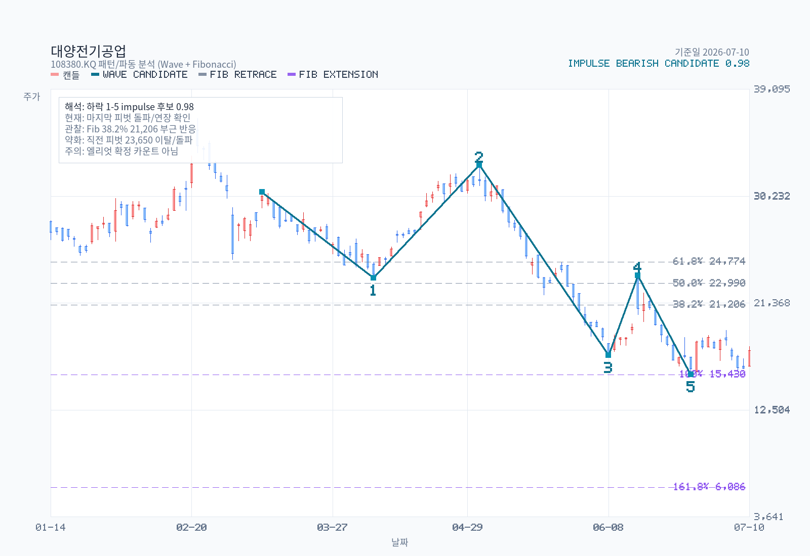

# Advanced Chart Analysis: 108380.KQ

- Name: 대양전기공업
- Latest date: 2026-07-10
- Latest close: 17420.00
- Moving-average structure: bearish
- Today's moving averages: MA5 16934.00, MA20 18036.00, MA60 23088.67, MA120 25528.08, MA200 26676.60
- Bollinger read: mid-band
- Ichimoku read: below-cloud
- RSI state: neutral
- MACD state: bullish / below-zero
- ADX state: building-trend / bearish / falling
- Volume regime: light
- Chart-only flow: bearish continuation

## Moving Averages on Latest Date

| Date | MA5 | MA20 | MA60 | MA120 | MA200 |
| --- | --- | --- | --- | --- | --- |
| 2026-07-10 | 16934.00 | 18036.00 | 23088.67 | 25528.08 | 26676.60 |

## Volume Moving Averages on Latest Date

| Date | Volume | VolMA20 | VolMA60 | Volume / VolMA20 |
| --- | --- | --- | --- | --- |
| 2026-07-10 | 57181 | 88116 | 61588 | 64.9% |

## Chart Images

The main chart uses OHLC candlesticks with upper and lower wicks, plus MA5, MA20, MA60, MA120, MA200, and volume bars. The separate volume chart enlarges participation detail with volume bars plus VolMA20 / VolMA60 lines. The overlay chart separates Bollinger Bands, Ichimoku cloud lines, and RSI14, and reserves 26 forward slots for the projected cloud. The momentum chart focuses on MACD, signal, histogram, and ADX/DMI so crossovers, momentum acceleration, and trend strength are easier to see. The structure chart pairs candles with a horizontal volume-by-price gutter (POC highlighted) and ATR-tolerance clustered support/resistance zones drawn as horizontal price bands (up to 3 each, within ±30% of current price). The pattern chart adds recent swing-pivot wave candidates and Fibonacci retracement/extension levels; labels are drawn only for candidates with confidence >= 0.55, while all candidates are exported to a sibling `-waves.csv`. The full zone roster — including broken or distance-filtered zones — is exported to a sibling `-zones.csv`.

## Pattern / Wave Candidates

Selected drawable candidate: impulse / bearish / confidence 0.978.

| Kind | Direction | Status | Confidence | Points |
| --- | --- | --- | --- | --- |
| impulse | bearish | drawable | 0.978 | start:2026-03-11@30,550 → 1:2026-04-07@23,450 → 2:2026-05-04@32,800 → 3:2026-06-08@17,030 → 4:2026-06-15@23,650 → 5:2026-06-26@15,430 |
| corrective | bearish-correction | drawable | 0.907 | A:2026-06-08@17,030 → B:2026-06-15@23,650 → C:2026-06-26@15,430 |
| corrective | bearish-correction | drawable | 0.792 | A:2026-04-07@23,450 → B:2026-05-04@32,800 → C:2026-06-08@17,030 |
| corrective | bullish-correction | drawable | 0.771 | A:2026-05-04@32,800 → B:2026-06-08@17,030 → C:2026-06-15@23,650 |
| impulse | bullish | drawable | 0.768 | start:2026-03-04@24,950 → 1:2026-03-11@30,550 → 2:2026-04-07@23,450 → 3:2026-05-04@32,800 → 4:2026-06-08@17,030 → 5:2026-06-15@23,650 |

Full wave roster: `대양전기공업-chart-pattern-waves.csv`

## Indicators

| Metric | Value |
| --- | --- |
| MA 5 | 16934.00 |
| MA 20 | 18036.00 |
| MA 60 | 23088.67 |
| MA 120 | 25528.08 |
| MA 200 | 26676.60 |
| Bollinger Upper | 21189.30 |
| Bollinger Middle | 18036.00 |
| Bollinger Lower | 14882.70 |
| Bollinger Width | 34.97% |
| Tenkan | 17375.00 |
| Kijun | 19540.00 |
| Current Cloud A | 23675.00 |
| Current Cloud B | 25700.00 |
| Future Cloud A | 18457.50 |
| Future Cloud B | 24115.00 |
| RSI 14 | 47.74 |
| MACD | -1220.42 |
| Signal | -1372.21 |
| Histogram | 151.79 |
| MACD State | bullish / below-zero |
| Histogram State | expanding |
| ADX 14 | 23.89 |
| +DI | 24.06 |
| -DI | 32.73 |
| ADX State | building-trend / bearish / falling |
| Avg Volume 20 | 88116 |
| Avg Volume 60 | 61588 |
| Volume vs Avg 20 | 64.9% |
| 20D Breakout Level | 23650.00 |
| 20D Breakdown Level | 15430.00 |

## Read

- Trend structure: price is below MA20, MA60, MA120, and MA200, so rallies still need confirmation before they count as trend recovery.
- Today's moving averages: MA5 16,934 / MA20 18,036 / MA60 23,089 / MA120 25,528 / MA200 26,677.
- Volatility: price is around the middle of the Bollinger range, and band width is stable.
- Cloud read: price is below the current cloud, tenkan is below kijun, and the projected cloud is bearish.
- Momentum and participation: RSI14 is neutral at 47.74; MACD remains above signal, and MACD is below zero; histogram momentum is expanding; ADX shows a trend that is building, with -DI slightly ahead, and trend strength is fading; volume is light versus the 20-day average.
- Practical checklist: nearest support watch is 15,430; first recovery check is 18,036, then 19,540; 20-day breakout level sits at 23,650; 20-day breakdown level sits at 15,430; chart-only flow still reads as bearish continuation.
