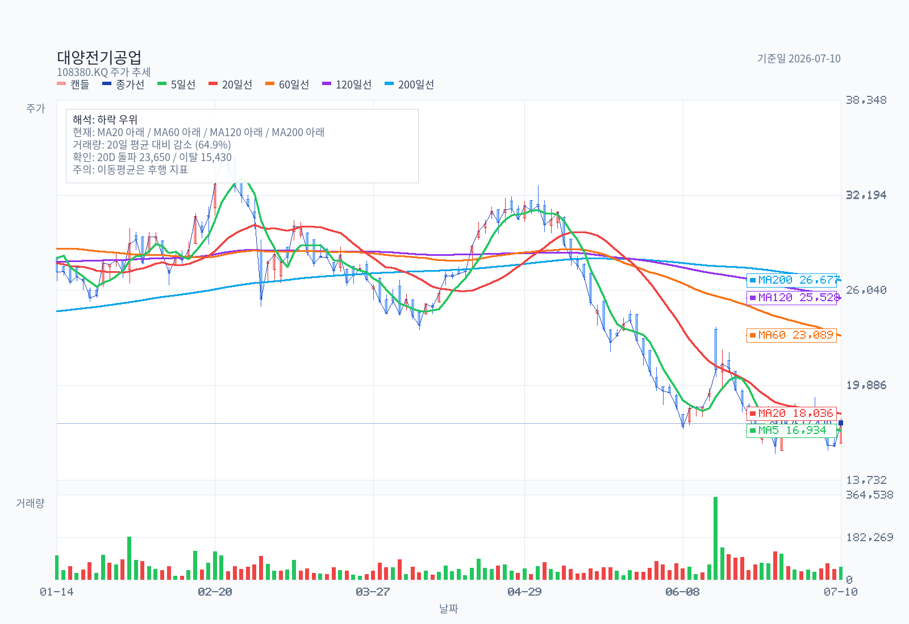
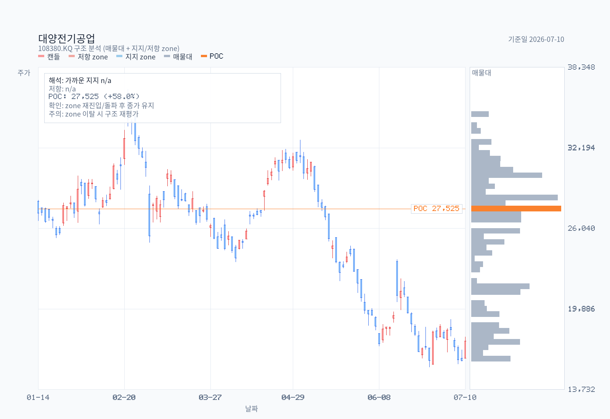
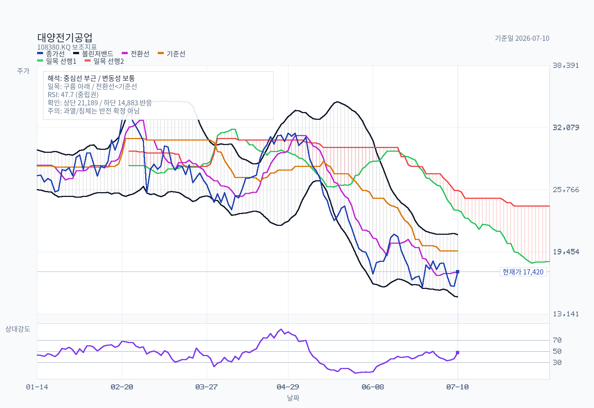
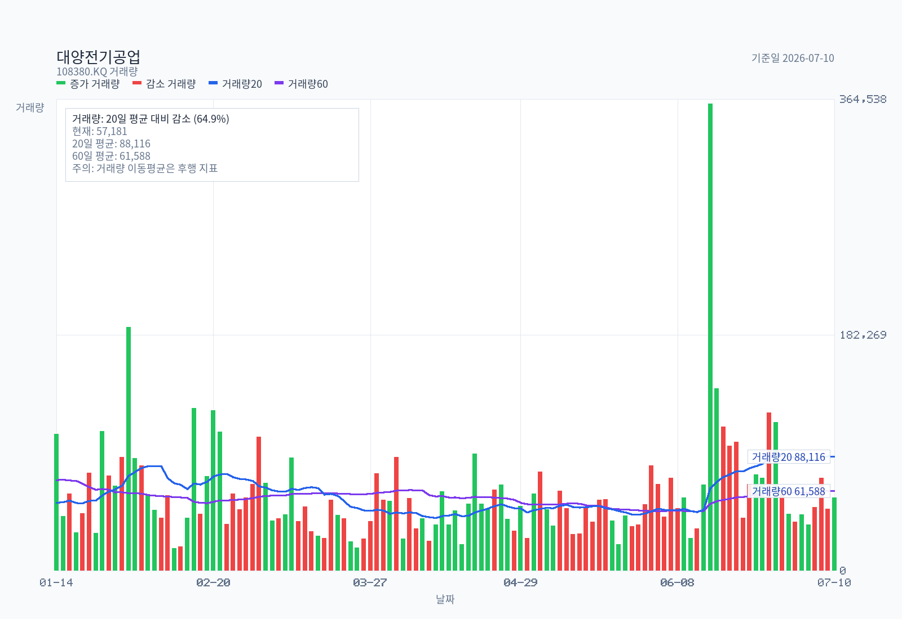
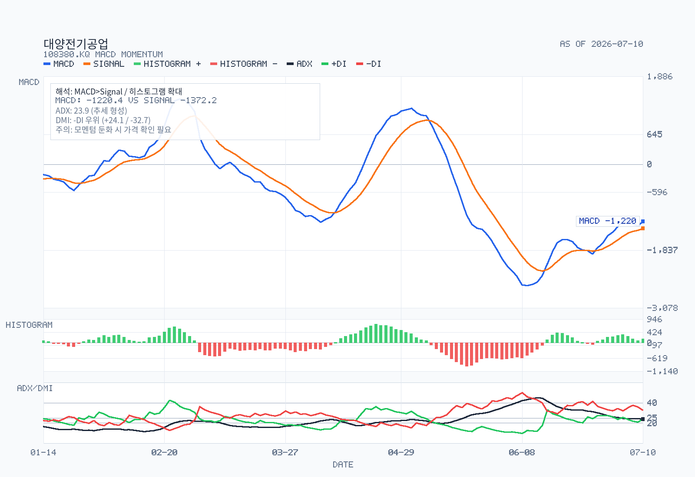

# 대양전기공업 | 15,430원 지지·19,540원 회복 확인·15,430원 무효화가 핵심이다. | 2026-07-10

이 글은 2026-07-10 최신 완료 거래일 기준의 가격·거래량·기술지표만으로 정리한 스윙 차트 체크리스트입니다. 펀더멘털·공시·밸류에이션·사업 내용은 다루지 않습니다.

## 한눈에 보는 결론

**15,430원 지지·19,540원 회복 확인·15,430원 무효화가 핵심이다.** 7월 10일 종가 17,420원은 핵심 지지 위에 있으나 MA20과 일목 기준선 아래에 있다. 따라서 현재 위치는 추세 전환을 단정하기보다, 지지 유지와 회복 조건을 차례로 확인하는 구간으로 본다.

| 구분 | 가격대 | 차트상 역할 | 확인 조건 |
| --- | ---: | --- | --- |
| 핵심 지지 | 15,430원 | 최근 20일 저점·6월 스윙 저점 | 종가 이탈 뒤 되돌림 실패면 하락 연장으로 해석 |
| 단기 회복선 | 17,375–18,036원 | 일목 전환선 + MA20 | 종가 회복과 거래량 개선을 함께 확인 |
| 추세 회복 확인선 | 19,540원 | 일목 기준선·피보나치 23.6% 부근 | 이 선 위 종가 안착 여부 확인 |
| 다음 저항 구간 | 22,070–23,675원 | 피보나치 38.2% + MA60 + 20일 돌파선 | 거래량 동반 돌파 전까지 공급 구간으로 인식 |
| 무효화 가격 | 15,430원 종가 이탈 | 단기 지지 훼손 | 반등 시나리오를 재평가 |

[brown: 현재는 지지 위 반등 가능성과 중기 하락 추세가 동시에 존재하는 중립 관찰 구간이다.]

## 가격 추세와 이동평균

7월 10일 종가 17,420원은 MA5 16,934원 위지만 MA20 18,036원, MA60 23,089원, MA120 25,528원, MA200 26,677원 아래다. 단기 반등은 나타났으나 중기·장기 이동평균 배열은 아직 약세다.

| 기준 | 값 | 읽는 법 |
| --- | ---: | --- |
| MA5 | 16,934원 | 단기 가격선; 종가가 위에 있으나 추세 전환 근거로는 부족 |
| MA20 | 18,036원 | 첫 회복선; 종가 회복 뒤 유지가 필요 |
| MA60 | 23,089원 | 중기 하락 추세를 훼손할 다음 확인선 |
| MA120 | 25,528원 | 중장기 공급 가능 구간 |
| MA200 | 26,677원 | 장기 추세 재평가선 |

[blue: 종가가 MA20·60·120·200 아래에 있어, 반등이 이어져도 MA20과 기준선 회복 전에는 추세 회복으로 단정하기 어렵다.]

## 수평 지지·저항

수평 매물대는 24,950–25,300원과 30,050–30,550원에 구조 저항으로 탐지됐다. 현재가에서 가까운 실전 판단 구간은 일목 전환선 17,375원, MA20 18,036원, 기준선 19,540원이다. 현재 일목 구름은 23,675–25,700원으로 가격 위에 놓여 있다.

| 가격 구간 | 근거의 겹침 | 해석 |
| --- | --- | --- |
| 15,430원 | 최근 20일 저점·6월 스윙 저점 | 종가 기준 방어 여부를 우선 관찰 |
| 17,375–18,036원 | 전환선 + MA20 | 단기 회복의 첫 관문 |
| 19,540원 | 기준선 + 피보나치 23.6% 부근 | 종가 안착 시 반등의 질을 재확인 |
| 22,070–23,675원 | 피보나치 38.2% + MA60 + 20일 돌파선 + 구름 하단 | 여러 저항이 겹친 공급 구간 |
| 23,675–25,700원 | 일목 구름 + 구조 저항 25,125원 + MA120 | 중기 추세 전환을 검증할 강한 매물대 |

[red: 18,036원 회복 후 19,540원 위 종가 안착은 단기 반등이 단순 되돌림인지 구분하는 첫 긍정 신호가 된다.]

## 거래량과 모멘텀

7월 10일 거래량은 57,181주로 20일 평균 88,116주의 64.9%다. 반등일 거래량이 평균을 밑돌아, 가격 회복 신호는 거래 참여로 한 번 더 확인할 필요가 있다. RSI14는 47.74로 중립이며, MACD는 신호선 위지만 0선 아래다. ADX14는 23.89, +DI 24.06, -DI 32.73으로 -DI가 우위다.

| 지표 | 현재값 | 체크 포인트 |
| --- | ---: | --- |
| 거래량 / 20일 평균 | 64.9% | 회복 구간에서는 20일 평균 이상 참여 여부 확인 |
| RSI14 | 47.74 | 과매수·과매도보다 50선 회복·유지가 중요 |
| MACD | -1,220.42 | 신호선 상향이지만 0선 아래; 반등 모멘텀의 초기 단계로 해석 가능 |
| MACD 히스토그램 | +151.79 | 확장 중인지 둔화되는지 연속 관찰 |
| ADX14 | 23.89 | 추세 강도는 형성 구간이나, -DI 우위가 유지되는지 확인 |

[brown: 모멘텀은 완전한 약세 일변도는 아니지만, 거래량과 0선 위 MACD 회복이 확인되기 전까지는 반등의 신뢰도가 제한적이다.]

## 실전 체크리스트

| 상황 | 종가 조건 | 거래량 조건 | 차트 해석 |
| --- | --- | --- | --- |
| 지지 확인 | 15,430원 위 마감 유지 | 저점 재시험 때 매도 거래량 둔화 여부 | 지지 방어 시 단기 반등 시나리오 유지 |
| 단기 회복 | 17,375–18,036원 회복 | 20일 평균 88,116주 이상에 근접·상회 | 전환선·MA20 회복의 질 확인 |
| 추세 회복 1단계 | 19,540원 위 종가 안착 | 회복일과 다음 날 모두 거래량 유지 | 기준선 회복, 단순 장중 돌파와 구분 |
| 추세 회복 강화 | 22,070–23,675원 돌파 | 평균 이상 거래량 동반 | 중기 저항·구름 하단을 통과하는지 확인 |
| 무효화 | 15,430원 종가 이탈 | 이탈 뒤 반등에도 거래량이 붙지 않음 | 지지 훼손으로 하락 연장 가능성을 재평가 |

이 표는 매수·매도 지시가 아니라 차트에서 확인할 조건을 정리한 것이다. 단일 호가보다 종가, 거래량, 다음 거래일의 유지 여부를 함께 본다.

## 출처

- 대양전기공업 2년 일봉 데이터 및 산출 메타데이터 — Yahoo Finance Chart API 수집, 2026-07-11 갱신.
- 기술지표·이동평균·일목·모멘텀 산출표 — 2026-07-10 최신 완료 거래일 기준.
- 수평 매물대·피벗 구간 CSV — ATR 허용오차 기반 일봉 구조 구간.

---

기준일: 2026-07-10 (최신 완료 거래일)

본 글은 가격·거래량 기반의 차트 교육 및 개인 기록용 자료이며, 특정 종목의 매수·매도를 권유하지 않습니다. 기술적 분석에는 오류 가능성이 있으며, 투자 판단과 그 결과에 대한 책임은 투자자 본인에게 있습니다.

> **RESEARCH COMPLETE · AI-ASSISTED EQUITY INTELLIGENCE**
> Codex (or Claude) × KrResearchKit · Crafted by **ray5273**
> ✓ 차트·수급
> [GitHub](https://github.com/ray5273/kr-research-kit) · Open Research Workflow
