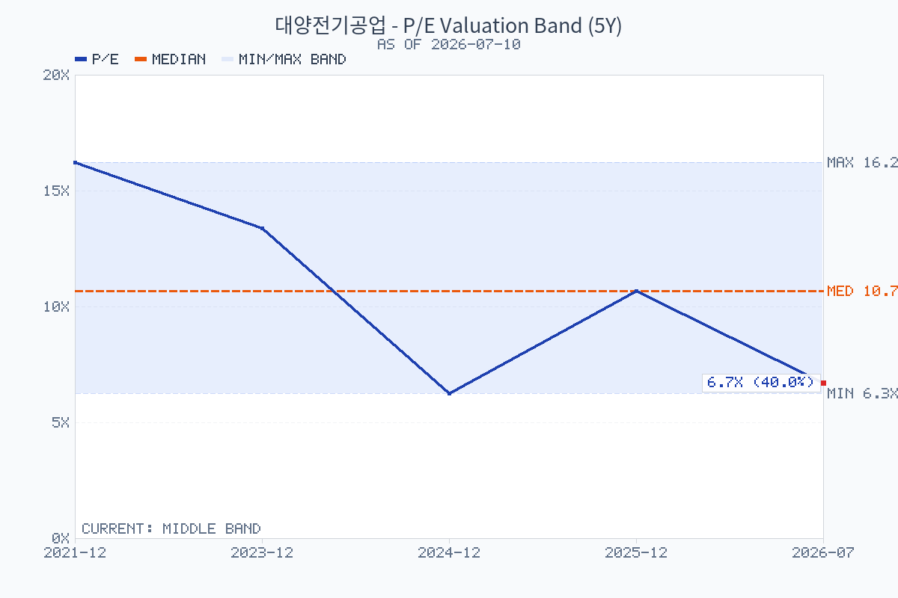
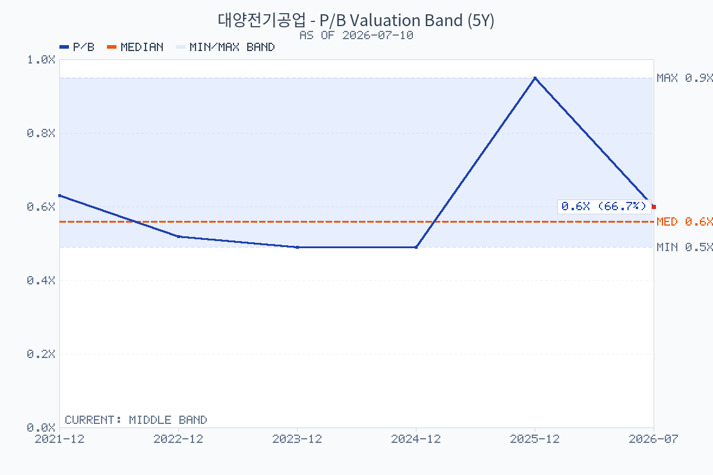

# 대양전기공업(108380) — 지지·저항선 교차검증

기준일: 2026-07-10 종가 `17,420원` (2026-07-12는 휴장)

이 문서는 선 하나를 정답처럼 제시하지 않는다. 일봉 2년 데이터에서 널리 쓰이는 네 가지 방법이 같은 가격대에 겹치는지로 신뢰도를 나눴다. 가격대는 단일 호가가 아니라 변동성을 감안한 **구간**으로 본다.

## 방법별 읽기

| 방법 | 현재 확인값 | 해석 | 신뢰도 조건 |
| --- | --- | --- | --- |
| 수평 매물대/피벗 | `25,125원`, `30,300원` 저항대가 반복 접촉으로 탐지 | 과거 거래가 쌓인 공급 구간 | 종가 돌파 뒤 거래량이 붙어야 저항 소화로 인정 |
| 이동평균 | MA5 `16,934`, MA20 `18,036`, MA60 `23,089`, MA120 `25,528`, MA200 `26,677` | 종가가 MA20·60·120·200 아래: 큰 추세는 약세 | MA20 회복만으로 추세전환 확정 아님; MA60까지 안착 필요 |
| 일목균형표 | 전환선 `17,375`, 기준선 `19,540`, 현재 구름 `23,675–25,700` | 단기 반등은 전환선, 중기 추세 확인은 기준선/구름이 기준 | 기준선 위 종가 안착과 구름 진입이 필요 |
| 최근 스윙·피보나치 | `32,800원`(2026-05-04 피벗 고점) → `15,430원`(2026-06-26 피벗 저점) | 반등 폭의 되돌림 저항을 가늠하는 보조선 | 피보나치 하나만으로 매매 근거를 만들지 않음 |

## 실전 가격 지도

| 구분 | 가격대 | 근거의 겹침 | 차트에서의 행동 기준 |
| --- | ---: | --- | --- |
| 핵심 지지 | `15,430원` | 최근 20일 저점·6월 스윙 저점 | 종가 이탈 후 되돌림 실패면 하락 연장 위험으로 본다 |
| 단기 회복선 | `17,375–18,036원` | 일목 전환선 + MA20 | 거래량을 동반한 종가 회복 전까지는 기술적 반등으로 분류 |
| 1차 저항 | `19,540원` | 일목 기준선 | 이 선 위 안착이 단기 추세 복원의 첫 확인 |
| 2차 저항 | `22,070–23,675원` | 피보나치 38.2% 약 `22,066원` + MA60 `23,089원` + 20일 돌파선 `23,650원` | 이 구간 돌파는 단기 하락 파동 훼손 신호이나 거래량 확인 필요 |
| 강한 공급대 | `23,675–25,700원` | 일목 구름 + 구조 저항 `25,125원` + MA120 | 여러 기법이 겹치는 첫 번째 강한 매물대 |
| 장기 저항 | `26,160–26,677원` | 피보나치 61.8% 약 `26,166원` + MA200 | 장기 추세 전환 여부를 가르는 구간 |
| 상단 공급대 | `29,080–30,550원` | 피보나치 78.6% 약 `29,080원` + 구조 저항 `30,300원` | 전고점권 재도전 이전의 마지막 큰 저항 |

피보나치는 위 스윙 고점과 저점으로 계산했다. 23.6% `19,530원`, 38.2% `22,070원`, 50% `24,115원`, 61.8% `26,160원`, 78.6% `29,080원`이다. 이 중 `19,540원`은 일목 기준선과도 거의 같아, 단순 산술선보다 더 볼 만한 **첫 회복 판정선**이다.

## 결론

현재 `17,420원`은 핵심 지지 `15,430원` 위이지만, MA20 `18,036원`과 기준선 `19,540원` 아래다. 따라서 지금은 **지지 확인 구간이지, 추세 전환 구간은 아니다.**

- 보수적 확인: `18,036원` 회복 후 `19,540원` 위 종가 안착.
- 더 강한 확인: `22,070–23,675원`을 거래량 동반으로 돌파.
- 무효화/위험 관리: `15,430원` 종가 이탈.

## 연 단위 밸류에이션

| 시점 | 수정주가 | EPS | BPS | PER | PBR |
| --- | ---: | ---: | ---: | ---: | ---: |
| 2021년 말 | 15,000원 | 924원 | 23,974원 | 16.24배 | 0.63배 |
| 2022년 말 | 12,000원 | -784원 | 23,112원 | N/A | 0.52배 |
| 2023년 말 | 11,720원 | 876원 | 23,964원 | 13.38배 | 0.49배 |
| 2024년 말 | 12,850원 | 2,049원 | 26,010원 | 6.27배 | 0.49배 |
| 2025년 말 | 27,700원 | 2,591원 | 29,042원 | 10.69배 | 0.95배 |
| 2026-07-10 | 17,420원 | 2,591원 (FY2025 실제) | 29,042원 (FY2025 실제) | 6.72배 | 0.60배 |

PER은 2022년 적자라 의미가 없어 N/A로 두었다. 2026년 7월 점은 FY2026 추정치가 아닌 FY2025 실제 EPS·BPS에 현재 주가를 나눈 스냅샷이다. 2025년 말 PBR `0.95배`는 가격 급등이 반영된 값이어서, 현재 `0.60배`와 직접 비교할 때는 실적·구조개편 기대가 주가에서 빠진 정도를 보여주는 지표로만 해석해야 한다.

## 데이터 출처·산식

- 가격·기술지표: [chart-data.json](chart-data.json), [chart-analysis.md](chart-analysis.md), [구조 구간 CSV](../assets/대양전기공업-chart-structure-zones.csv). 수평 구조 구간은 ATR 허용오차로 군집화한 일봉 피벗/접촉 기반이다.
- FY2021–FY2024 EPS·BPS·연말 수정주가: [FnGuide 투자지표](https://comp.fnguide.com/SVO2/asp/SVD_Invest.asp?MenuYn=Y&NewMenuID=105&ReportGB=D&cID=&gicode=A108380&pGB=1&stkGb=701).
- FY2025 EPS·BPS: [2025 사업보고서](https://dart.fss.or.kr/dsaf001/main.do?rcpNo=20260323001662). BPS는 지배주주 순자산에서 자기주식을 차감한 뒤 기말 유통주식수로 나눈 값이다.
- 연도별 산식·원자료: [valuation-history.json](valuation-history.json).
