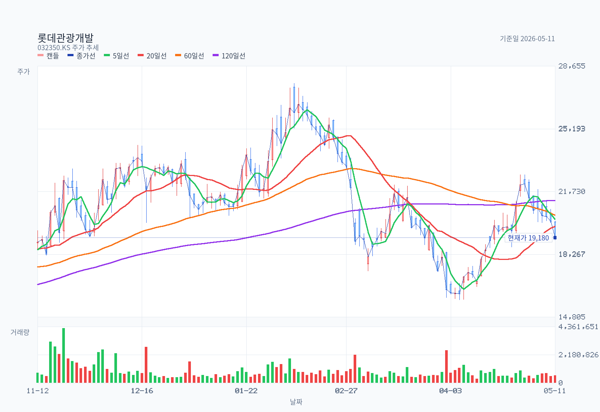
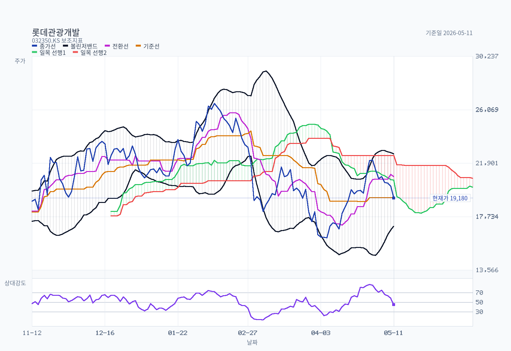
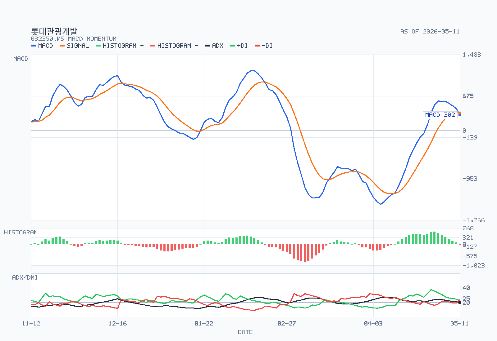

# 롯데관광개발(032350) — 의사결정 메모

기준일: 2026-05-12

- **모드:** Full Memo (단일 종목, 결정 지향)
- **시장:** KRX (KOSPI)
- **기준 종가:** 19,180원 (2026-05-11)
- **시가총액:** 약 1,527십억원 (79,601,474주 × 19,180원, 제출일 기준 주식수, 사업보고서 2025.12)
- **사업 정체성:** 제주 드림타워 복합리조트 운영 (외국인 전용 카지노+5성급 호텔+리테일+크루즈 여행) — 사실상 단일 자산 + 단일 라이선스 + 고레버리지 회복주 (`single-asset levered inbound recovery`)
- **출처 채널:** DART 사업보고서(2025.12, rcept_no 20260319000832) + 주요사항보고 다수 / Yahoo Finance OHLCV (243봉, 2025-05-12 ~ 2026-05-11) / 한경 컨센서스 14개 셀사이드 리포트 (2025-05-11 ~ 2026-04-24) / Naver 블로거 5명 17개 포스트 / **외국계 IB 커버리지는 스크립트 갭으로 본 메모에서 미반영 (§Follow-up #7 참고)**

---

## Summary

롯데관광개발은 2025년 **영업이익 1,433억원(+267% YoY, OPM 21.9%) · 당기순이익 276억원 흑자전환**으로 4년에 걸친 드림타워 가동률 정상화 사이클이 손익 라인에 확실히 잡힌 종목이다. 한울회계법인 2025 감사보고서는 **2023년에 있던 "계속기업 불확실성" 강조사항을 완전히 삭제**(rcept_no 20260319800859)했고, 셀사이드 14건은 전원 BUY 등급에 목표주가 중앙값 28,000원(레인지 27,000~32,000원)을 제시하고 있다.

그럼에도 현재 주가는 52주 고점(27,700원) 대비 **-30.8%**, 모든 단·중·장기 이평선(MA5/20/60/120) 아래 역배열, MACD 약세 교차의 매도 흐름이다. 가격이 이렇게 빠진 이유는 결과 자체가 아니라 **2026.06.30~07.30 행사 예정인 제8-1회 CB 700억원 풋옵션 + 9,500억원 Tranche A·B 차입 구조 + 김한준-EquitiesFirst 환매조건부 9.14백만주 잠재 매도 압력**이라는 자본구조·거버넌스 cliff에 시장이 디스카운트를 적용하고 있기 때문으로 본다. 즉 **운영 사이클은 강하지만 자본구조 사이클이 약하고, 둘이 같은 분기에 만난다.** 본 메모는 그래서 매수·매도 단답형 결론으로 끌지 않고, 8-1회 CB 응대 자금조달 공시(예상 6월 이전)가 나오기 전까지는 **"운영 모멘텀 유효 + 자본구조 리스크 미해소"** 의 보류 스탠스를 유지한다.

---

## Decision Frame

투자결정을 가장 크게 바꿀 5가지 이슈만 먼저 분리한다.

1. **8-1회 CB 풋옵션 응대 (2026.06.30~07.30)** — 액면 700억원, 표면 0%/만기수익률 4.7%, 전환가 18,231원 vs 현재가 19,180원. 현재가가 전환가를 살짝 웃돈다는 점이 양면적이다. 만약 풋이 대거 행사되면 700억원 현금 유출 + 재차입 부담, 행사되지 않으면 자본구조 부담 완화·시장 안도. **현금흐름 시뮬레이션과 응대 자금 출처 공시 없이는 본 cliff가 가장 큰 단일 변수다.** (DART recheck §10, rcept_no 20251022000296)
2. **드림타워 운영 모멘텀의 진위** — 셀사이드는 4Q25 매출 1,871억(+70.1% YoY), 영업이익 442억(+1,942.5% YoY), 1Q26 카지노 순매출 1,186억(+40.3% YoY, 유안타 2026-04-24 추정)을 인용. 동시에 독립 트랙(tlsgmltmddk 2026-03-05)은 **2월 카지노 순매출 326억으로 전월비 -28.4%, 드롭액 -33.9%** 라는 단월 부진을 보고. 1Q 2026 분기보고서 미제출(2026-05-12 시점) 상태에서 **월 단위 변동성이 크고, 분기 평균만 잘 보이는 구조**라는 점 주의. (§7)
3. **별도 자본총계 162억 — 자본잠식 직전선** — 연결 기준은 회복됐지만 **모회사 단독 자본은 162억으로 매우 얇고**, 별도 2025 순손실 -1,034억이 지속(사업보고서 III.1 별도 요약). 모회사 단독으로 보면 여전히 위태로운 그림이고, 카지노 종속 ㈜엘티엔터테인먼트 주식 100%가 Tranche A·B 대주에게 근질권으로 잡혀있다는 사실과 합쳐서 봐야 한다. (§8)
4. **외국인 인바운드 정상화의 지속성** — 한일령 반사수혜, 무비자 효과, 호텔 콤프 객실 800→1,000개 확대, 테이블 가동률 130→167개로의 레버리지는 셀사이드 핵심 멀티플 확장 근거. 그러나 **중국 대사관의 해외 도박 자제 권고(2026.02 보도)와 중동 지정학(미국-이란 전쟁 시나리오, tlsgmltmddk 2026-03-08)** 같은 외생 충격에 취약한 단일 사이트 모델임도 같이 봐야 한다.
5. **거버넌스 — 김한준 환매조건부 9.14M주 + 동화투자개발 대여 2.4M주의 잠재 매도 압력** — 현재 발행주식의 약 **14.5%** 가 김한준·EquitiesFirst 환매조건부 매매 계약에 묶여 있다. 본인 명의 1.0M주(1.26%)와는 별개. 김한준이 환매하지 못하면 EquitiesFirst가 시장에 풀 수 있는 잠재 물량이다. 시점·트리거가 공시되지 않아 정량 추정은 불가능하지만, **본 종목의 오버행 디스카운트의 핵심 구성요소**로 본다. (§11)

---

## Business and Thesis

| 사업부 | 2025 매출(백만원) | 비중 | 2025 영업이익(백만원) | OPM |
|---|---:|---:|---:|---:|
| **제주 드림타워 복합리조트** | **561,314** | **85.9%** | **133,046** | **23.7%** |
| 여행관련 서비스 | 89,141 | 13.6% | 10,723 | 12.0% |
| 인터넷 언론 (마이데일리) | 2,992 | 0.5% | (441) | -14.7% |
| **연결 합계** | **653,448** | 100% | **143,328** | **21.9%** |

출처: 사업보고서 III.1, 부문 주석 (Line 9360-9445).

사업의 본질은 **외국인 전용 카지노 (운영주체 ㈜엘티엔터테인먼트 100% 자회사) + 5성급 그랜드 하얏트 제주 호텔 + 리테일 + 크루즈 여행** 의 복합리조트 단일 자산이다. 사업분류 기준 카지노 매출 비중은 **72.94%** (476,655백만원, 사업보고서 II.2 Line 793-809)이며, 2년 만에 152.4bn → 294.6bn → 476.7bn 으로 **+213% 성장**.

가장 중요한 변수는 단순하다.
1. **카지노 매출의 절대 수준** — 현재 분기 평균 1,000~1,400억원
2. **카지노 영업레버리지** — 매출이 일정 수준 넘어가면 OP가 비선형 증가 (드림타워 부문 OPM 7.5% → 23.7% 이동이 증명)
3. **인바운드 입국자 수 + 카지노 방문객 전환율** — 5월 1~9일 외국인 관광객 +30% YoY (phoop7 2026-05-10 인용)

---

## Revenue Mix

| 분해축 | 상태 |
|---|---|
| 사업분류별 (사업보고서 II.2) | **카지노 73% / 여행 14% / 호텔 12% / 인터넷정보 0.5% / 리테일 0.4%** |
| 지리적 | **국내 매출 단일** — 드림타워는 제주 단일 사이트, 여행업은 한국→해외 송출 중심. 연결 기준 해외매출 분해 별도 미공시 |
| 카지노 VIP / Mass / Junket 믹스 | **DART 미공시** (의무 항목 아님). KCASINO 통계·회사 IR 데크 보강 필요 |
| Drop / Hold / Win % | **DART 미공시**. 셀사이드 추정치 — IBK(2026-02-13): 2025 홀드율 18.6% (+2.4%p YoY) / 2026.01 드롭액 2,616억(+89.8% YoY) |
| 고객집중도 | DART 본 보고서 어디에도 단일 매출처 5% 이상 의무 공시(II.4 매출처 항목) **해당 사항 없음으로 기재** — 카지노 특성상 익명 다중 고객 구조로 추정 |
| 특수관계자 거래 매출 | 코레일관광 313백만, **롯데관광㈜(별도 법인) 130,856백만** (전기 151,552백만) — 여행업 위탁/대리 관련 추정 (주석 29, Line 8770-8825) |

> **롯데JTB 거래는 사업보고서 특수관계자 주석에 명칭 자체가 등장하지 않음** — DART recheck §9 결과 "롯데JTB와 정기적 특수관계자 거래" 주장은 **반박**.

---

## What The Latest Results Say

### 5.1 손익 (연결, 백만원)

| 구분 | 2025 | 2024 | 2023 | YoY |
|---|---:|---:|---:|---:|
| 영업수익 | **653,448** | 471,468 | 313,548 | +38.6% |
| 영업이익 | **143,328** | 39,007 | (60,606) | +267.4% |
| 영업이익률 | **21.9%** | 8.3% | -19.3% | +13.6%p |
| 당기순이익 | **27,597** | (116,573) | (202,331) | 흑전 |
| 지배주주순이익 | 27,765 | (116,575) | (202,220) | 흑전 |
| EPS (원) | **356** | (1,531) | (2,721) | - |

출처: 사업보고서 III.1 요약 연결재무정보 (Line 1283-1305). 2024년 총포괄이익 243.3bn은 토지·건물 재평가차익 효과가 포함된 값으로 영업개선과 분리 해석 필요.

### 5.2 분기 흐름 (셀사이드 인용·검증 필요)

| 분기 | 매출 (억) | 영업이익 (억) | 비고 |
|---|---:|---:|---|
| 2Q 2025 | 1,577 | **331** | 한화/유진/SK 공통 인용 — 드림타워 개장 이래 분기 첫 순이익 흑전 (the_trip 2025-08-05) |
| 3Q 2025 | n/a | n/a | 9월 카지노 매출 529억 역대 최고치 (SK증권 2025-10-29) |
| 4Q 2025 | **1,871** | **442** | 4Q25 Review 컨센서스 (한화·IBK·유진 2026-02-13). 시장 기대치(471억)는 소폭 하회, **순이익 483억 서프라이즈** |
| 1Q 2026 (E) | 1,611 | **371** | 유안타 2026-04-24 Preview; 카지노 순매출 1,186억(+40.3% YoY) |

### 5.3 대차대조표 — 자산은 부동산, 부채는 차입금

- **부동산 (토지 635.3bn + 건물 937.2bn = 1,572.5bn 장부가)** 가 **부동산담보신탁(신한자산신탁㈜)** 으로 담보 제공
- 비유동자산 중 드림타워 부문 1,996.6bn (98% 집중)
- 드림타워 부문 부채 1,709.6bn (전체 연결부채의 약 95%)
- **별도 기준 자본총계 16.2bn — 자본잠식 직전선** (사업보고서 III.1 별도 요약)
- 연결 기준 이익잉여금 **-1,065.3bn (여전히 큰 결손)**

### 5.4 차입금 스케줄 (연결, 천원, 사업보고서 III.3 주석)

| 항목 | 2025년말 | 2024년말 |
|---|---:|---:|
| **장기차입금 (Tranche A+B)** | **883,042,361** | 740,826,598 |
| 종속회사 내부 차입 (4.6%) | 290,521,800 | - |
| 유동성 전환사채 | 84,589,392 | 239,189,267 |
| 비유동 전환사채 | 5,499,920 | - |
| **합계 (사채+CB)** | **1,263,653,473 ≈ 1,263.7bn** | **1,093,065,665** |

- **Tranche A·B 9,500억원** — 새마을금고중앙회 외 46개 금융기관, 이자율 6.0~9.0%, 우선수익한도 11,400억원(=차입실행액의 120%)
- 담보: **(a) 부동산담보신탁 + (b) 카지노 자회사 ㈜엘티엔터테인먼트 주식 4,000,000주 전량에 근질권 + (c) 최대주주 김기병의 자금보충약정** (사업보고서 주석 30, Line 9272-9273)
- **8-1회 CB 700억원** — 표면 0%/YTM 4.7%/전환가 18,231원/만기 2026.11.29/**풋 행사기간 2026.06.30~07.30**
- 10-1·10-2회 CB는 2025년 풋옵션으로 잔액 5.5bn까지 축소 완료

### 5.5 자본배분 — 배당·자사주

- 보통주 배당: **2025년 결산 무배당 추정** (사업보고서 III.2 배당사항 — 별도 자본총계 16bn으로 배당 여력 사실상 없음)
- 자사주: 2025년 자기CB 만기 전 취득·매도 거래 다건 — 풋옵션 응대용 일시 보유 후 재매각 패턴 (rcept_no 20250218001539 등)
- **신규 유상증자 결정 공시 2024.05~2026.05 전구간 없음** — 자본조달은 차입금(Tranche B) 신규 도입 중심

---

## DART Recheck

| Claim | DART 근거 | 판정 |
|---|---|---|
| 2025 연결 영업이익 1,433억원 흑자전환 | 사업보고서 III.1 (Line 1287) | **확인** |
| 카지노 매출 2년 만에 +213% (152→477bn) | 사업보고서 II.2 (Line 803) | **확인** |
| 2025 감사보고서 계속기업 불확실성 강조사항 존재 | 외부감사 §제55기 (Line 20518-20534) | **반박** — "해당사항 없음", 2023년 강조사항 삭제 |
| Tranche A·B 9,500억, 부동산담보신탁+카지노 자회사 주식근질권 | 주석 30 (Line 9272-9273) | **확인** |
| 8-1회 CB 700억 만기 2026.11.29, 전환가 18,231원, 풋 2026.06.30~07.30 | 주석 17 (Line 24666-24680) + rcept_no 20251022000296 | **확인** |
| 김기병+특수관계인 합산 39.49% | VII.1 (Line 21280) | **확인** |
| 김한준 EquitiesFirst 환매조건부 약 9.14M주 | VII.1 주1-6 (Line 21289-21297) | **확인** |
| 국민연금 5.34% → 10.34%로 +5pp 확대 | 주석 1 (Line 2493) | **확인** |
| "롯데JTB와 정기적 특수관계자 거래" | 주석 29 (Line 8770-8825) | **반박** — 롯데JTB 명칭 자체가 주석에 등장하지 않음. "롯데관광㈜"(별도 법인)는 매출 130.9bn 존재 |
| 카지노 단독 OP·VIP/Mass 믹스·Drop/Hold | 사업보고서·감사보고서 전구간 | **미공시** — DART 의무 항목 아님 |

---

## Street / Alternative Views

### 7.1 셀사이드 (한경 컨센서스, 14개 리포트, 5개 증권사)

| 항목 | 값 |
|---|---|
| 등급 분포 | **BUY 14 / HOLD 0 / SELL 0** |
| 목표주가 중앙값 | **28,000원** (mean 27,643원, range 27,000~32,000원) |
| 최신 리포트 | 유안타 이환욱 2026-04-24 (TP 27,000원) |
| TP 추이 (월 중앙값) | 2025-06 19,500 → 2025-12 32,000 → 2026-04 **29,000** (직전 피크 대비 -9% 하향) |

핵심 narrative (broker bullets, dart-extracted 인용):
- **IBK 김유혁 2026-02-13:** "2026 영업이익 2,112억원(+42.9% YoY), 한일령 반사수혜·호텔객실 콤프 확대(800→1,000실)·테이블 가동률 130→167개" / TP 32,000원·업종 최선호
- **유진 이현지 2026-02-13:** "4Q25 카지노 매출 1,427억(+93.2% YoY), 10·11월 카지노 순매출 500억 상회 / 영업 외단에서의 수익성 개선 기대" / TP 32,000원
- **한화 박수영 2026-02-13:** "강한 영업레버리지 2분기부터 본격 확인 / 4Q25 영업이익은 컨센 471억 하회·순이익 483억 서프라이즈" / TP 32,000원
- **유안타 이환욱 2026-04-24:** "1Q26 매출 1,611억(+32.1% YoY), 카지노 순매출 1,186억(+40.3% YoY), 총 방문객 15만명 — 컨센 매출 1,662·OP 390억 소폭 하회 예상이나 큰 폭 YoY 실적" / TP **27,000원(유지)**

> **Street 시그널 해석:** 운영 narrative는 일관된 강세이지만 TP 중앙값이 32,000원(2025-12)에서 29,000원(2026-04)으로 -9% 하향됐다는 점이 **숨겨진 약세 신호**. 특히 유안타가 27,000원으로 가장 보수적이고, 그 차이의 이유가 무엇인지 PDF 본문(`analyst-report-insight.md`)에서는 명시되지 않음.

### 7.2 Independent / Specialist (Naver 블로거 5명, 17개 포스트)

| 블로거 | 가장 결정적 view | 날짜 | 라벨 |
|---|---|---|---|
| **phoop7** "투자 점방" | "4월 실적 좋고 5월은 더 좋을 것. 5월 1~9일 외국인 관광객 전년 대비 +30%, 영업레버리지가 큰 회사" | 2026-05-10 | Independent view — 강세 |
| **tlsgmltmddk** "조금씩 천천히" | "2026.02 카지노 순매출 326억 (전월비 -28.4%), 드롭액 -33.9% — 단월 부진. 다만 1월 바카라/포커 대회의 3월 이연 영향으로 수요 분산 가능성" | 2026-03-05 | Independent view — 단월 부진 분석 |
| **tlsgmltmddk** (포트폴리오 코멘트) | 미국-이란 전쟁 시나리오에서 롯데관광 비중 7.84% 보유 유지, 카지노 수요가 전쟁 영향으로 적어졌다고 보기는 어렵다 | 2026-03-08 | Independent view — geopolitics |
| **wonderfather** "조조할인" | "어닝 서프라이즈 + 리파이낸싱 효과 / 목표주가 33,000원 자체 산출" | 2026-03-17 | Independent view — 강세 (자체 모델) |
| **the_trip** "여행플러스" | 한중일 크루즈 2026.05 출시, TTG 트래블어워드 명예의 전당 (광고성·공식블로그) | 2025-08~10 | Specialist media (회사 IR 채널) |

> **Naver 시그널 해석:** 1) 운영 강세 view 우세, 2) 다만 tlsgmltmddk(2026-03-05)의 월별 분해는 **셀사이드가 잘 노출하지 않는 단월 변동성**을 그대로 보여주며, 본 메모 §2 Decision Frame #2 의 근거. 3) wonderfather의 33,000원은 셀사이드 최고치(32,000)와 거의 일치 — 시장 컨센이 이미 그 수준에 정착했음을 의미.

### 7.3 외국계 IB

- **본 메모 기준일 갭:** `kr-foreign-analyst` 스크립트가 stale 함수 호출(`searchNaverNewsStructured` 미존재)로 0건 반환. 외국계 IB 커버리지 유무 자체를 본 메모에서 검증하지 못함. **Follow-up #7에서 별도 fetch 권장**.

---

## Current Valuation Snapshot

| 항목 | 값 | 비고 |
|---|---:|---|
| Price / 종가 (2026-05-11) | 19,180원 | KRX 정규시장 종가, 2026-05-11 |
| 발행주식수 | 79,601,474주 | 사업보고서 제출일 2026-03-19 기준 — CB 일부 전환 +61,990주 반영 |
| Market cap / 시가총액 | **1,527십억원** | 19,180 × 79.6M, 2026-05-11 |
| 2025 EPS | 356원 | 사업보고서 III.1, rcept 2026-03-19 |
| **Trailing PER (2025)** | **53.9x** | 19,180 ÷ 356 (기준일 2026-05-11) |
| Forward PER (2026E) | n/a | 셀사이드 EPS 컨센 PDF 본문에서 인용 가능, 본 메모 미파싱 |
| 셀사이드 2026 OP 컨센 | 약 2,100억 | IBK 2026-02-13 2,112bn / 유진·한화 2026-02-13 유사 범위 |
| 차입금 + CB 합계 | 1,264bn | 사업보고서 III.3, rcept 2026-03-19 |
| 추정 순차입 (현금 미공시 가정) | ≈ 1,200bn 내외 | 보수 추정, 현금성자산 별도 확인 필요 |
| **추정 EV** | **약 2,700~2,800bn** | 시총+순차입 (대략치), 2026-05-11 |
| 2025 영업이익 | 143.3bn | 사업보고서, rcept 2026-03-19 |
| 2025 EBITDA (추정) | ≈ 200bn | OP + 감가상각 ~50bn 추정 (건물 1.57조 장부가 기준), **추정치 라벨** |
| **추정 EV/EBITDA (2025)** | **약 13~14x** | 추정치 — 카지노·복합리조트 통상 8~10x 대비 **할증** |
| Trailing PBR / P/B | n/a (의미 없음) | 연결 이익잉여금 -1,065bn / 별도 자본 16bn 자본잠식 직전 — 책임치 비교 불가 |
| FCF Yield | n/a | 영업현금흐름·자본적지출 별도 정밀 파싱 미수행 |
| **배당수익률** | **0%** | 2025년 결산 무배당 추정, rcept 2026-03-19 — 별도 자본총계 16bn으로 배당여력 제한 |

## Historical Valuation Bands

회사가 **2023년까지 4년 연속 적자**였기 때문에 **3~5년 P/E, EV/EBITDA 밴드는 통계적 의미가 없다.** 본 메모에서는 밴드 차트를 생성하지 않으며, 셀사이드도 통상 forward 멀티플 + 카지노 peer (파라다이스 034230, GKL 114090, 그랜드코리아레저 등)와 상대 비교 위주로 가치를 산출. Forward EV/EBITDA 기반 정량 peer 비교는 본 메모의 데이터 범위 밖이며 **Follow-up #4**에서 권장.

---

## Chart and Positioning

### 가격 흐름 (243봉, 2025-05-12 ~ 2026-05-11)

| 지표 | 값 | 해석 |
|---|---:|---|
| 종가 (2026-05-11) | **19,180원** | |
| 52주 고점 | 27,700원 | **-30.76%** |
| 52주 저점 | 10,540원 | +81.97% (큰 회복 후 조정) |
| MA 5 / 20 / 60 / 120 | 20,176 / 19,806 / 20,422 / 21,235 | **가격 < 모든 이평선, 역배열** |
| Bollinger (상/중/하 / 폭) | 22,624 / 19,806 / 16,988 / 28.45% | 중단 부근, 폭 안정 |
| Ichimoku | Tenkan 20,850 / Kijun 19,205 / 현재 구름 20,587~22,500 | **구름 하단 below-cloud**, 미래 구름도 약세 |
| RSI 14 | **45.03** | 중립, sub-50 |
| MACD / Signal / Hist | 302.35 / 341.98 / **-39.63** | **약세 교차, above-zero, 히스토그램 축소중** |
| ADX 14 / +DI / -DI | 19.64 / 22.96 / 23.72 | **weak-trend / bearish / falling** |
| 20일 평균거래량 | 658,828 | 정상 (vs avg = 91.9%) |
| 20D Breakout 레벨 | 22,650원 | 상방 트리거 |
| 20D Breakdown 레벨 | 16,460원 | 하방 트리거 — 8-1회 CB 전환가 18,231원 아래 |
| 가까운 지지/저항 | 16,988 / 19,205-19,806 / 22,650 | |

**차트 단독 흐름 결론: bearish continuation.** 가격이 모든 이평선 아래에 있고 구름 하단이며 MACD 약세 교차의 환경. 차트만 보면 회복 흐름의 출발점이 아직 잡히지 않은 상태.

### Rule Screen

| 룰 | 결과 |
|---|---|
| **Minervini Trend Template** | **fail/incomplete** — 가격 < MA50/150/200, SMA50 < SMA150 항목에서 fail. RS percentile·52주 비율 cache 미제공으로 일부 항목 unavailable |
| KRX 52주 신고가 리더십 점수 | **0/15 partial** — RS 외부 cache 없어 정밀 점수 미산출 |
| 가격이 52주 고점의 75% 이상 | **fail** (현재가 19,180은 52w 고점 27,700의 69.2%) |
| 가격이 52주 저점의 +30% 이상 | **pass** (+82%) |

> 현재 단계는 Minervini Stage 4 (조정·재축적) 또는 Stage 1 초입의 후보. 차트 단독으로는 적극 매수 신호 부재.

---

## Governance and Structure

### 10.1 주주 구조 (2025.12.31 기준)

| 성명/회사 | 관계 | 주식수 | 지분율 | 비고 |
|---|---|---:|---:|---|
| **김기병** | 본인 | 18,068,171 | **22.72%** | 동화투자개발 대여분 2.4M 포함 |
| 신정희 | 처 | 1,408,147 | 1.77% | |
| 김한성 | 자녀 | 2,112,065 | 2.66% | 임원 등재 |
| **김한준** | 자녀 | 1,000,000 | 1.26% | **EquitiesFirst 환매조건부 별도 9.14M주 (잠재 매도 압력)** |
| **동화투자개발㈜** | 계열사 | 8,823,521 | 11.09% | 2.4M주 김기병에게 대여중 |
| 특수관계인 계 | — | 31,411,904 | **39.49%** | |
| **국민연금공단** | 기관 | 8,227,282 | **10.34%** | **2024년말 5.34% → 2025년말 10.34% (+5.0%p)** |
| 기타주주 | — | 39,900,298 | 50.16% | |

### 10.2 왜 중요한가

1. **김한준-EquitiesFirst 환매조건부 9.14백만주** = 발행주식의 **약 11.5%**. 본인 명의 1.0M주(1.26%)와는 별개의 **잠재 시장 공급 물량**. 환매 실패 시 EquitiesFirst가 시장에 풀 수 있는 구조. 시점·트리거 미공시. **본 종목의 만성 오버행 디스카운트의 핵심 구성요소** (DART recheck §10 확인).
2. **카지노 자회사 ㈜엘티엔터테인먼트 주식 100% 근질권 + 김기병 자금보충약정** — Tranche A·B 차입의 대가. **만약 차입금 불이행 시 카지노 라이선스 회사가 채권자에게 넘어갈 수 있는 구조**. 이는 단순한 부동산담보 차입이 아니라 **회사 본체에 묶인 라이선스 자체를 담보로 한 차입**이라는 의미.
3. **국민연금 +5pp 확대** — 2024년말 5.34%(5%룰 임계 직후)에서 2025년말 10.34%로 추가 매수. 패시브·액티브 비중 분해는 미공시지만, 운영 사이클 정상화 시점에 국민연금이 추가매수했다는 사실 자체는 의미 있는 시그널.
4. **별도 자본총계 16bn — 자본잠식 직전선** — 모회사 단독으로는 여전히 위태. 종속회사 ㈜엘티엔터테인먼트의 카지노 영업 흑자가 연결 손익을 떠받치는 구조. 카지노에 충격이 오면 다른 사업부의 buffer가 거의 없다.

---

## Catalysts

| 시점 | 이벤트 | 영향 |
|---|---|---|
| **2026.05 중순** | 1Q 2026 분기보고서 | 카지노 부문 매출·OP, 월별 드롭/홀드, 호텔 ADR/OCC 등 운영 KPI 확인 |
| 2026.05.04 (이미 공시) | 1Q 2026 잠정실적 공정공시 (rcept_no 20260504800530) | 본 메모 미파싱 — Follow-up #1에서 추적 |
| 2026.06 이전 | **8-1회 CB 풋옵션 응대 자금조달 공시** | 본 메모의 최대 단일 변수. 회사채·은행차입·자기CB 매도 중 어느 방식인지에 따라 시장 반응 크게 갈림 |
| **2026.06.30~07.30** | **8-1회 CB 풋옵션 행사기간** | 700억원 풋 행사 비율 → 단기 자본구조 결정 |
| 분기말마다 | 카지노 월별 드롭·순매출 회사 발표 | 한일령·중국 OBM·무비자 효과 지속성 검증 |
| 2026.11.29 | 8-1회 CB 만기 | 풋옵션이 미행사된 잔액의 만기상환 |
| 미정 | 호텔 콤프 객실 800→1,000실 확대 / 테이블 167개 가동 정상화 | 셀사이드 OP 2,100억 전망의 핵심 가정 검증 |

---

## Risks

### 12.1 운영 리스크
1. **단일 사이트 · 단일 라이선스** — 제주 드림타워 외 백업 없음. 자연재해·정책·면허·평판 어느 한 곳에 충격이 오면 회피 경로 없음.
2. **중국 정책 변동** — 중국 대사관 해외 도박 자제 권고(2026.02 보도) + 환전 규제·VIP 의존 구조의 정책 민감도. tlsgmltmddk(2026-03-05) 분석 인용.
3. **월 단위 변동성** — 2026.02 단월 카지노 순매출 -28.4% MoM 사례. 분기 평균만 잘 보이는 IR 패턴에 주의. 1~3월 춘절 효과의 분기 분배 변동.
4. **호텔 부문 별도 부진** — 한화 박수영 2026-02-13: "지난해 카지노 실적은 가파르게 성장했으나 호텔 실적은 다소 부진. 추가 납부 기준은 카지노 제외 호텔 매출액". 호텔 ADR/OCC가 카지노에 비해 약하다는 시그널.

### 12.2 자본구조 리스크
5. **8-1회 CB 풋옵션 700억 (2026.06-07)** — 응대 자금 출처 미공시
6. **Tranche A·B 9,500억 만기·금리 갱신** — 2025년 중 Tranche B 신규 도입(외화사채 USD 18.5M 부족금액 보충약정), 향후 차환 리스크 잔존
7. **카지노 자회사 주식근질권** — 채권자에게 회사 본체 라이선스가 묶여있는 구조
8. **별도 자본총계 16bn — 자본잠식 직전** — 별도 회계상 buffer 없음

### 12.3 거버넌스 리스크
9. **김한준-EquitiesFirst 환매조건부 9.14M주** — 시점 미공시 잠재 매도 압력
10. **동화투자개발 → 김기병 주식대차 2.4M주** — 김기병 본인 명의 22.72%에 대여분 포함, 실질 본인 지분은 그보다 작음
11. **롯데JTB 미공시** — 그룹 구조 내 별도 IR/주석 보강 필요

### 12.4 차트·시장 리스크
12. **차트 역배열 + MACD 약세 교차** — 단기 추세 회복 신호 부재
13. **52주 고점 -30.8%** — 기간 조정 장기화 시 신용잔고 청산·EquitiesFirst 환매 트리거 리스크 동조 가능성

---

## Uncomfortable Questions

본 회사 archetype은 **Single-asset levered inbound recovery + family-controlled holding 구조의 turnaround**. 일반 카지노 peer 질문(파라다이스·GKL·강원랜드) 대신 다음 회사 특수 질문을 강조한다.

1. **8-1회 CB 700억 풋옵션을 응대할 현금 출처가 무엇이고, 그 출처는 다시 무엇으로 갚는가?** 자기CB 재매각·신규 차입·운영현금흐름 어느 조합인지 미공시. 만약 신규 차입이라면 어떤 담보로 누구한테 빌리는가?
2. **카지노 자회사 ㈜엘티엔터테인먼트 주식 100%가 근질권으로 잡혀 있는 상태에서, 만약 Tranche A·B에 대한 covenant 발동 시 라이선스의 운영 주체가 채권자로 넘어가는가?** 차주 채권자 그룹 (새마을금고중앙회 등)이 카지노 영업 인가를 승계할 수 있는 법적 경로가 있는가?
3. **별도 자본총계 16bn이 무너지면 어떻게 되는가?** 모회사 자본잠식 시 한국거래소 관리종목 지정 가능성과 그 트리거 임계.
4. **김한준-EquitiesFirst 환매조건부 9.14M주가 본 회사 주식의 어느 가격대에서 마진콜·강제매도 트리거가 되는가?** EquitiesFirst의 일반 계약 조건과 김한준의 자력 환매 가능성.
5. **드림타워 부문 OPM 23.7%는 어디까지 지속 가능한가?** 카지노 평균 GGR-cost 구조 + 호텔 ADR 회복 + 인바운드 입국자 모두가 동시에 정상화된 시점인데, 평균회귀·인바운드 둔화·중국 정책 변경 어느 하나가 오면 OPM이 어디까지 떨어지는가?
6. **카지노 단독 영업이익이 미공시인데, 셀사이드의 2026 OP 2,100억 추정이 어떤 가정 위에 서 있는가?** WPUPD(일평균테이블당매출) 가정·테이블 수 167개·고객별 ARPU 어디서 깨질 수 있는가?
7. **2024년 토지·건물 재평가차익 효과의 회계적 함의는?** 재평가 후 1,572.5bn 장부가가 부동산담보신탁의 평가 base가 되었는데, 시장가치 하락 시 담보 부족 상황과 우선수익한도(11,400억 = 차입의 120%)의 헤드룸은 얼마인가?
8. **롯데JTB·롯데관광㈜·동화투자개발이 본 회사 IR에서 갖는 실제 역할은 무엇인가?** 사업보고서 주석 29에서 롯데관광㈜ 매출 130.9bn은 어느 상품·노선의 거래인가? 일반 시장가격 거래인가, 일감?

---

## Decision-Changing Issues

1. **8-1회 CB 풋옵션 응대 방식 공시 (예상 2026.06 이전)** — 본 메모 보류 스탠스를 매수 또는 매도 방향으로 전환시킬 가장 직접적 trigger.
2. **1Q 2026 분기보고서 카지노 부문 단독 영업이익 / 호텔 매출·OPM 단독 공개 여부** — 셀사이드 컨센 2026 OP 2,100억의 운영 KPI 검증.
3. **별도 자본총계가 다음 분기 어떻게 변하는가** — 16bn에서 더 빠지면 자본잠식, 더 회복되면 자본구조 안전판 두꺼워짐.
4. **국민연금의 추가 매수 또는 차익실현** — 10.34%에서 추가 변동은 액티브 매니저 view 시그널.
5. **EquitiesFirst 환매조건부 9.14M주의 시장 노출 또는 새 변경계약 공시** — 환매·연장·재계약 어느 쪽이든 공시 의무 발생 가능.

---

## Structured Stance

**현재 스탠스: 보류 (운영 사이클 강세 + 자본구조 사이클 미해소).** 본 메모는 단답형 매수·매도 추천을 내리지 않는다.

- **메모가 여기서 멈추는 이유:** 운영 측면에서는 2025 흑전·셀사이드 14건 전원 BUY·OPM 21.9% 의 신호가 명확하지만, 8-1회 CB 풋옵션(2026.06-07)·Tranche A·B 9,500억 차환·별도 자본총계 16bn·김한준 EquitiesFirst 9.14M주 잠재 매도라는 자본구조 cliff 4개가 같은 분기에 몰려 있기 때문이다. 차트도 모든 이평선 아래 역배열로 회복 신호가 아직 없다.
- **현 가격대 (19,180원)에서의 risk-reward:**
  - 상방 시나리오 (8-1회 CB 풋옵션 무난 응대 + 1Q26 어닝 인라인 + 운영 모멘텀 지속) → 셀사이드 TP 중앙값 28,000원까지 +46% 상방 (12개월 기준)
  - 하방 시나리오 (8-1회 CB 응대 자금조달 부정적·신규 차입에 가까운 형태 + 단월 운영 부진 + EquitiesFirst 일부 시장 매도) → 52주 저점 인근 (10,540원)까지 -45% 하방
- **현재 스탠스를 매수로 전환시킬 조건:**
  1. 8-1회 CB 풋옵션 응대를 운영현금흐름·자기CB 매도로 처리하는 공시
  2. 1Q 2026 분기보고서에서 카지노 단독 OP 600억+ 인라인 또는 상회
  3. 가격이 MA60(20,422원) 이상에서 안착 + MACD 골든크로스
- **현재 스탠스를 매도로 전환시킬 조건:**
  1. 8-1회 CB 응대를 위해 추가 고금리 차입 또는 유상증자 결정 공시
  2. 단월 카지노 순매출이 300억 이하로 2개월 연속 빠지는 시그널
  3. 김한준 환매조건부 계약의 시장 매도·풀(release) 공시

---

## Follow-up Research Prompts

1. **2026.05.04 잠정실적 공정공시 (rcept_no 20260504800530) 본문 파싱** — 1Q 2026 매출/영업이익/순이익 정확 수치 확인, 본 메모 §5.2 분기 흐름에 반영.
2. **8-1회 CB 풋옵션 응대 자금조달 공시 모니터링** — 2026.05~2026.06 사이 주요사항보고서(자금조달·차환·자기CB 거래) 신규 발생 추적. 회사 IR에 직접 문의해 응대 시나리오 의 코멘트 확보.
3. **카지노 단독 영업이익률 및 VIP/Mass 분해 추정 보강** — 사업보고서·감사보고서에 미공시인 KPI를 회사 IR 데크(분기 IR Q&A 녹취)·KCASINO 통계·관광공사 외래객 통계로 cross-validate. 셀사이드 IBK·유진 PDF에 부분 인용된 드롭액 7,686억(4Q25)·홀드율 18.6% 시계열을 빌드.
4. **카지노 peer 정량 valuation 비교** — 파라다이스(034230) · GKL(114090) · 그랜드코리아레저 외 강원랜드(035250) 의 forward EV/EBITDA·P/B·FCF yield를 같은 기준일(2026-05-11)로 비교. `peer-valuation.js`에 입력.
5. **EquitiesFirst 환매조건부 매매계약 일반 조건 리서치** — 글로벌 EquitiesFirst의 표준 LTV·강제매도 가격대·만기·연장 옵션 일반 조건을 외부 공개 정보로 조사, 본 종목의 현재 가격대(19,180원)에서 마진콜 트리거 가능성을 어림.
6. **별도 자본총계 16bn의 한국거래소 관리종목 지정 임계 거리** — 별도 자본잠식 50% 미만의 정확한 규정과 본 회사 별도 자본총계가 추세상 다음 1~2분기에 어디로 가는지 시뮬레이션.
7. **외국계 IB 커버리지 갭 해소** — 본 메모 §7.3 갭. `kr-foreign-analyst` 스크립트의 `searchNaverNewsStructured` 미존재 버그 우회 (a) 스크립트 패치 (b) 직접 Naver 뉴스에서 "Macquarie 롯데관광", "노무라 롯데관광", "CLSA 롯데관광" 등 broker 키워드로 수동 검색. Macquarie가 한국 카지노/관광 섹터 커버리지를 가지고 있으므로 우선 확인.
8. **롯데JTB · 롯데관광㈜ · 동화투자개발의 실제 IR 역할 그룹 구조도** — DART 본 보고서에는 명칭 명확 매핑이 없음. 외부 그룹 구조도·과거 보도자료·공정거래위원회 공시대상기업집단 정보에서 김기병 일가 관련 회사 매핑을 보강.

---

## Output Map

| 파일 | 경로 |
|---|---|
| 본 메모 | `analysis-example/kr/롯데관광개발/memo.md` |
| DART 정밀 분석 | `analysis-example/kr/롯데관광개발/dart-analysis.md` |
| 셀사이드 다이제스트 | `analysis-example/kr/롯데관광개발/analyst-report-insight.md` |
| Naver 블로거 다이제스트 | `analysis-example/kr/롯데관광개발/naver-insights.md` |
| 차트 요약 | `analysis-example/kr/롯데관광개발/chart-summary.md` |
| OHLCV 데이터 | `analysis-example/kr/롯데관광개발/chart-data.json` |
| 차트 PNG | `analysis-example/kr/롯데관광개발/assets/롯데관광개발-chart{,-overlay,-momentum}.png` |
| DART 캐시 | `analysis-example/kr/롯데관광개발/dart-cache.json` |
| 셀사이드 인덱스 | `analysis-example/kr/롯데관광개발/analyst-index.json` |
| Naver 포스트 캐시 | `analysis-example/kr/롯데관광개발/naver-posts.json` |
