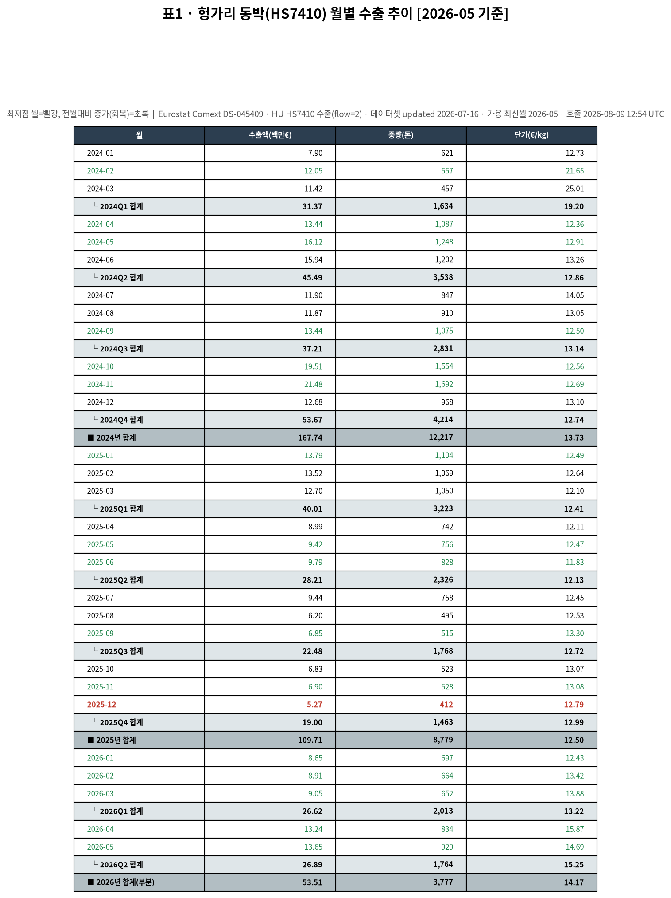
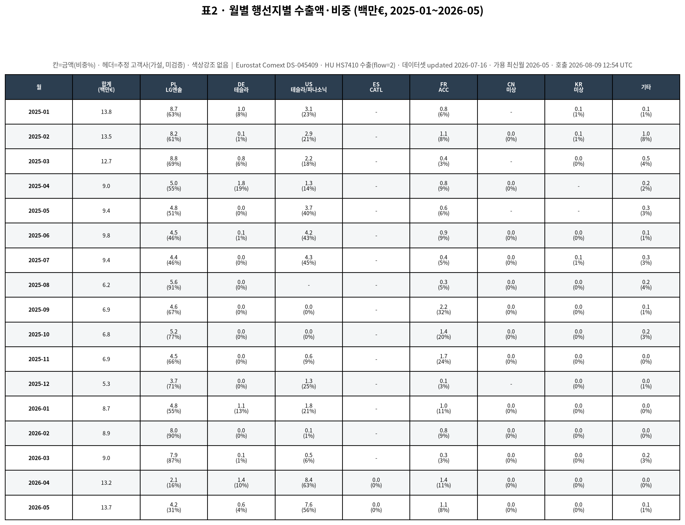
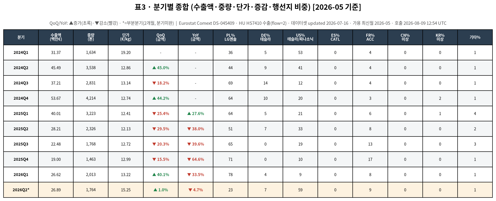
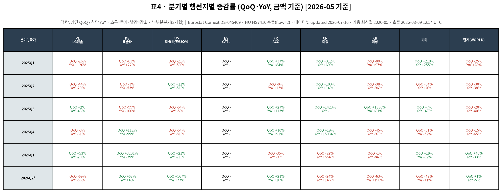

# 솔루스첨단소재(336370) 전지박 수출 대리지표(Proxy) 분기 업데이트 — 2026년 5월 기준

> **데이터 메타** · 데이터셋 updated: **2026-07-16 11:00 (+0200)** · 가용 최신월: **2026-05** · API 호출시각: **2026-08-09 12:54 UTC / 21:54 KST**
> **출처**: Eurostat Comext **DS-045409** (EU trade since 1988 by HS2-4-6 and CN8) — 헝가리(HU) 동박(HS **7410**) 수출(flow=2), 월별(freq=M).

## 한 줄 요약

**2026년 2분기(4~5월, 3개월 중 2개월 집계)에 헝가리 동박수출이 '급증(YoY 플러스 전환)' 국면에 진입했다.** 4·5월 like-for-like 2개월 YoY는 **금액 +46.1%·중량 +17.7%**로, 4월 단월에서 처음 플러스 전환한 YoY가 5월까지 이어지며 (부분)분기 차원에서도 플러스로 자리잡았다. 월평균 run-rate는 Q1 €8.87M → Q2 €13.45M(+51.6%)로 회복이 지속·가속됐다. **급증의 견인국은 미국(추정 테슬라·파나소닉, Q2 비중 59%, 2개월 €4.99M→€15.95M)**, 반면 Q1의 압도적 견인국이던 **폴란드(추정 LG에너지솔루션)는 Q2에 월평균 €6.88M→€3.15M로 후퇴**했다. 이는 솔루스 2Q26 실적발표(2026-07-24)의 "전지박 매출 750억원, YoY +63%, 북미 시장이 성장 견인"과 방향·견인국 모두 정합한다.

---

## 1. 핵심 추세 (proxy 기준, 잠정치)

### 분기 추이 (수출액, 백만€)
| 분기 | 수출액 | QoQ | YoY | 해석 |
|---|---:|---:|---:|---|
| 2025Q1 | 40.0 | −25.4% | +27.6% | |
| 2025Q2 | 28.2 | −29.5% | −38.0% | 하강 |
| 2025Q3 | 22.5 | −20.3% | −39.6% | 하강 |
| 2025Q4 | **19.0** | −15.5% | −64.6% | **바닥(저점)** |
| 2026Q1 | 26.6 | +40.1% | −33.5% | 회복 진입(QoQ+), 급증 아님(YoY−) |
| **2026Q2\*** | **26.9** | (표3 +1.0%*) | (표3 −4.7%*) | **급증 진입 — 단, 2개월 부분집계라 표3의 QoQ/YoY는 왜곡. 아래 like-for-like로 판독** |

> **\* 2026Q2는 4·5월 2개월만 집계(6월은 역내 상세 7~11주 지연으로 미가용).** 표3의 2026Q2 QoQ +1.0%·YoY −4.7%는 **2개월(2026Q2) vs 3개월(2026Q1·2025Q2)** 비교라 기간 불일치로 왜곡된 값이다. 아래 like-for-like·run-rate 지표가 올바른 판독이다.

### 부분분기 왜곡을 보정한 올바른 판독 (핵심)
| 비교 방식 | Q1 → Q2 | 판정 |
|---|---|---|
| **월평균 run-rate** | €8.87M → €13.45M = **+51.6%** | 회복 지속·가속 |
| **like-for-like 2개월 YoY (4~5월, 금액)** | 2025 €18.41M → 2026 €26.89M = **+46.1%** | **YoY 플러스 = 급증 진입 확인** |
| like-for-like 2개월 YoY (4~5월, 중량) | 2025 1,497.9톤 → 2026 1,763.6톤 = **+17.7%** | 물량도 동반 회복(금액 < 중량 → 단가효과 병행) |

- **저점은 2025년 12월(€5.27M, 표1 빨강)**. 이후 **2026-01(€8.65M) → 02(€8.91M) → 03(€9.05M) → 04(€13.24M) → 05(€13.65M)** 5개월 연속 증가(표1 초록).
- **회복 진입 vs 급증 구분**: 2026Q1은 QoQ만 플러스(회복 진입, YoY는 −33.5%)였으나, **2026Q2(4~5월)는 like-for-like YoY까지 플러스(+46.1%)로 전환 → '급증' 국면 진입**. 4월 단월(YoY +47.3%) 신호가 5월(단월 YoY도 플러스)까지 이어져 일시적 스파이크가 아님이 확인됐다.

### 금액 회복 vs 물량 회복 (가격효과 분리)
| 구간 | 수출액(백만€) | 중량(톤) | 단가(€/kg) |
|---|---:|---:|---:|
| 2025Q4 (저점) | 19.0 | 1,462.7 | 12.99 |
| 2026Q1 | 26.6 | 2,012.9 | 13.22 |
| 2026Q2\* (4~5월) | 26.9 | 1,763.6 | 15.25 |

- **금액·물량 동반 회복**: like-for-like YoY 금액 +46.1% > 중량 +17.7% → 회복이 순수 물량만이 아니라 **단가(믹스) 상승을 동반**한다. 단가는 €13.22(Q1) → €15.25/kg(Q2)로 상승.
- 단가 상승은 **고부가 추정 미국향 비중 확대**와 정합적이나, 단월 단가 변동성이 크므로(2026-04 €15.87 → 05 €14.69) 추세 확정 전 보수적으로 해석.

---

## 2. 행선지(추정 고객사)별 흐름

> **추정 고객사 매핑은 가설이며 검증된 사실이 아니다.** 헝가리 적출 통계에는 솔루스 외 타사·타품목이 섞일 수 있다.
> PL=LG에너지솔루션 · DE=테슬라 · US=테슬라/파나소닉 · ES=CATL · FR=ACC · CN/KR=미상

### 2026Q2(4~5월) 행선지 비중 (수출액 기준)
- **US(미국/추정 테슬라·파나소닉) 59%** — Q2 최대 비중, 급증의 핵심 엔진. 2개월 €15.95M(2025 동기 €4.99M 대비 **+220%**), 월별 4월 €8.36M·5월 €7.59M.
- **PL(폴란드/추정 LG엔솔) 23%** — Q1 78%에서 급락. 절대금액도 월평균 €6.88M→€3.15M로 반토막(표4 QoQ −69%). **견인국 교대(PL → US)**가 이번 분기의 구조적 특징.
- FR(프랑스/추정 ACC) 9%(2개월 QoQ +21%, 소폭 반등), DE(독일/추정 테슬라) 7%. ES(CATL)·CN·KR은 사실상 0~미미.

### 견인·이탈 요약
- **견인(회복 주도)**: **US(테슬라/파나소닉)** — 압도적. FR(ACC)이 소폭 가세.
- **이탈(약세)**: **PL(LG엔솔)** — 절대금액 감소. Q1까지 견인하던 유럽(폴란드) 물량이 Q2에 빠지고 그 자리를 북미가 채운 구도.
- CN·KR은 의미 있는 신호 없음(미미/결측).

(월별·분기별 상세 수치는 표2·표3·표4 참조)

---

## 3. 솔루스 직전 분기 실적과 대조

**솔루스첨단소재 2026년 2분기(2Q26) 잠정실적** (2026-07-24 발표, 언론 보도 기준):

| 항목 | 2Q26 | 비교 |
|---|---:|---|
| 연결 매출 | 1,019억원 | YoY +31%(778억), QoQ +16%(881억) |
| **전지박(이차전지용 동박) 매출** | **750억원** | **YoY +63%** (1Q26 610억 대비 QoQ 약 +23%) |
| 영업손익 | **−213억원** | YoY 소폭 확대(−208억), QoQ 적자폭 축소(적자 지속) |

회사 설명: **북미 시장 EV 수요 증가 + AI 데이터센터 확대에 따른 ESS용 공급이 성장 견인**, 유럽도 EV 회복세로 EV·ESS 공급 확대. 헝가리 공장(CAPA 3.8만톤)은 램프업을 거쳐 **하반기 가동률 90%+ 기대**. 적자 지속 사유는 전력비·원자재가 상승, 환율, OLED 신공장 이전 일시비용.

### 대조 판정
- **방향 정합(급증) ✔**: 솔루스 전지박 **YoY +63%** ↔ Eurostat 헝가리 동박수출 **like-for-like 2개월 YoY +46.1%**. 두 지표 모두 **2026Q2 급증(YoY 플러스) 전환**을 동일하게 가리킨다.
- **QoQ 방향 정합 ✔**: 솔루스 전지박 QoQ **약 +23%** ↔ Eurostat 월평균 run-rate QoQ **+51.6%**. 절대 폭은 다르나(수준 비교 불가) 회복 지속 방향 일치.
- **견인국 정합 ✔✔ (proxy 신뢰도 가산)**: 솔루스가 지목한 **"북미가 성장 견인"** ↔ Eurostat **US 비중 59%·2개월 +220% 급증**. 대리지표가 실적의 지역 서사와 국가 레벨에서 일치한 점은 이번 분기 proxy 타당성의 강한 방증.
- **부분 괴리 △**: 솔루스는 "유럽 EV 회복"도 언급했으나, Eurostat상 **PL(추정 LG엔솔) 절대금액은 Q2에 감소**(월평균 €6.88M→€3.15M). 유럽 회복은 아직 헝가리 적출 데이터에 뚜렷이 나타나지 않는다. ① 6월(미가용) 반영 시 달라질 수 있고, ② 유럽향이 헝가리 외 경로로 출하되거나 타품목으로 계상됐을 가능성, ③ 회사의 유럽 언급이 Q2보다 하반기 전망일 가능성을 감안해야 한다.
- **수익성 미회복 일관 ✔**: 물량·매출은 급증했으나 전력·원자재가 부담으로 영업적자(−213억) 지속. 이는 proxy 단가가 아직 정상 마진을 담보하지 못하는 국면과 정합.

> 비교 정렬: 이 루틴은 2Q26 실적발표(2026-07-24) 직후 실행. 2Q26 실적 기간(2026-04~06) 중 **Eurostat는 4·5월만 가용(6월 미반영)**. 따라서 대조는 like-for-like 2개월(4~5월) 기준이며, **6월 확정 시(11월 루틴)** 분기 완결 재확인 필요.

---

## 4. 표 (PNG)

| 표 | 내용 | 파일 |
|---|---|---|
| 표1 | 월별 추이(수출액/중량/단가, 최저점·회복 색표시, 분기·연간 합계) | `table1-monthly-2026-05.png` |
| 표2 | 월별 행선지별 금액·비중(전 국가, 추정 고객사 헤더) | `table2-destination-2026-05.png` |
| 표3 | 분기별 종합(QoQ/YoY ▲▼, 행선지 비중 전체) | `table3-quarterly-2026-05.png` |
| 표4 | 분기별 행선지별 QoQ·YoY(견인/이탈 식별) | `table4-country-qoq-yoy-2026-05.png` |

---

## 5. 한계 및 가정 (반드시 함께 읽을 것)

- **Proxy 가정의 한계**: '헝가리 동박(HS7410) 수출 = 솔루스 전지박'은 가정이다. ① 헝가리 내 솔루스 외 타사·타품목(회로박 등 다른 동박 포함)이 혼입될 수 있고, ② Eurostat는 €·HS코드 기준, 솔루스 실적은 원화·전지박 부문 기준이라 **수준(level)이 아닌 추세(trend)로만** 비교해야 한다.
- **고객사 매핑은 가설**: 행선지국→고객사 매핑(PL=LG엔솔 등)은 검증된 사실이 아니다. 헝가리 내 타 적출 주체가 섞일 수 있다. 특히 이번 US 급증을 '테슬라/파나소닉'으로 단정할 수 없다.
- **부분분기 왜곡(중요)**: 2026Q2는 4·5월 2개월만 집계. **표3의 2026Q2 QoQ(+1.0%)·YoY(−4.7%)는 2개월 vs 3개월 비교로 왜곡된 값**이며, 올바른 판독은 본문 §1의 월평균 run-rate·like-for-like 2개월 지표다. 6월 확정 시 수치가 크게 달라질 수 있다.
- **잠정치·개정 리스크**: Eurostat 역내 상세는 7~11주 지연되며 모든 수치는 **잠정치로 후속 개정 가능**. 특히 최신월(2026-05)과 2026-04는 개정폭이 클 수 있다.
- **실적 수치 출처 편차**: 총매출 기준(연결 vs 별도), 전분기 대비 기준은 매체·잠정/확정에 따라 편차가 있다. 본 대조는 매체 간 일관된 **전지박 부문 매출(YoY +63%)**을 중심으로 판단했다.

---

## 6. 레퍼런스 신뢰도 평가

| 항목 | 등급 | 코멘트 |
|---|---|---|
| 데이터 출처 신뢰도 | **A (높음)** | Eurostat Comext는 EU 공식 무역통계. API·메타데이터(updated 2026-07-16) 명확, 재현 가능. |
| Proxy 가정 타당성 | **B+ (보통~양호)** | 이번 분기 솔루스 전지박 YoY(+63%)·견인국(북미)이 Eurostat YoY(+46.1%)·US 비중(59%)과 **방향+지역 모두 정합** → 전분기 대비 가산. 단, 타사·타품목 혼입·통화/품목 불일치로 수준 비교는 여전히 불가. |
| 고객사 매핑 | **C (낮음, 가설)** | 행선지→고객사 추정은 미검증 가설. US=테슬라/파나소닉 단정 불가. 해석 보조용으로만. |
| 결측·개정 리스크 | **B− (주의)** | 2026Q2 6월 미가용(2개월 부분)으로 분기 판독에 보정 필요, 최신월(4·5월) 잠정·개정 가능. 유럽(PL) 흐름은 실적 서사와 부분 괴리. |
| 종합 | **B+** | 추세·전환(급증 진입) 판단과 견인국 식별에는 이번 분기 신뢰도 양호. 단 절대 수준·고객사 귀속·분기 완결은 신뢰도 낮음(6월 확정 시 재검증). |

---

### 출처
- Eurostat Comext DS-045409 API (헝가리 HS7410 수출, freq=M, flow=2). 호출 2026-08-09 12:54 UTC. 데이터셋 updated 2026-07-16.
- 솔루스첨단소재 2Q26 실적(2026-07-24 발표): 디지털데일리, 아주경제, 이투데이, ZDNet Korea, 아시아투데이 등 언론 보도(잠정실적 기준). 1Q26 전지박 610억원은 IBK투자증권·딜사이트(2026-04~05) 기준.

*본 문서는 자동 분기 루틴 산출물이며 모든 수치는 잠정치입니다. 투자 판단의 책임은 이용자에게 있습니다.*
</content>
</invoke>
