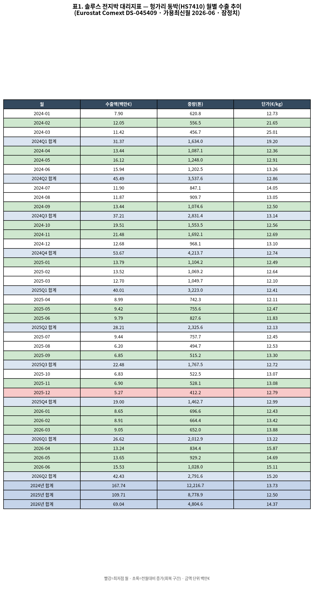
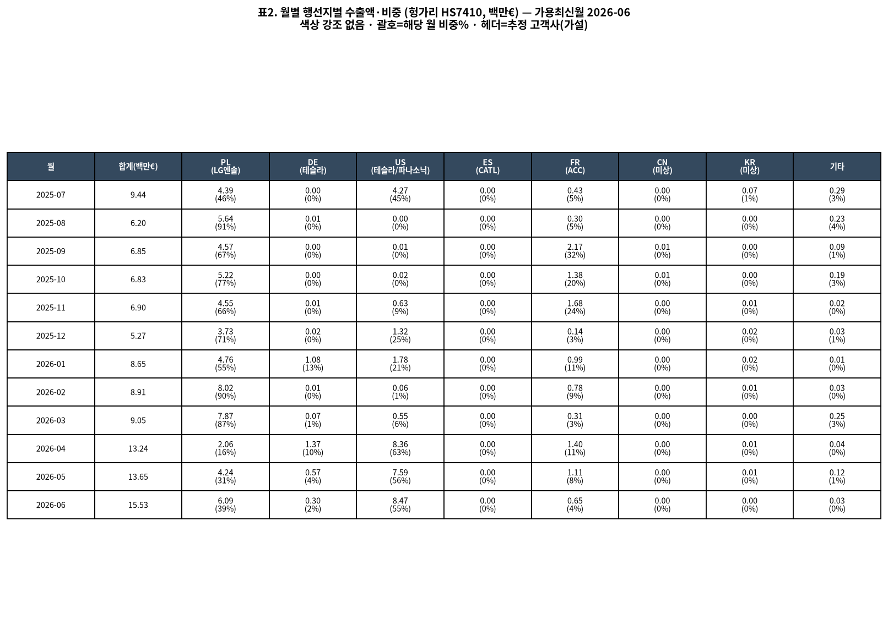
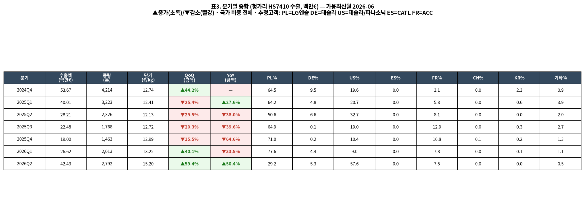
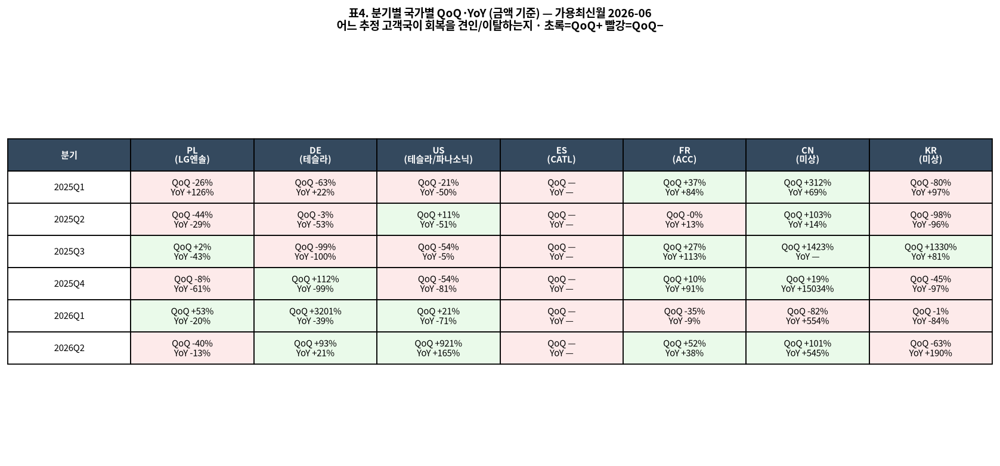

# 솔루스첨단소재(336370) 전지박 수출 대리지표(Proxy) 분기 업데이트 — 2026년 6월 기준

> **데이터 메타** · 데이터셋 updated: **2026-08-14 11:00 (+0200)** · 가용 최신월: **2026-06** · API 호출시각: **2026-08-25 00:09 UTC / 09:09 KST**
> **출처**: Eurostat Comext **DS-045409** (EU trade since 1988 by HS2-4-6 and CN8) — 헝가리(HU) 동박(HS **7410**) 수출(flow=2), 월별(freq=M). 결측·API 오류 없음(8개 행선지 × 2개 지표 전량 수신).

## 한 줄 요약

**2026년 2분기(Apr–Jun) 헝가리 동박수출은 QoQ +59.4%·YoY +50.4%로 '회복 진입'을 넘어 '급증(YoY 플러스 전환)'에 도달했다.** 지난 4월 단월에서 처음 나타났던 YoY 플러스 신호가 2분기 전체(€42.4M)에서 확정됐다. 급증의 견인국은 **미국(추정 테슬라·파나소닉, 2Q26 비중 57.6%·QoQ +921%·YoY +165%)** 이고, **폴란드(추정 LG에너지솔루션)는 이탈**로 전환(QoQ −40%·YoY −13%, 비중 77.6%→29.2%). 솔루스 2Q26 잠정실적의 **전지박 매출 750억원(YoY +63%)** 과 방향이 정합한다.

---

## 1. 핵심 추세 (proxy 기준, 잠정치)

### 분기 추이 (수출액, 백만€)
| 분기 | 수출액 | QoQ | YoY | 해석 |
|---|---:|---:|---:|---|
| 2025Q1 | 40.0 | −25.4% | +27.6% | |
| 2025Q2 | 28.2 | −29.5% | −38.0% | 하강 |
| 2025Q3 | 22.5 | −20.3% | −39.6% | 하강 |
| 2025Q4 | **19.0** | −15.5% | −64.6% | **바닥(저점)** |
| 2026Q1 | 26.6 | +40.1% | −33.5% | 회복 진입(QoQ+), 급증 아님(YoY−) |
| **2026Q2** | **42.4** | **+59.4%** | **+50.4%** | **급증 도달(QoQ+ & YoY+ 동시)** |

- **저점 2025Q4(2025-12, €5.27M) 이후 6개월 연속 월별 증가**: 2026-01(€8.65M) → 02(€8.91M) → 03(€9.05M) → 04(€13.24M) → 05(€13.65M) → 06(€15.53M). 2026-06은 저점(2025-12) 대비 **약 2.9배**.
- **회복 진입 vs 급증 — 이번 분기 급증으로 승격**: 2026Q1은 QoQ만 플러스(회복 진입)였으나, **2026Q2는 QoQ(+59.4%)와 YoY(+50.4%)가 동시에 플러스**로 전환됐다. 지난 루틴(4월 기준)이 "4월 단월 YoY +47.3%는 분기 확정 필요"라고 유보했던 신호가 **2분기 전체 데이터로 확정**됐다.

### 금액 회복 vs 물량 회복 (가격효과 분리)
| 구간 | 수출액(백만€) | 중량(톤) | 단가(€/kg) |
|---|---:|---:|---:|
| 2025Q4 (저점) | 19.0 | 1,462.7 | 12.99 |
| 2026Q1 | 26.6 | 2,012.9 | 13.22 |
| **2026Q2** | **42.4** | **2,791.6** | **15.20** |

- **물량도 동반 급증**: 2026Q2 중량 2,791.6톤(QoQ +38.7%, YoY +20.0% vs 2025Q2 2,325.6톤) → 금액 회복이 단순 가격효과가 아닌 **실물 출하 확대**에서 나옴.
- **단가 상승 지속**: €12.99 → €13.22 → €15.20/kg. 단가 상승 폭(QoQ +15%)이 물량 증가와 겹치며 금액 급증을 증폭. 4월(€15.87)·6월(€15.11)의 고단가는 **미국향(추정 고부가) 비중 확대**와 정합적이나, 통화·믹스 변동성이 크므로 추세 수준으로만 해석.

---

## 2. 행선지(추정 고객사)별 흐름 — **견인국 교대 확정**

> **추정 고객사 매핑은 가설이며 검증된 사실이 아니다.** 헝가리 적출 통계에는 솔루스 외 타사·타품목이 섞일 수 있다.
> PL=LG에너지솔루션 · DE=테슬라 · US=테슬라/파나소닉 · ES=CATL · FR=ACC · CN/KR=미상

### 2026Q2 행선지 비중 (수출액 기준)
- **US(미국/추정 테슬라·파나소닉) 57.6%** — 2분기 급증의 **핵심 엔진**. QoQ +921%, YoY +165%. 2025년 하반기 사실상 0%까지 위축됐던 미국향이 극적으로 반등.
- **PL(폴란드/추정 LG엔솔) 29.2%** — 비중이 직전분기 77.6%에서 급락. **QoQ −40%·YoY −13%로 이탈**. 다만 절대 금액은 6월 €6.09M로 4월 저점(€2.06M) 대비 회복 중이라 '완전 이탈'보다는 '상대 비중 축소 + 재회복' 국면.
- **FR(프랑스/추정 ACC) 7.5%** (QoQ +52%·YoY +38%로 재개선), **DE(독일/추정 테슬라) 5.3%** (QoQ +93%·YoY +21%).
- ES(CATL)·CN·KR은 사실상 0~미미(KR은 6월 0, 2분기 비중 0.0%).

### 견인/이탈 요약
- **견인**: US(압도적) > FR·DE(소폭 개선).
- **이탈/약세**: PL(비중·YoY 모두 하락), KR(소멸 수준).
- **해석(가설)**: 미국향 급증은 솔루스가 제시했던 "북미 신규 고객사 공급 개시 + 기존 고객 물량 확대"와 정합. 반면 폴란드(LG엔솔 추정) 비중 축소는 헝가리 적출 물량의 목적지 믹스가 미국 쪽으로 이동했음을 시사(가설). 단, 헝가리 내 타 적출 주체 혼입 가능성으로 인해 국가→고객사 귀속은 여전히 추정에 불과하다.

(상세 수치는 표3·표4 참조)

---

## 3. 솔루스 직전 분기 실적과 대조

**솔루스첨단소재 2026년 2분기(2Q26) 잠정실적** (발표일 **2026-07-24**, 언론 보도 기준):

| 항목 | 2Q26 | QoQ | YoY |
|---|---:|---:|---:|
| 연결 매출 | 1,019억원 | +16% | +31% |
| **전지박(이차전지용 동박) 매출** | **750억원** | — | **+63%** |
| 영업손익 | **−213억원** | 적자폭 축소(전분기 대비) | 전년 −208억 대비 소폭 확대 |

- **방향 일치(정합, 이번 분기 특히 강함)**: 솔루스 **전지박 매출 YoY +63%** ↔ Eurostat 헝가리 동박수출 **2026Q2 YoY +50.4%**. 두 지표 모두 **2Q26 급증(YoY 플러스 전환)** 을 동일하게 가리킨다. 물량·방향 모두 proxy 연동성이 이번 분기에 매우 잘 작동.
- **성장 드라이버도 정합**: 솔루스가 밝힌 "기존 주요 고객사 물량 확대 + 신규 고객사 공급 + AI 데이터센터/ESS용 수요"는 Eurostat에서 관측된 **미국향(추정 테슬라·파나소닉) 급증(비중 57.6%)** 과 스토리상 부합(가설).
- **수익성은 아직 미회복**: 판매 확대·가동률 상승에도 전력비·원자재·환율 부담, OLED 신공장 이전 비용 등으로 **영업적자(−213억) 지속**. 다만 전분기 대비 **적자폭은 축소** — Eurostat 단가 상승(믹스 개선)과 방향은 같으나, 수출 급증이 곧 흑자를 의미하지는 않음.

> 비교 정렬: 이 루틴은 2Q26 실적발표(2026-07-24) 직후 실행. 2Q26 실적이 커버하는 기간(2026-04~06) = Eurostat **2026Q2** 데이터와 정확히 일치하므로 직접 대조 가능. 이번 분기는 가용 최신월(2026-06)이 실적 분기 말과 정확히 일치해 시차 왜곡이 없다.

---

## 4. 표 (PNG)

| 표 | 내용 | 파일 |
|---|---|---|
| 표1 | 월별 추이(수출액/중량/단가, 최저점·회복 색표시, 분기·연간 합계) | `table1-monthly-2026-06.png` |
| 표2 | 월별 행선지별 금액·비중(전 국가, 추정 고객사 헤더) | `table2-destination-2026-06.png` |
| 표3 | 분기별 종합(QoQ/YoY ▲▼, 행선지 비중 전체) | `table3-quarterly-2026-06.png` |
| 표4 | 분기별 행선지별 QoQ·YoY(견인/이탈 식별) | `table4-country-qoq-yoy-2026-06.png` |

---

## 5. 한계 및 가정 (반드시 함께 읽을 것)

- **Proxy 가정의 한계**: '헝가리 동박(HS7410) 수출 = 솔루스 전지박'은 가정이다. ① 헝가리 내 솔루스 외 타사·타품목(회로박 등 다른 동박 포함)이 혼입될 수 있고, ② Eurostat는 €·HS코드 기준, 솔루스 실적은 원화·전지박 부문 기준이라 **수준(level)이 아닌 추세(trend)로만** 비교해야 한다.
- **고객사 매핑은 가설**: 행선지국→고객사 매핑(PL=LG엔솔, US=테슬라/파나소닉 등)은 검증된 사실이 아니다. 헝가리 내 타 적출 주체가 섞일 수 있으며, 특히 이번 분기의 미국향 급증을 특정 고객사에 귀속하는 것은 추정이다.
- **잠정치·개정 리스크**: Eurostat 역내 상세는 7~11주 지연되며 모든 수치는 **잠정치로 후속 개정 가능**. 특히 최신월(2026-06)은 개정폭이 클 수 있다.
- **QoQ 기저효과 주의**: 미국향 QoQ +921%는 직전분기(2026Q1) 미국 비중이 9.0%로 낮았던 기저 탓이 크다. 절대 금액(2Q26 US €24.4M) 회복이 실질이며, 증감률은 기저와 함께 읽어야 한다.

---

## 6. 레퍼런스 신뢰도 평가

| 항목 | 등급 | 코멘트 |
|---|---|---|
| 데이터 출처 신뢰도 | **A (높음)** | Eurostat Comext는 EU 공식 무역통계. API·메타데이터(updated 2026-08-14) 명확, 결측 없음, 재현 가능. |
| Proxy 가정 타당성 | **B+ (보통~양호)** | 이번 분기 솔루스 전지박 YoY(+63%)와 Eurostat YoY(+50.4%) 방향·크기 모두 정합으로 가산점. 2개 분기(1Q·2Q) 연속 방향 일치. 단, 타사·타품목 혼입·통화/품목 불일치로 수준 비교는 여전히 불가. |
| 고객사 매핑 | **C (낮음, 가설)** | 행선지→고객사 추정은 미검증 가설. 미국향 급증의 고객사 귀속도 해석 보조용으로만. |
| 결측·개정 리스크 | **B (주의)** | 최신월(6월) 잠정·개정 가능성. 이번 분기는 실적 분기와 데이터 커버리지가 정확히 일치해 시차 왜곡은 없음. |
| 종합 | **A− / B+** | 추세 방향성 판단에는 이번 분기 특히 유용(2분기 연속 정합). 절대 수준·고객사 귀속은 신뢰도 낮음 유지. |

---

### 출처
- Eurostat Comext DS-045409 API (헝가리 HS7410 수출, freq=M, flow=2). 호출 2026-08-25 00:09 UTC. 원자료 `eurostat-raw-2026-06.json`.
- 솔루스첨단소재 2Q26 실적(발표 2026-07-24): [아시아투데이](https://www.asiatoday.co.kr/kn/view.php?key=20260724010008935), [아주경제](https://www.ajunews.com/view/20260724132538517), [글로벌이코노믹](https://www.g-enews.com/article/Industry/2026/07/2026072413471930563084322ec9_1), [디지털데일리](https://www.ddaily.co.kr/page/view/2026072414050544400) 등 언론 보도(잠정실적 기준).

*본 문서는 자동 분기 루틴 산출물이며 모든 수치는 잠정치입니다. 투자 판단의 책임은 이용자에게 있습니다.*
</content>
</invoke>
