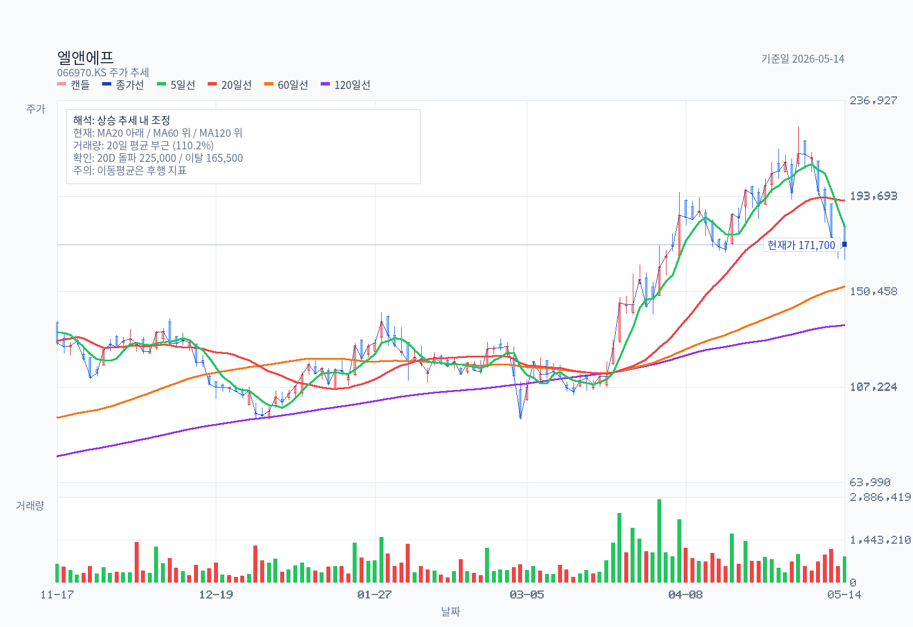
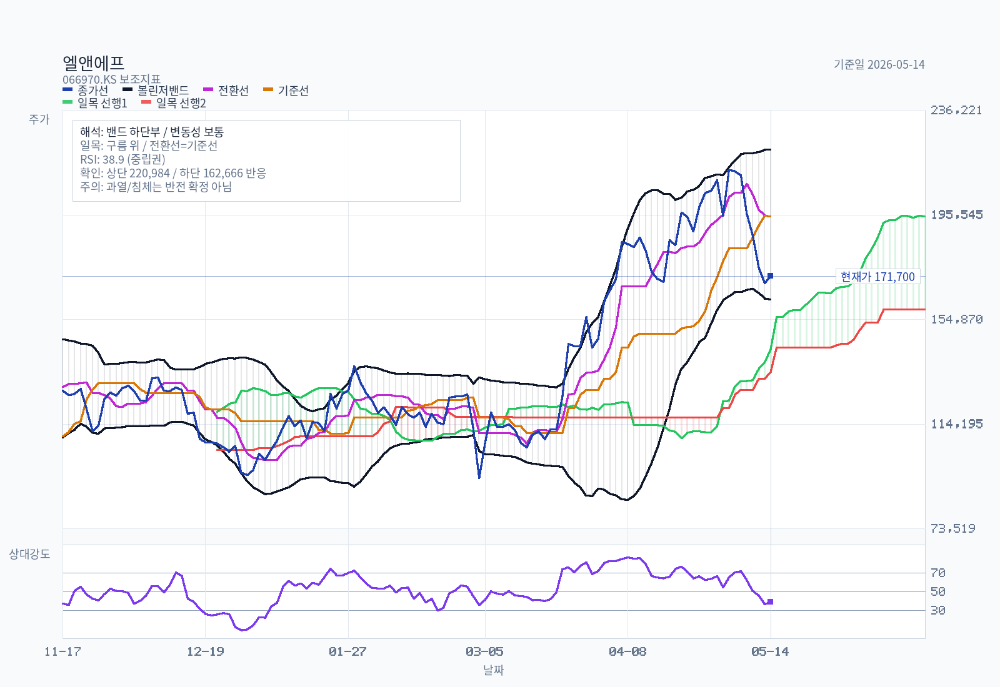
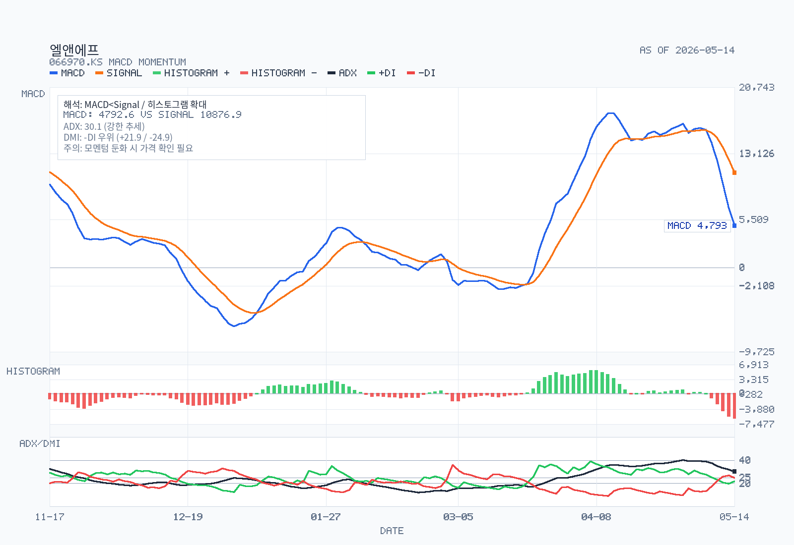
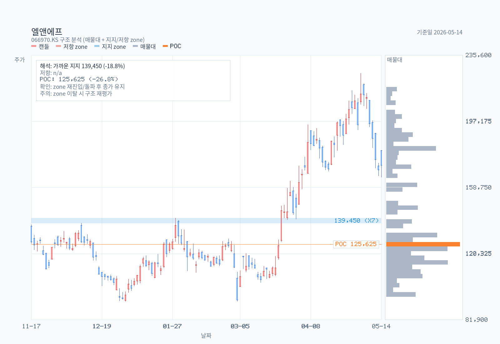
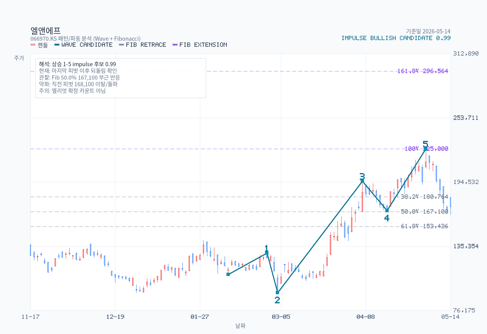

# Advanced Chart Analysis: 066970.KS

- Name: 엘앤에프
- Latest date: 2026-05-14
- Latest close: 171700.00
- Moving-average structure: pullback-inside-uptrend
- Bollinger read: lower-half
- Ichimoku read: above-cloud
- RSI state: neutral
- MACD state: bearish / above-zero
- ADX state: strong-trend / bearish / falling
- Volume regime: normal
- Chart-only flow: range-bound or base-building

## Chart Images

The main chart uses OHLC candlesticks with upper and lower wicks, plus MA5, MA20, MA60, MA120, and volume. The overlay chart separates Bollinger Bands, Ichimoku cloud lines, and RSI14, and reserves 26 forward slots for the projected cloud. The momentum chart focuses on MACD, signal, histogram, and ADX/DMI so crossovers, momentum acceleration, and trend strength are easier to see. The structure chart pairs candles with a horizontal volume-by-price gutter (POC highlighted) and ATR-tolerance clustered support/resistance zones drawn as horizontal price bands (up to 3 each, within ±30% of current price). The pattern chart adds recent swing-pivot wave candidates and Fibonacci retracement/extension levels; labels are drawn only for candidates with confidence >= 0.55, while all candidates are exported to a sibling `-waves.csv`. The full zone roster — including broken or distance-filtered zones — is exported to a sibling `-zones.csv`.

## Support / Resistance Zones (Structure Chart)

| Type | Zone | Center | Touches | Last Touch | Score | Status |
| --- | --- | --- | --- | --- | --- | --- |
| support | 138,000 ~ 140,900 | 139,450 | 7 | 2026-04-01 | 0.401 | active |

Full zone roster (including broken / distance-filtered): `엘앤에프-chart-structure-zones.csv`

## Pattern / Wave Candidates

Selected drawable candidate: impulse / bullish / confidence 0.988.

| Kind | Direction | Status | Confidence | Points |
| --- | --- | --- | --- | --- |
| impulse | bullish | drawable | 0.988 | start:2026-02-06@109,200 → 1:2026-02-26@129,000 → 2:2026-03-04@92,500 → 3:2026-04-07@195,300 → 4:2026-04-16@168,100 → 5:2026-05-04@225,000 |
| corrective | bullish-correction | drawable | 0.838 | A:2026-04-07@195,300 → B:2026-04-16@168,100 → C:2026-05-04@225,000 |
| impulse | bearish | drawable | 0.770 | start:2026-01-28@140,900 → 1:2026-02-06@109,200 → 2:2026-02-26@129,000 → 3:2026-03-04@92,500 → 4:2026-04-07@195,300 → 5:2026-04-16@168,100 |
| corrective | bearish-correction | drawable | 0.736 | A:2026-03-04@92,500 → B:2026-04-07@195,300 → C:2026-04-16@168,100 |
| impulse | bullish | drawable | 0.713 | start:2025-11-24@111,000 → 1:2025-12-10@138,000 → 2:2026-01-05@92,500 → 3:2026-01-28@140,900 → 4:2026-02-06@109,200 → 5:2026-02-26@129,000 |

Full wave roster: `엘앤에프-chart-pattern-waves.csv`

## Indicators

| Metric | Value |
| --- | --- |
| MA 5 | 179760.00 |
| MA 20 | 191825.00 |
| MA 60 | 152723.33 |
| MA 120 | 135230.83 |
| Bollinger Upper | 220984.00 |
| Bollinger Middle | 191825.00 |
| Bollinger Lower | 162666.00 |
| Bollinger Width | 30.40% |
| Tenkan | 194850.00 |
| Kijun | 194850.00 |
| Current Cloud A | 143175.00 |
| Current Cloud B | 134500.00 |
| Future Cloud A | 194850.00 |
| Future Cloud B | 158750.00 |
| RSI 14 | 38.94 |
| MACD | 4792.59 |
| Signal | 10876.93 |
| Histogram | -6084.34 |
| MACD State | bearish / above-zero |
| Histogram State | expanding |
| ADX 14 | 30.15 |
| +DI | 21.94 |
| -DI | 24.85 |
| ADX State | strong-trend / bearish / falling |
| Avg Volume 20 | 817773 |
| Volume vs Avg 20 | 110.2% |
| 20D Breakout Level | 225000.00 |
| 20D Breakdown Level | 165500.00 |

## Read

- Trend structure: price is below MA20 but still above MA60, which keeps this closer to a pullback than a full trend break.
- Volatility: price is in the lower half of the Bollinger range, and band width is stable.
- Cloud read: price is above the current cloud, tenkan and kijun are flat, and the projected cloud is bullish.
- Momentum and participation: RSI14 is neutral at 38.94; MACD remains below signal, and MACD is above zero; histogram momentum is expanding; ADX shows a strong trend, with -DI in front, and trend strength is fading; volume is close to the 20-day average.
- Practical checklist: nearest support watch is 165,500; first recovery check is 191,825, then 194,850; 20-day breakout level sits at 225,000; 20-day breakdown level sits at 165,500; chart-only flow is range-bound or base-building.
