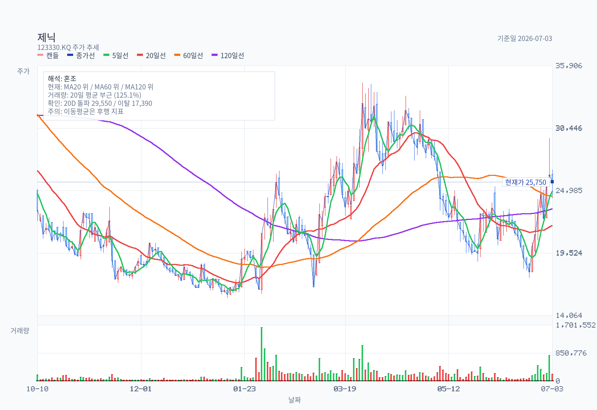
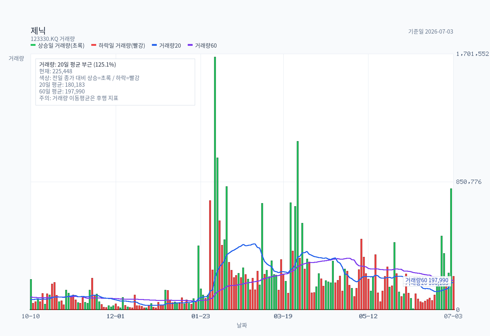
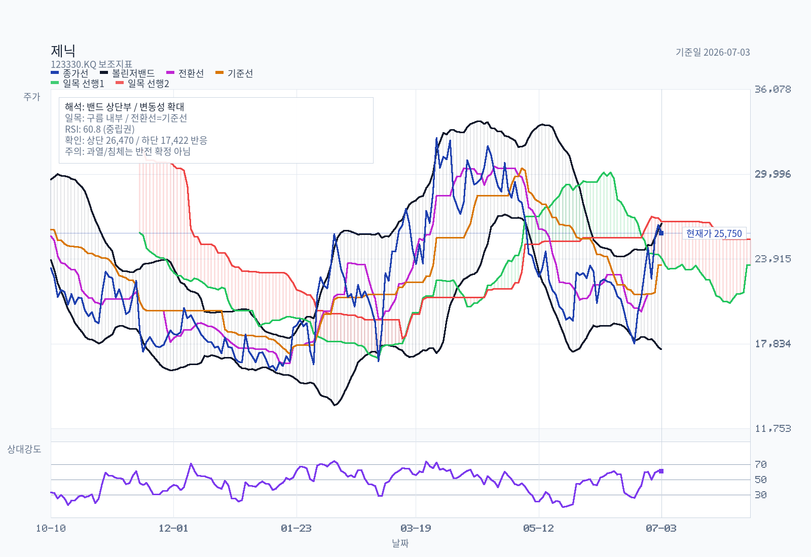
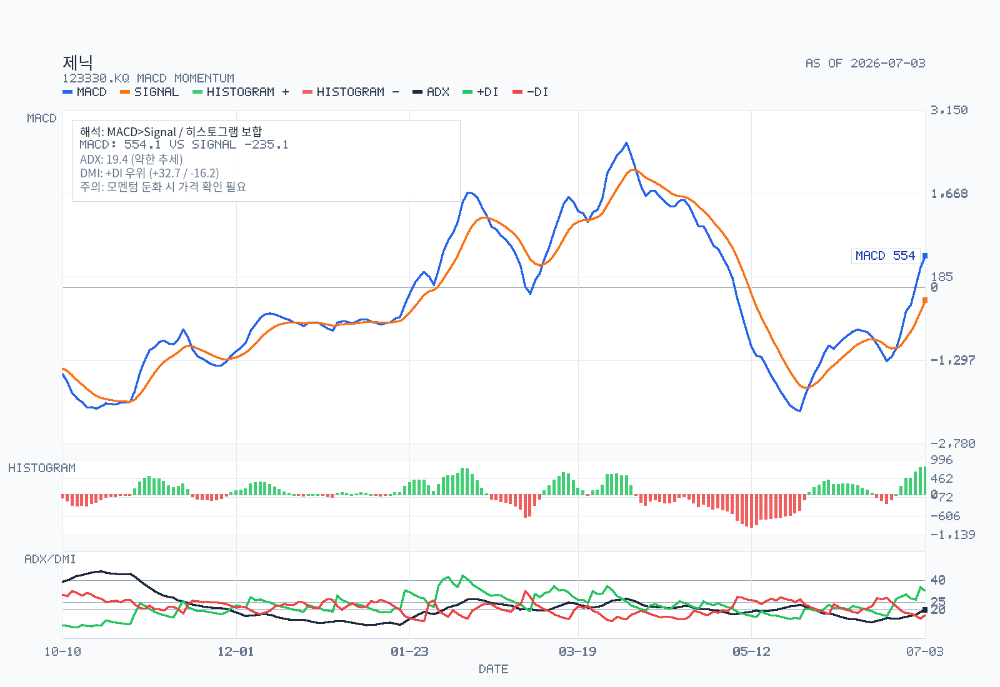
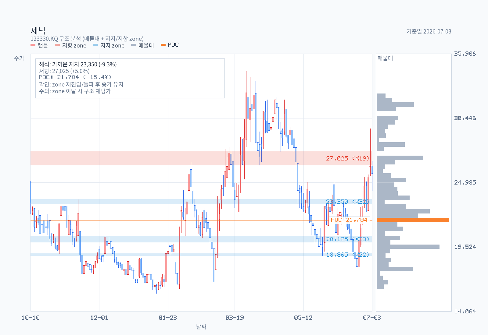
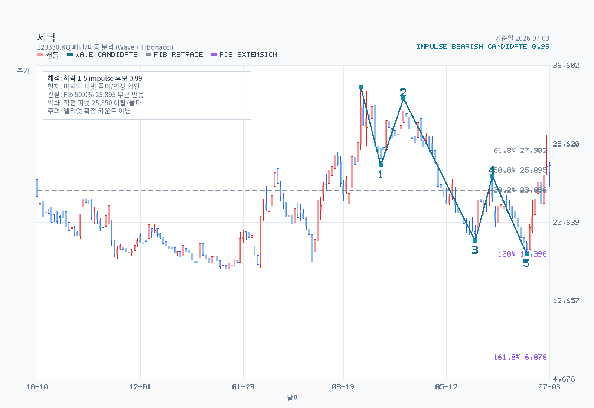

# 제닉 (123330) Full Memo

- 기준일: 2026-07-03
- 분석 모드: full memo
- 최근 업데이트일: 2026-07-03
- 보통주 / KOSDAQ / operating company

## Decision Frame

제닉의 투자판단을 바꾸는 핵심은 "하이드로겔 마스크팩 ODM 수요가 실제로 구조적 성장인지, 아니면 2025~2026년의 주문/가동률 사이클인지"다. 2025년에는 매출 782억원, 영업이익 150억원으로 턴어라운드가 확인됐지만, 1Q26에는 매출이 65% 늘었는데 영업이익은 감소했다. 따라서 지금은 단순한 성장주 추격보다 2Q26 이후 수율 정상화, 매출채권 회수, 고객 집중도, 라인 증설의 실제 마진 기여를 확인해야 한다.

현재 스탠스는 `추가 검증 후 관찰 유지`다. 2026E 순이익 207억원(KIRS) 기준 forward PER은 약 9.9배로 과도하게 비싸 보이지 않지만, P/B 4.6배와 EV/EBITDA 12.2배는 이미 하이드로겔 ODM의 구조적 수요와 높은 수익성을 상당 부분 반영한다. 투자판단을 위로 바꾸려면 2Q26~3Q26에서 매출 성장과 OPM 회복이 동시에 확인되어야 한다.

## Summary

핵심 질문은 — 하이드로겔 ODM 성장성과 1Q26 마진 검증.

제닉은 하이드로겔 마스크팩에 특화된 화장품 ODM/OEM 회사다. 2025년에는 하이드로겔 얼굴 마스크 중심의 수요 회복으로 매출 781.98억원, 영업이익 149.74억원, 당기순이익 188.87억원을 기록하며 턴어라운드했다. 다만 1Q26은 매출 293.56억원으로 성장했지만 영업이익률이 11.6%로 낮아졌고, 영업활동현금흐름도 -55.36억원으로 악화됐다. 기준일은 2026-07-03이며, 가격·차트·밸류에이션은 2026-07-03 종가 25,750원을 사용했다.

## Business and Thesis

제닉은 수용성 하이드로겔 마스크팩, 시트마스크팩, 기초화장품 등을 개발·제조·판매한다. 2026년 1분기 공시 기준 핵심 사업은 자체 브랜드보다 OEM/ODM이며, 하이드로겔 얼굴 마스크가 제품 매출의 대부분을 차지한다. 이 회사의 장점은 하이드로겔 조성, 시트화, 양산, 품질관리 경험이 축적되어 있다는 점이다.

투자 논지는 단순하다. 글로벌 K-뷰티와 프리미엄 마스크팩 수요가 늘고, 하이드로겔을 안정적으로 대량 생산할 수 있는 공급자가 제한적이라면 제닉의 가동률과 단가가 동시에 좋아질 수 있다. 반대로 이 논지가 틀리는 지점도 명확하다. 수요가 특정 고객 신제품 사이클에 치우쳐 있거나, 증설 이후 수율과 인건비가 안정되지 않거나, 매출채권 증가가 반복되면 2025년의 이익률을 구조적 기준으로 보기 어렵다.

## 제닉 제품은 어디로 들어가나

제닉을 볼 때 소비자가 직접 만나는 브랜드 회사로 보면 놓치는 부분이 있다. 공시상 제닉의 핵심은 자체 브랜드가 아니라 `브랜드사 → 제닉 ODM/OEM 생산 → 국내외 유통채널`로 이어지는 제조 파트너 포지션이다. 2026년 1분기 기준 사업부문 매출의 85.93%가 OEM/ODM이고, 제품 기준으로는 하이드로겔 얼굴 마스크가 78.47%를 차지한다. 즉 제닉의 실적은 특정 소비자 브랜드의 판매량보다, 하이드로겔 마스크를 대량으로 안정 생산해 줄 수 있는 ODM 수요에 더 직접적으로 연결된다.

| 구분 | 확인 수준 | 내용 | 투자 포인트 |
| --- | --- | --- | --- |
| 공시로 확인되는 구조 | confirmed | 1Q26 매출은 OEM/ODM 252.25억원, 브랜드 12.59억원, 수출 28.99억원이다. 고객별 매출 비중과 고객명은 DART에서 별도 공시되지 않는다. | 제닉은 전면 브랜드보다 후방 제조사로 봐야 한다. 고객 집중도는 핵심 공백이다. |
| 제품군 | confirmed | 하이드로겔 얼굴 마스크가 1Q26 제품 매출의 78.47%, 2025년 제품 매출의 75.44%다. | 제닉의 레버리지는 하이드로겔 마스크 카테고리 성장에 집중되어 있다. |
| 주요 downstream 브랜드 | 보도/리서치 기준 | 이투데이 보도는 북미 인디 브랜드 바이오던스를 제닉 성장의 핵심으로 지목했고, 제닉이 일본을 제외한 글로벌 물량을 담당한다고 설명했다. | 바이오던스 같은 글로벌 인디 브랜드의 주문 지속성이 실적의 핵심 변수가 된다. |
| 유통 채널 | 리테일 페이지 확인 | 바이오던스 하이드로겔 마스크는 Amazon, Sephora, Costco 등 미국 주요 채널에서 확인된다. Amazon 상품 페이지는 `100K+ bought in past month`를 표시하고, Costco는 24팩 상품을 판매한다. | 제닉이 직접 유통하는 구조가 아니라, 고객 브랜드의 미국 온라인·대형 리테일 확장이 제닉 주문으로 연결되는 구조다. |
| 수요 확장 | sell-side view | 하나증권은 Amazon·Sephora뿐 아니라 Target, Costco, Walgreens 등 미국 주요 리테일의 하이드로겔 마스크 입점 수요와 국내외 브랜드의 신제품 출시 수요가 동시에 커지고 있다고 본다. | 단일 브랜드만이 아니라 카테고리 전체 ODM 수요가 늘어나는지가 밸류에이션의 핵심이다. |

따라서 제닉 제품이 "어디에 들어가느냐"를 한 문장으로 정리하면, `북미 중심 K-뷰티 인디 브랜드의 하이드로겔 마스크 제품에 들어가고, 최종 판매는 Amazon에서 시작해 Sephora, Costco, Ulta, Target, Walgreens 같은 대형 채널로 확장되는 구조`다. 다만 DART가 고객사명과 고객별 매출 비중을 공개하지 않기 때문에, 바이오던스 노출도와 채널별 물량은 공시 사실이 아니라 보도·리서치로 교차 확인해야 하는 영역이다.

## Revenue Mix

| 구분 | 1Q26 매출 | 1Q26 비중 | 2025 매출 | 2025 비중 | 출처 |
| --- | ---: | ---: | ---: | ---: | --- |
| 하이드로겔 마스크류(얼굴) | 230.37억원 | 78.47% | 589.96억원 | 75.44% | DART 사업의 내용 |
| 하이드로겔 마스크류(아이) | 14.20억원 | 4.84% | 55.67억원 | 7.12% | DART 사업의 내용 |
| 기초류 | 27.18억원 | 9.26% | 55.38억원 | 7.08% | DART 사업의 내용 |
| 에센스마스크류 | 16.97억원 | 5.78% | 67.07억원 | 8.58% | DART 사업의 내용 |
| 필름/코팩류 | 2.93억원 | 1.00% | 9.58억원 | 1.23% | DART 사업의 내용 |
| 기타 | 1.91억원 | 0.65% | 4.32억원 | 0.55% | DART 사업의 내용 |
| 합계 | 293.56억원 | 100.00% | 781.98억원 | 100.00% | DART 사업의 내용 |

사업부문 기준 1Q26 매출은 OEM/ODM 252.25억원(85.93%), 브랜드 12.59억원(4.29%), 수출 28.99억원(9.88%), 기타 -0.27억원이다. 지역/수출 관점에서는 국내 제품 매출 264.84억원, 수출 매출 28.99억원으로 공시된다. 고객별 매출 비중과 최대 고객사 이름은 DART에서 별도 공시되지 않는다.

## What The Latest Results Say

| 지표 | 1Q26 | 1Q25 | YoY | 2025 | 2024 | YoY |
| --- | ---: | ---: | ---: | ---: | ---: | ---: |
| 매출액 | 293.56억원 | 178.28억원 | +64.7% | 781.98억원 | 499.08억원 | +56.7% |
| 영업이익 | 34.11억원 | 37.61억원 | -9.3% | 149.74억원 | 60.24억원 | +148.6% |
| 당기순이익 | 34.76억원 | 35.16억원 | -1.1% | 188.87억원 | 75.63억원 | +149.7% |
| 영업이익률 | 11.6% | 21.1% | -9.5%p | 19.1% | 12.1% | +7.0%p |
| 영업활동현금흐름 | -55.36억원 | 45.79억원 | 적자전환 | 206.51억원 | 2.72억원 | 개선 |

1Q26은 매출 성장의 질을 확인해야 하는 분기다. 매출은 전년 대비 65% 증가했지만, 매출원가율과 운전자본 부담이 커졌다. 연결 현금흐름표상 1Q26 매출채권은 142.66억원 증가했고, 재고도 16.68억원 증가했다. 이는 고성장 국면에서 자연스러운 현상일 수 있지만, 고객 검수/결제 조건이나 재고 리스크로 이어지면 밸류에이션을 낮춰야 한다.

## DART Recheck

| 주장 | 상태 | 확인값 또는 판단 | 출처 | 비고 |
| --- | --- | --- | --- | --- |
| 1Q26 매출은 크게 성장했지만 영업이익은 감소했다 | confirmed | 매출 293.56억원(+64.7% YoY), 영업이익 34.11억원(-9.3% YoY) | 2026 1Q DART | 성장과 마진을 분리해서 봐야 함 |
| 2025년 턴어라운드는 공시 숫자로 확인된다 | confirmed | 2025 매출 781.98억원, 영업이익 149.74억원, 순이익 188.87억원 | 2025 사업보고서 | 순이익에는 세효과도 포함 |
| 매출은 하이드로겔 얼굴 마스크와 OEM/ODM에 집중되어 있다 | confirmed | 하이드로겔 얼굴 78.47%, OEM/ODM 85.93% | 2026 1Q DART | 단일 제품군/채널 집중 |
| 고객별 집중도는 공개되어 있다 | not separately disclosed | 고객별 매출 비중 없음 | 2026 1Q DART | 가장 큰 검증 공백 |
| 1Q26 현금흐름 악화는 운전자본 증가와 관련 있다 | confirmed | CFO -55.36억원, 매출채권 증가 142.66억원, 재고 증가 16.68억원 | 2026 1Q DART | 다음 분기 회수 확인 필요 |
| 솔브레인홀딩스 영향력이 크다 | confirmed | 최대주주 34.55%, 2024년 제3자배정 이후 지분 상승 | 2025 사업보고서 | 지배구조/환원정책 점검 필요 |

## Street / Alternative Views

| Source role | Date | Takeaway | Verification status | Source |
| --- | --- | --- | --- | --- |
| KIRS | 2026-04-09 | 2026E 매출 1,019억원, 영업이익 226억원, 지배순이익 207억원 전망 | research estimate | https://w4.kirs.or.kr/download/research/260409_%EC%A0%9C%EB%8B%89.pdf |
| 하나증권 | 2026-06-05 | 1Q26 매출은 강했지만 OPM이 기대보다 낮았고, 2Q26 매출 396억원·영업이익 76억원을 전망 | broker estimate | https://www.hanaw.com/main/research/research/download.cmd?attachFileSeq=1&bbsCd=2224&bbsId=&bbsSeq=1287448&dbType= |
| 유안타증권 | 2026-05-14 | 마스크팩 수출 확대와 CAPA 확대를 2026년 실적 기대 요인으로 제시 | broker estimate | https://file.alphasquare.co.kr/media/pdfs/market-report/%EC%A0%9C%EB%8B%8926%EB%85%8420260514%EC%9C%A0%EC%95%88%ED%83%80%EC%A6%9D%EA%B6%8C. |
| IRGO | 2026-06-24 | 교보증권의 N/R 리포트 존재는 확인되나 직접 PDF 다운로드는 접근 제한 | source availability | https://m.irgo.co.kr/IR-COMP/123330/-IR-PAGE |
| Naver independent | 2026-07-03 | 적격 Naver 블로거 후보 0건 | no qualifying posts | `naver-insights.md` |
| Foreign IB | 2026-07-03 | Korean news 기반 외국계 IB 커버리지 확인 없음 | empty / script-limited | `foreign-views.md` |

외부 시각의 공통점은 수요가 아니라 마진 회복을 다음 검증 지점으로 본다는 점이다. 하나증권은 1Q26 수익성 저하를 초과근무와 신제품 초기 수율 문제로 해석했고, 2Q26에는 라인 증설과 수율 안정화로 매출·마진이 회복될 것으로 본다. 이 주장은 아직 DART로 확인되지 않았으므로 2Q26 분기보고서나 잠정실적이 나오기 전까지는 `Street view`로만 다룬다.

## Current Valuation Snapshot

| 항목 | 값 | 기준일 | 산식/비고 |
| --- | ---: | --- | --- |
| price / 현재가 | 25,750원 | 2026-07-03 | 종가 |
| market cap / 시가총액 | 약 2,052억원 | 2026-07-03 | 종가 × 발행주식수 7,968,680주 |
| TTM 매출 | 897.27억원 | 2026-03-31 | 2025 + 1Q26 - 1Q25 |
| TTM 영업이익 | 146.24억원 | 2026-03-31 | 2025 + 1Q26 - 1Q25 |
| TTM 순이익 | 188.47억원 | 2026-03-31 | 2025 + 1Q26 - 1Q25 |
| Trailing PER | 10.9x | 2026-07-03 | 시가총액 / TTM 순이익 |
| Forward PER | 9.9x | 2026-07-03 | KIRS 2026E 순이익 207억원 기준 |
| EV/EBITDA | 12.2x | 2026-07-03 | EV / TTM EBITDA |
| PBR / P/B | 4.6x | 2026-07-03 | 시가총액 / 1Q26 자본총계 |
| 2025 FCF yield | 8.8% | 2026-07-03 | 2025 CFO - 유형자산 취득 |
| TTM FCF yield | 2.8% | 2026-07-03 | 1Q26 운전자본 부담 반영 |
| 배당수익률 | 0.0% | 2025 결산 | 2023~2025 결산배당 없음 |
| 순차입금 | 약 5.5억원 | 2026-03-31 | 단기차입금+리스부채-현금 |

현재 주가는 2025년 연말 16,520원 대비 크게 올라와 있다. 이익이 유지된다면 trailing PER은 부담스럽지 않지만, P/B와 EV/EBITDA는 이미 정상화된 마진과 구조적 성장성을 요구한다. 따라서 싸다/비싸다의 결론보다 "2026년 연간 OPM이 2025년 19% 수준으로 회복되는가"가 더 중요하다.

## Historical Valuation Bands

| 기준 | 연말/현재가 | 시총 | P/E | P/B | EV/EBITDA | 해석 |
| --- | ---: | ---: | ---: | ---: | ---: | --- |
| 2023 | 3,600원 | 252억원 | NM | 2.2x | NM | 적자 구간 |
| 2024 | 22,950원 | 1,829억원 | 24.2x | 8.3x | 24.4x | 턴어라운드 기대 선반영 |
| 2025 | 16,520원 | 1,316억원 | 7.0x | 3.2x | 7.0x | 실적 확인 후 배수 하락 |
| 2026-07-03 | 25,750원 | 2,052억원 | 10.9x | 4.6x | 12.2x | 재성장/마진 회복 기대 반영 |

P/E band: `NM -> 24.2x -> 7.0x -> 10.9x`

P/B band: `2.2x -> 8.3x -> 3.2x -> 4.6x`

EV/EBITDA band: `NM -> 24.4x -> 7.0x -> 12.2x`

2023년은 적자라 밴드로 쓰기 어렵고, 2024년은 턴어라운드 기대가 먼저 가격에 반영된 구간이다. 의미 있는 비교는 2025년 실적 확인 후 7배대 이익 배수에서 현재 10~12배대로 재평가된 변화다. 2026년 실적이 KIRS 전망처럼 매출 1,000억원, 영업이익 200억원대를 넘기면 현재 배수는 방어될 수 있지만, 1Q26 마진이 반복되면 다시 비싸 보일 수 있다.

## Chart and Positioning

### Rule Screen

- Minervini Trend Template: `fail`
- KRX 52주 신고가 리더십 점수: `20/100` (Grade `D`)

| 항목 | 상태 | 세부 |
| --- | --- | --- |
| 현재가 > SMA50/SMA150/SMA200 | pass | 현재가 25,750 / SMA50 23,434 / SMA150 22,334 / SMA200 22,571 |
| SMA150 > SMA200 | fail | SMA150 22,334 / SMA200 22,571 |
| SMA50 > SMA150 and SMA200 | pass | 단기선은 중장기선 위 |
| SMA200 상승 | fail | SMA200은 20거래일 전보다 낮음 |
| 현재가 >= 52주 저가의 130% | pass | 52주 저가 대비 161.7% |
| 현재가 >= 52주 고가의 75% | fail | 52주 고가 대비 61.2% |
| RS percentile >= 70 | pass | RS percentile 71.0 |

차트는 단기 반등 흐름이지만, 엄격한 추세추종 조건은 아직 통과하지 못했다. 최신 종가 25,750원은 MA5 24,950원, MA20 21,946원, MA60 24,505원, MA120 23,392원 위에 있지만, 일목균형표상 현재 구름 안에 있고 52주 고가와도 거리가 있다. RSI14는 60.81로 중립 상단, MACD는 signal 위와 0선 위에 있지만 ADX 19.45로 추세 강도는 아직 약하다.

구조 차트 기준 주요 지지대는 23,150~23,550원과 19,900~20,450원이다. 가까운 저항대는 26,450~27,600원이며, 20일 돌파 레벨은 29,550원이다. 차트만 보면 `bullish continuation` 가능성이 있으나, 리더십 점수는 낮아 추격보다 실적 확인 후 눌림/돌파 신호를 보는 쪽이 더 합리적이다.

## Governance and Structure

제닉은 솔브레인홀딩스가 34.55%를 보유한 지배주주 구조다. 2024년 7월 제3자배정 유상증자 이후 솔브레인홀딩스 지분율이 25.49%에서 34.55%로 상승했다. 2026년 3월 말 임원 현황상 허남 대표이사는 솔브레인홀딩스 사장을 겸하고, 정문주 기타비상무이사는 솔브레인홀딩스 공동대표이사이자 최대주주의 자녀로 기재되어 있다.

이사회 독립성은 할인 요인이다. 2025 사업보고서는 이사회가 사내이사 3인과 감사 1인으로 구성되어 있고, 벤처기업 및 별도 자산총액 1천억원 미만 예외로 사외이사 선임의무가 없다고 설명한다. 2026년 3월 말에는 허남, 구병양, 정문주가 등기임원으로 확인된다. 독립 사외이사 부재, 감사위원회 부재, 무배당 정책은 소수주주 관점에서 계속 확인해야 한다.

자기주식은 143,994주로 발행주식의 1.8%다. 2023~2025년 현금배당은 없었다. 제닉이 2026년에도 높은 현금창출력을 보인다면 배당, 자사주 소각, CAPA 투자 우선순위가 지배구조 재평가의 실제 신호가 된다.

## Catalysts

- 2Q26 실적에서 매출 400억원 내외와 OPM 회복이 확인되는지.
- 증권사 관점처럼 수율 안정화와 라인 증설 효과가 2Q26~3Q26에 실제 숫자로 나타나는지.
- 수출 매출과 글로벌 고객 주문이 일회성 신제품 출시가 아니라 반복 발주로 이어지는지.
- 매출채권 회수와 재고 회전이 정상화되어 2025년처럼 높은 FCF로 연결되는지.
- 자기주식 소각, 배당, 지배구조 개선 같은 소수주주 환원 신호가 나오는지.

## Risks

- 1Q26처럼 매출은 늘지만 수율, 초과근무, 원가율 부담으로 OPM이 낮게 유지될 수 있다.
- 고객별 매출 비중이 공시되지 않아 특정 글로벌/국내 브랜드 의존도가 실제보다 클 수 있다.
- 매출채권이 빠르게 늘어 현금흐름이 이익을 따라가지 못할 수 있다.
- 라인 증설 후 수요가 둔화되면 고정비와 재고 부담이 커질 수 있다.
- 지배주주 영향력과 사외이사 부재가 밸류에이션 할인으로 남을 수 있다.

## Uncomfortable Questions

1. 제닉의 2026년 성장은 하이드로겔 시장 전체의 구조적 성장인가, 아니면 몇 개 고객사의 신제품/채널 확장 사이클인가?
2. 1Q26 OPM 11.6%는 일시적 수율 문제인가, 아니면 빠른 증설과 주문 대응 과정에서 반복될 정상 마진인가?
3. 고객별 매출 비중이 공개되지 않는 상황에서, 시장이 생각하는 고객 다변화가 DART로 확인될 수 있는가?
4. 매출채권이 1Q26에 142.66억원 늘어난 것은 분기말 매출 인식 타이밍인가, 결제조건 변화인가?
5. 솔브레인홀딩스 지배하에서 소수주주가 받을 수 있는 실제 현금환원 또는 자사주 소각 경로가 있는가?

## Decision-Changing Issues

| Rank | Issue | Bullish Resolution | Bearish Resolution |
| ---: | --- | --- | --- |
| 1 | 2Q26~3Q26 OPM 회복 | OPM 18~20% 재진입 | 매출 증가에도 10~12%대 고착 |
| 2 | 매출채권 회수 | CFO가 이익을 따라 회복 | 매출채권/재고 증가가 반복 |
| 3 | 고객 집중도 | 반복 발주 고객이 다변화 | 한두 고객/제품에 성장 의존 |
| 4 | CAPA 증설 효과 | 라인 증설 후 단가·수율 개선 | 증설 후 고정비/불량 부담 확대 |
| 5 | 자본배치 | 배당/소각/투자 우선순위 명확화 | 무배당·지배주주 중심 의사결정 지속 |

## Structured Stance

현재 판단은 `추가 검증 후 관찰 유지`다. 제닉은 2025년 턴어라운드와 1Q26 매출 성장으로 사업 변화가 실제 숫자로 드러난 회사다. 그러나 1Q26의 낮아진 영업이익률과 음의 영업현금흐름은 "수요가 좋다"는 한 문장만으로 넘기기 어렵다.

관점을 긍정적으로 바꾸는 조건은 2Q26~3Q26에서 매출 성장, OPM 회복, CFO 정상화가 동시에 확인되는 것이다. 반대로 2Q26에도 매출채권 증가와 OPM 저하가 반복되면 현재 배수는 성장주 프리미엄이 아니라 사이클 상단 배수로 봐야 한다. 지금 필요한 것은 목표가보다 확인 순서다.

## Update Log

### 2026-07-03

- Added a channel/customer section explaining where Genic's hydrogel mask products enter the downstream value chain, separating DART-confirmed facts from news/research-based Biodance and U.S. retail-channel references.

## Follow-up Research Prompts

1. 2Q26 분기보고서에서 매출채권, 재고, 매입채무가 각각 어떻게 변했나? why it matters: 1Q26의 이익-현금흐름 괴리가 일시적인지 확인하는 첫 증거다.
2. 2Q26 연결 OPM은 2025년 19.1%에 얼마나 가까워졌나? why it matters: 하나증권의 수율 정상화 가정이 맞는지 판단한다.
3. 2026년 신규 라인 증설 후 월별 CAPA와 실제 가동률은 어느 수준인가? why it matters: 매출 1,000억원 이상이 가능한 물리적 근거다.
4. 글로벌 고객 주문이 반복 발주인지, 신제품 런칭 초기 물량인지 확인할 수 있는가? why it matters: 구조적 성장과 단기 주문 사이클을 구분한다.
5. 솔브레인홀딩스의 지배하에서 배당, 자사주 소각, 투자 우선순위가 어떻게 정리되는가? why it matters: P/B 4배 이상을 정당화하려면 소수주주 환원 가시성이 필요하다.
6. 하이드로겔 얼굴 마스크 외 기초류/아이패치/신규 제형의 매출 비중이 커지고 있는가? why it matters: 단일 제품군 집중도를 낮출 수 있는지 확인한다.

## Sources

- DART 2026 1Q report: https://dart.fss.or.kr/dsaf001/main.do?rcpNo=20260514000899
- DART 2025 annual report: https://dart.fss.or.kr/dsaf001/main.do?rcpNo=20260316001140
- Company disclosure page: https://www.genic21.com/kr/sub/ir/disclosure.asp
- Price / market data cross-check: https://meerae.ai/atlas/123330/
- KIRS report, 2026-04-09: https://w4.kirs.or.kr/download/research/260409_%EC%A0%9C%EB%8B%89.pdf
- Hana Securities report, 2026-06-05: https://www.hanaw.com/main/research/research/download.cmd?attachFileSeq=1&bbsCd=2224&bbsId=&bbsSeq=1287448&dbType=
- Yuanta report, 2026-05-14: https://file.alphasquare.co.kr/media/pdfs/market-report/%EC%A0%9C%EB%8B%8926%EB%85%8420260514%EC%9C%A0%EC%95%88%ED%83%80%EC%A6%9D%EA%B6%8C.
- IRGO report list: https://m.irgo.co.kr/IR-COMP/123330/-IR-PAGE
- Etoday / Daum, 2026-02-03: https://v.daum.net/v/XiSUAPaeSt
- Edaily Marketin, 2026-06-05: https://marketin.edaily.co.kr/News/ReadE?newsId=02883126645478768
- Amazon Biodance product page: https://www.amazon.com/Biodance-Bio-Collagen-Tightening-Hydrating-Molecular/dp/B0B2RM68G2
- Sephora Biodance product page: https://www.sephora.com/product/bio-collagen-real-deep-mask-for-pore-minimizing-firming-care-P515952
- Costco Biodance 24-pack page: https://www.costco.com/p/-/biodance-bio-collagen-real-deep-mask-24-pack/4000283885
- Ulta sheet-mask category page: https://www.ulta.com/shop/skin-care/treatment-serums/sheet-masks

본 메모는 투자 판단을 돕기 위한 리서치 예시이며 특정 종목의 매수 또는 매도 추천이 아니다.
