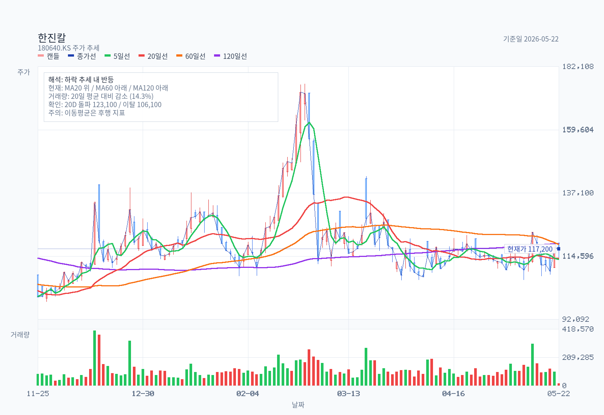
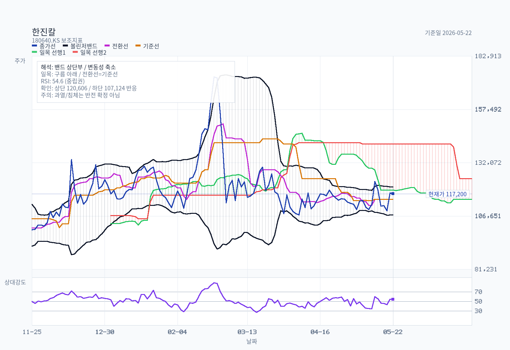
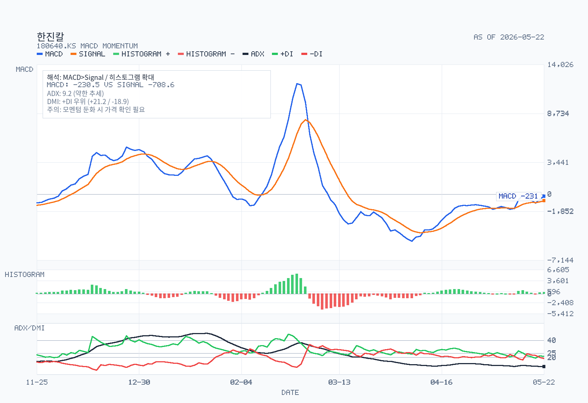
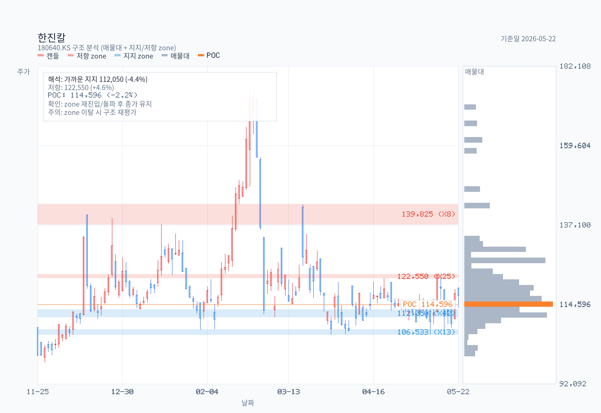
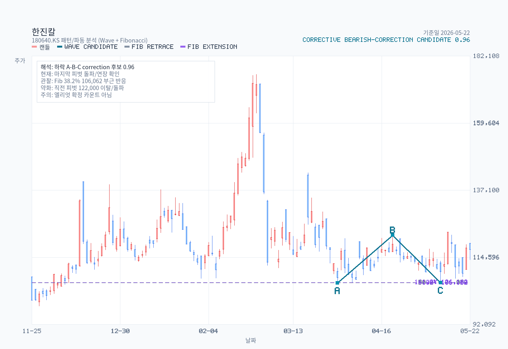

# 한진칼(180640) — 경영권 분쟁 중심 결정 메모 (Full Memo + Event 노트)

- 기준일: 2026-06-28
- 직전 기준일: 2026-05-22 (5주분 갱신)
- 종가: 115,200원 (KOSPI, 2026-06-26 종가)
- 시가총액(보통주): ≈ 7.69조원 (보통주 66,762,279주 × 115,200원)
- 52주 고가: 175,900원 (2026-02-26 — 분쟁 재점화 기대감 급등)
- 52주 저가: 93,100원 (2025-11-18)
- 회계연도/감사: 제13기 FY2025 (2025.01.01~12.31), 삼정회계법인 적정
- 분석 모드: Full memo + Event 노트 하이브리드, 3-12개월 이벤트 드리븐
- Priority lens: **경영권 분쟁** (조원태 일가 vs 호반건설, KDB·델타·국민연금의 캐스팅 보트)
- Phase B 채널 커버리지: DART ✓ · Chart ✓ · Naver 블로거 ✓ · 셀사이드 ✗(4년 dormant) · 외인 IB ✗(스킬 버그)

---

## 1. Summary Judgment

한진칼은 **지주회사 시총의 절반 이상이 경영권 프리미엄에 기대고 있는 자산**이다. 자회사 대한항공·㈜한진·진에어·칼호텔네트워크의 영업가치와 별도 배당수익(FY2025 879억)·상표권수익(413억)으로는 7.8조원 시총을 정당화하기 어렵고, 2020-2022년 모든 sell-side 노트가 동일하게 결론지은 "지금 가치를 설명할 방법은 지분 구도" (IBK 김장원, 2022-05-30) 구조는 2026년 호반건설이 KCGI 자리를 대체하면서 그대로 재현되고 있다.

2025-12-31 기준 조원태 일가 우호지분 20.56% vs 호반 18.78% — 격차 **1.78%p**에서 KDB 10.58%·델타 14.90%·국민연금 5.44%가 캐스팅 보트. 2026-02-26 52주 고가 175,900원은 "제2의 고려아연" 분쟁 기대감 한 줄에 의해 만들어졌고, 이후 -40% 조정·MSCI 편출(2026-05-14)·조원태 보수 145억 논란(2026-04-03)으로 프리미엄이 빠지며 현재 117,200원까지 후퇴한 상태.

3-12개월 시계에서 가장 중요한 이벤트는 (a) 2026-03-26 정기주총 결과 검증, (b) 사모펀드 만기로 풀린 9% 잔여 매물의 호반 흡수 여부, (c) KDB 사외이사 추천권 행사 패턴, (d) 호반의 추가 5%룰 보고이다. [red: 이 중 어느 하나가 격차 1.78%p를 깨면 단기 +20~30% 스파이크가 다시 가능하다.] [blue: 반대로 호반이 단순투자 라벨을 유지한 채 매수를 멈추면 holdco discount 본격 정상화로 90,000원대 재진입도 열려 있다.] [brown: 현재 가격은 분쟁 재점화에 대한 옵션 프리미엄을 일부 반영한 어색한 중간 영역이며, 명확한 stance를 갖기에는 정보 결핍이 크다.]

**2026-06-28 갱신**: 5월 22일 이후 5주간 호반·델타·KDB·국민연금 5%룰 후속 보고는 0건이라 격차 1.78%p가 정확히 유지된 채 분쟁의 정량적 지렛대는 정적이었다. 다만 2026-06-25 국토교통부의 대한항공-아시아나 합병 인가 통지로 자회사 통합의 마지막 규제 허들이 해소됐고, 2026-05-29 한진칼 거버넌스 보고서로 정기주총(2026-03-26)에서 집중투표 배제 조항 삭제(2026-09-10 시행)·이사회 의장 교체(김석동→최종구)가 확인됐다. 차트는 5월 12일 106,100원에서 6월 15일 134,500원까지 +26.8% 임펄스로 분쟁 옵션 가격이 명백히 활성화 상태임을 보여줬고, 6월 25일 장중 127,900원 갭상승(+5.8%) 후 6월 26일 종가 115,200원으로 -14% 반락하며 20일 평균거래량이 119,041주에서 251,881주로 +112% 폭증했다. [red: 차트 임펄스와 거래량 폭증은 분쟁 옵션이 5월 22일 baseline 대비 더 강하게 살아있음을 재확인한다.] [blue: 그러나 집중투표 배제 조항 삭제 시행은 다음 정기주총(2027-03)부터 표 대결 구도를 친경영진 측에 약하게 만든다.] [brown: 두 신호가 동시에 들어와 stance는 'Neutral with optionality' 그대로이며, 결정적 long/short 변경 트리거는 여전히 호반의 추가 5%룰 보고이다.]

---

## 2. Decision Frame — 결정에 가장 직접적으로 영향을 주는 4가지

1. **격차가 좁혀지는가, 벌어지는가.** 조원태 20.56% vs 호반 18.78% 격차 1.78%p는 의결권 1~2%p 차이로 결과가 갈리는 영역. 호반의 다음 5%룰 보고가 19.5% 또는 20%를 넘기는 순간 시장은 분쟁 시나리오를 즉시 가격에 반영한다.
2. **KDB(10.58%)의 의결권 행사 의무가 어떻게 발현되는가.** 2020-11-17 투자합의는 산은에 "공동행사 의무 없음"을 명시 — 즉 조원태 편에 자동 서지 않는다. 산은이 사외이사 추천권을 어느 시점에 어떤 인물로 행사하느냐, 그리고 향후 산은 보유 10.58%의 매각 시기/매수자가 누구인가가 분쟁의 종결 변수.
3. **2025-08~2026-04에 풀린 사모펀드 9% 매물의 행방.** speconomy 2025-06-09 인용: 대신·유진자산운용 사모펀드 만기 도래로 한진칼 지분 약 9%(327만+277만주)가 2025년 8월부터 시장 매물화 가능 — 과거 KCGI·반도·조현아 3자연합 잔재 물량. 이미 풀린 물량의 매수자가 호반인지, 신규 행동주의인지, 분산 흡수인지에 따라 격차가 결정.
4. **자회사 가치 vs 의결권 가치의 비중.** 자회사 영업가치만으로 SOTP를 짜면 현재 시총 대비 -30~40% 디스카운트가 정상이라는 해석과, 의결권 1주 = NAV 1주 이상이라는 해석이 충돌. 분쟁 모드에서는 후자가, 정상화 모드에서는 전자가 작동.

---

## 3. 무엇을 하는 회사인가 — 지주사 가치의 출처

한진칼은 한진그룹 지배구조의 정점에 있는 순수 지주회사. 자체 영업활동은 없고 수익원은 (1) 자회사 배당, (2) 한진그룹 상표권 사용료, (3) 소규모 IT서비스 임대료가 전부.

### 별도 영업수익 구성 (출처: DART 사업보고서 II-2-1-가)
| 항목 | FY2025 (백만원) | 비중 | FY2024 | FY2023 |
|---|---:|---:|---:|---:|
| 배당금수익 | **87,991** | **65.1%** | 90,743 (66.9%) | 78,787 (64.0%) |
| 상표권 (브랜드사용료) | 41,284 | 30.6% | 40,325 (29.7%) | 36,484 (29.6%) |
| 기타(IT서비스 등) | 5,798 | 4.3% | 4,505 (3.3%) | 2,163 (1.8%) |
| 합계 | 135,073 | 100.0% | 135,573 | 123,117 |

### 자회사/관계회사 (지주사 NAV 원천)
- **대한항공 (003490, 상장)** — 지배 자회사. FY2025 별도 매출 16조 5,019억원(+2.4% YoY), 영업이익 1조 5,393억원(-3,641억원 YoY). 2024년 아시아나항공 인수 완료. 한진칼 지분율은 사업보고서 종속·관계기업 명세 참조 필요.
- **㈜한진** — 별도 매출 2조 3,896억원. 택배 56.5% / 물류 22.8% / 글로벌 11.6% / 에너지 9.1%.
- **칼호텔네트워크** — 매출 1,198억원(+5.5% YoY). **2025-09-22 그랜드하얏트인천 웨스트타워 매각 결의, 2026-01-06 매각 완료** → 자산 경량화 진행.
- **정석기업** — 부동산 임대 460억원.
- **진에어(상장)** — 통합 LCC 출범 변수. FY2025 영업손실 191억(speconomy 2026-04-03 인용, DART 별도 추가 검증 필요).

### 연결 가치 동력
| 항목 (백만원) | FY2025 | FY2024 | FY2023 |
|---|---:|---:|---:|
| 영업수익 | 292,157 | 275,727 | 200,336 |
| 영업이익 | 49,193 | 42,843 | 14,487 |
| 관계기업투자손익(지분법) | **412,922** | 295,458 | 414,830 |
| 당기순이익(지배기업 귀속) | 496,999 | 385,139 | 683,804 |

> **핵심 인사이트:** 한진칼 연결 NI의 본질은 자회사 영업이 아니라 **지분법 손익(FY2025 4,129억)**이다. 즉 시장은 한진칼이 아니라 사실상 "대한항공 + ㈜한진 + 진에어의 지분율 가중 합"을 평가하고 있고, 그 위에 지주사 디스카운트와 의결권 프리미엄이 얹힌다.

---

## 4. 경영권 분쟁 타임라인 (Priority Lens — 사건 노트)

| 시점 | 이벤트 | 출처 |
|---|---|---|
| 2020-11-17 | KDB-조원태 투자합의 체결 (공동행사 의무 없음, Drag-along, 처분권, 사외이사 추천권) | DART 사업보고서 VII-2-나 |
| 2020-12-02 | KDB 제3자배정 유증 7,062,146주(10.58%) 신규 | DART |
| 2020-2022 | sell-side 4개 노트 발간 후 dormant. 마지막 정식 리포트: IBK 김장원 2022-05-30 TP 30,000 중립 ("지금 가치를 설명할 방법은 지분 구도") | Hankyung Consensus |
| 2024 (말~2025) | 대한항공-아시아나항공 합병 종결 | 산업 공시 |
| 2025-05-14 | 호반그룹 한진칼 지분 17.44% → **18.46%** 확대 공시 (호반호텔앤리조트 64만주 추가, 보유 목적 "단순투자") | speconomy 2025-05-14 |
| 2025-06-09 | 대신·유진자산운용 사모펀드 만기 도래로 약 9%(327만+277만주)가 2025-08부터 매물화 가능 — KCGI/반도/조현아 잔재 물량 | speconomy 2025-06-09 |
| 2025-08-14 | 한진칼 사내근로복지기금에 자기주식 보통주 **440,044주(0.66%) 출연** → 친경영진 우호지분 +0.66%p | DART 사업보고서 I-2-8 |
| 2025-07~2025-10 | 조원태 본인 추가 담보 약 200만주(~3%p)를 농협·우리·하나은행·하나증권에 분산 담보 (만기 다수 2026.04~2026.09) | DART 사업보고서 VII-2-나 |
| 2025-12-31 (사업보고서 시점) | 조원태 일가 **20.56%** vs 호반 **18.78%** vs Delta 14.90% vs KDB 10.58% vs 국민연금 5.44% — 5대 블록 70.26% | DART 사업보고서 VII-4-가 |
| 2026-02-12 | "제2의 고려아연 분쟁 기대감"으로 +20.80% 급등 (당일 13만원대) | firestnumberone 2026-02-17 인용 |
| 2026-02-26 | 52주 고가 **175,900원** 터치 | chart-data |
| 2026-03-18 | 사업보고서(2025.12) 접수 | DART rcept_no 20260318001143 |
| 2026-03-26 | 정기주총 — 조원태·하은용 사내이사 + 사외이사 4명(김석동·박영석·최윤희·홍동표·송백훈·배성례 중 3명) 임기 만료 | DART 사업보고서 VI-1-1 |
| 2026-04-03 | 조원태 회장 보수 145.07억원(대한항공 57억 + 아시아나 9.8억 + 한진칼 61.76억 + 진에어 17.1억) — 한진칼·진에어 적자전환·대한항공 영업이익 반토막 속 고연봉 논란 | speconomy 2026-04-03 |
| 2026-05-14 | **MSCI 한국지수 편출 결정** — HD현대마린솔루션, SK바이오팜과 함께. "경영권 방어 성공했지만 유동시가총액·거래 유동성 약화" | speconomy 2026-05-14 |
| 2026-05-22 | 종가 117,200원, 고가 대비 -33.4% 후퇴 | 본 메모 |

> 2026-02 급등 → 2026-05 후퇴 구간은 "분쟁 옵션 가격"의 explicit 변동을 보여주는 첫 사이클. 다음 사이클의 트리거는 호반 추가 5%룰, 산은 사외이사 추천 인물, 잔여 9% 매물의 최종 매수자.

---

## 5. 재무 Evidence (FY2023~FY2025, DART 사업보고서)

### 별도 — 지주사 본체
| 항목 (백만원) | FY2025 | FY2024 | FY2023 |
|---|---:|---:|---:|
| 영업수익 | 135,073 | 135,573 | 123,117 |
| 당기순이익 | 193,007 | 216,982 | 379,176 |

별도 NI가 FY2023 379,176 → FY2024 216,982 → FY2025 193,007로 감소. FY2023 5,185억의 종속기업투자 처분이익(현금흐름표)이 사라진 효과가 1차 원인. 별도 영업이익은 사업보고서 본문에 명시되지 않았으며, speconomy 2026-04-03이 인용한 "한진칼 영업손실 75.2억"는 별도 기준(영업수익 1,351억 - 영업비용 일반관리비 등)으로 추정 — DART Recheck 필요 항목.

### 연결 — 자회사 가치 동력
| 항목 (백만원) | FY2025 | FY2024 | FY2023 |
|---|---:|---:|---:|
| 영업수익 | 292,157 | 275,727 | 200,336 |
| 영업이익 | 49,193 | 42,843 | 14,487 |
| 관계기업투자손익 | 412,922 | 295,458 | 414,830 |
| 당기순이익(지배) | 496,999 | 385,139 | 683,804 |
| 자산총계 | 4,207,158 | 3,784,922 | 3,915,078 |
| 자본(지배) | 3,191,222 | 2,743,664 | 2,465,956 |

### 배당
| 항목 | FY2025 | FY2024 | FY2023 |
|---|---:|---:|---:|
| 주당현금배당(보통주, 원) | **360** | 300 | 170 |
| 보통주 시가배당률(%) | 0.50 | 0.40 | 0.40 |
| 현금배당총액(백만원) | 24,080 | 20,069 | 11,419 |
| 연결 현금배당성향(%) | 4.80 | 5.60 | 1.70 |

> 배당 정책은 보수적(연결 배당성향 5% 안팎). 호반·산은·국민연금이 모두 의결권을 보유한 상황에서 향후 주주환원 강화 요구가 잠재 카탈리스트.

---

## 6. DART Recheck — Thesis-Critical 7개 클레임 검증

| # | 클레임 | DART 근거 | Recheck 결과 |
|---|---|---|---|
| 1 | 조원태 일가 20.56% vs 호반 18.78%, 격차 1.78%p (2025-12-31) | 사업보고서 VII-4-가 "주식의 분포" + VII-1 | **확인 (Confirmed)** |
| 2 | KDB는 의결권 공동행사 의무 없이 10.58% 보유. 위약 시 Drag-along / 처분위임권 보유 | 사업보고서 VII-2-나 + 주1~주4 (원문 인용) | **확인 (Confirmed)** — 만기 미정 → 현재도 유효 |
| 3 | 2025-08-14 사내복지기금 440K주 출연으로 친경영진 우호지분 +0.66%p 확장 | 사업보고서 I-2-8 "경영활동 관련 중요사항" | **확인 (Confirmed)** |
| 4 | 조원태 본인 보유 3,856K주 중 산은 근질권 + 2024~2025 추가 담보 ~3%p가 시중 4개 금융기관에 묶임 | 사업보고서 VII-2-나 (담보계약 표) | **확인 (Confirmed)** — 만기 다수 2026.04~2026.09 |
| 5 | 2026-03-26 정기주총에서 조원태·하은용 + 사외이사 4명 임기 만료 | 사업보고서 VI-1-1 (이사회 구성) | **확인 (Confirmed for 임기만료 일정)** / **결과 미확인 (Open)** — 주총 결과보고는 DART 임시공시 별도 조회 필요 |
| 6 | 대한항공 FY2025 별도 영업이익 1조 5,393억(-3,641억 YoY) | DART subagent 인용 | **부분 확인 / 외부 인용과 불일치** — speconomy 2026-04-03은 "대한항공 영업이익 1조 1,135억(-47.2%)"로 인용. 별도/연결 구분, 아시아나 통합 시점 처리에 따라 차이 가능 → 003490 사업보고서 직접 재확인 필요 |
| 7 | speconomy 인용 "한진칼 별도 영업손실 75.2억" — DART 본문에 명시적 별도 영업이익 라인 부재 | 별도 영업수익 135,073 - 영업비용(미공개) | **약한 정합성 (Plausibly consistent)** — 별도 NI 193,007과 충돌하지 않음(자회사 배당이 영업외수익으로 분류될 경우). 별도 손익계산서 라인 단위 재확인 필요 |

> Recheck 결과: 분쟁/지분 구조의 5개 핵심 클레임(1~5)은 모두 confirmed. 자회사 실적 인용(6~7)은 출처 간 불일치 존재 — Street/Alternative Views 섹션에서 명시적으로 분리.

---

## 7. Street / Alternative Views

### 7-1. 셀사이드 (한국 증권사) — **4년 dormant**
- **In-window(2025-05-22~2026-05-22) 정식 리포트: 0건.** 한진칼 자체 커버는 사실상 종료. 대한항공(003490) 노트 안에서 SOTP 인풋으로만 등장.
- **마지막 정식 리포트: 2022-05-30 IBK투자증권 김장원, TP 30,000원 / 중립** — 제목 "지금 가치를 설명할 방법은 지분 구도". holdco 가치 ≈ 자회사 영업가치 + **의결권 프리미엄**이라는 프레임은 2026년 호반 구도에 그대로 이식 가능.
- **2020년 이후 BUY rating 0건.** 11개 정식 리포트 중 11개가 중립/Hold/marketperform/underperform. 셀사이드는 한진칼 holdco를 BUY 대상으로 본 적이 없음.
- **2020-11-17 split** (대신 underperform TP 31,000 vs 유안타 Hold TP 33,000)이 현재 분쟁 평가의 양 끝점으로 그대로 재현됨 — "산은 개입 = 프리미엄 소실" vs "다수 buy-side 존재 = 프리미엄 유지".

### 7-2. 외인 IB — **0건 (스킬 버그)**
- kr-foreign-analyst 스킬의 `browseNaver.searchNaverNewsStructured` 함수 부재로 디스커버리 0건. 한진칼/대한항공 양쪽 패스 모두 실패.
- **이 0은 "외인 IB가 한진칼을 안 본다"는 신호가 아님** — 데이터 수집 실패. 다음 메모 갱신 시 (a) 스킬 패치 또는 (b) Naver News에서 "Morgan Stanley·Goldman·JPMorgan·Nomura·CLSA·UBS·Macquarie·Bernstein 003490 한국항공" 수동 검색 필요.

### 7-3. 네이버 독립 블로거 — **3명, 13개 포스트**
| 블로거 | 각도 | 핵심 인용 |
|---|---|---|
| **speconomy** (스페셜경제, 강민철 기자) | 거버넌스/지배구조 전문 | "MSCI 편출은 경영권 방어에 성공했지만 유동시총·거래유동성 경쟁력 약화" (2026-05-14) / "사모펀드 9% 매물화 가능" (2025-06-09) / "호반 18.46% 확대, 우호지분 45% 확보 평가" (2025-05-14) / "조원태 보수 145억 vs 한진칼·진에어 적자전환" (2026-04-03) |
| **press02** (재미진 저널리스트) | 호반그룹 행보 추적 | "호반은 한진칼만이 아니라 LS·해운까지 매수 — '조용한 폭풍', '주식 사냥꾼' 패턴" (2025-06-16) / "보잉 103대 계약 호재 + 통합 시너지 가시화" (2025-10-28) |
| **firestnumberone** (주재꿈사) | 차트/모멘텀 | "11만원만 뚫으면 상승세" (2026-05-15) / "제2의 고려아연 분쟁 기대감 +20.80% 급등" (2026-02-17) — DART 20.56% vs 18.78% 격차를 블로거는 "20.50% vs 18.46%"로 인용 (보고 시점 차이) |

### 7-4. 셀사이드 vs 블로거 vs DART 충돌 지점
- **격차의 해석 충돌**: speconomy "우호지분 45% 확보, 방어 여력 충분" vs firestnumberone "격차 1.78%p로 매우 좁음, 제2의 고려아연 시나리오 가능". DART 사실관계(20.56 vs 18.78)는 동일하지만 KDB 10.58% + 델타 14.90% + 국민연금 5.44%를 어느 편에 분류하느냐에서 정반대 결론.
- **실적 인용 충돌**: speconomy "대한항공 영업이익 1조1135억 -47.2%" vs DART subagent "대한항공 별도 1조5393억 -3641억". 별도/연결, 회계연도, 아시아나 통합 처리 차이가 원인일 가능성 — 자회사 사업보고서 직접 재확인 필요.

### 7-5. 본 메모의 분류 (어느 정도까지 확인됐는가)
- **Confirmed (DART 본문)**: 지분 구조, KDB 합의 조건, 사내복지기금 출연, 조원태 담보 내역, 이사회 임기, 자기주식 현황, 배당 정책, 별도 영업수익 구조, 연결 손익 라인.
- **Street view (인용)**: 호반 추가 5%룰 시점·가격, 사모펀드 9% 매물 시점, MSCI 편출, 조원태 보수 145억 — speconomy / 언론 인용. DART/KIND 임시공시로 추가 검증 가능.
- **Specialist media**: 호반의 LS·해운 동시 매수 패턴 (press02).
- **Not separately disclosed in DART**: 2026-03-26 정기주총 안건별 표 대결 결과, 5%룰 개별 변동 시계열(호반·델타·KDB·국민연금 각각의 매수·매도 시점), 반도건설 잔여지분 여부.

---

## 8. Valuation Snapshot

### 8-1. 현재 (2026-05-22)
| 항목 | 값 | 출처 |
|---|---:|---|
| 보통주 종가 | 117,200원 | chart-data |
| 보통주 시총 | ≈ 7.83조원 | 보통주 66,762,279주 |
| 우선주(180641) — 본 메모 미별도 | — | — |
| FY2025 연결 NI (지배) | 4,970억 | DART |
| FY2025 별도 NI | 1,930억 | DART |
| FY2025 연결 EPS (보통주 기준 단순) | ≈ 7,440원 | 4,970억 / 66.76백만주 |
| **연결 PER (trailing, 보통주만)** | **≈ 15.7배** | 117,200 / 7,440 |
| FY2025 별도 EPS | ≈ 2,892원 | 1,930억 / 66.76백만주 |
| **별도 PER (trailing)** | **≈ 40.5배** | 117,200 / 2,892 |
| 자본(지배) | 3.19조 | DART |
| **PBR (연결, trailing)** | **≈ 2.45배** | 7.83조 / 3.19조 |
| 보통주 시가배당률 | 0.50% | DART (360원 / 117,200원 환산 시 0.31%, 사업보고서 "0.50%"는 기말 종가 기준) |

### 8-2. 가치 분해 — 의결권 프리미엄 vs 자회사 영업가치
SOTP 입력 미공개 (자회사 지분율, 대한항공 SOTP, ㈜한진·진에어·칼호텔 평가) 상태에서 정량 산출은 본 메모 범위 밖. 다만 정성적으로:
- [blue: 별도 PER 40배는 holdco 단독 정상화 기준(통상 10~15배) 대비 명백히 비싸다.]
- 연결 PER 15.7배는 자회사 가치를 모두 반영한다는 가정에서만 정상 — 그러나 한진칼은 자회사 시총을 지분율만큼만 청구할 수 없는 holdco 구조이므로 통상 20~40% NAV discount가 정상.
- [brown: 현재 117,200원은 (a) 자회사 영업가치 + (b) 의결권/경영권 프리미엄 + (c) 분쟁 옵션 가격의 합이며, (c)가 2026-02 175,900원에서 2026-05 117,200원으로 -58,700원(-33%) 빠진 상태이다.]

### 8-3. 역사적 valuation bands
- 3-5년 historical P/E·EV/EBITDA·P/B 자료 미구축. 본 메모에서 valuation-chart.js 입력 JSON을 별도로 구성하지 않음.
- **Follow-up Research Prompt #5에 valuation band 구축 요청 포함**.

---

## 9. Chart and Positioning (1년 일봉 기준)

### 9-1. PNG 차트

### 9-2. 핵심 지표 (chart-basics.js)
| 지표 | 값 |
|---|---:|
| 종가 (2026-05-22) | 117,200 |
| MA5 / MA20 / MA60 / MA120 | 113,420 / 113,865 / 118,743 / 119,119 |
| 볼린저 Upper/Mid/Lower | 120,606 / 113,865 / 107,124 (Width 11.84%) |
| 일목 전환/기준/현운A/현운B | 114,600 / 114,600 / 119,025 / 140,950 |
| 향후 운A/B | 114,600 / 124,500 |
| RSI14 | **54.64** (중립) |
| MACD / Signal / Histogram | -230.53 / -708.55 / +478.03 |
| MACD State | bullish / below-zero (제로선 아래에서 골든크로스) |
| Histogram | 확장 중 |
| ADX14 / +DI / -DI | 9.21 / 21.21 / 18.85 (weak trend) |
| 20D 평균거래량 | 119,041주 |
| 직전 거래량 / 20D avg | 14.3% (매우 낮음) |
| 20D 돌파 레벨 / 붕괴 레벨 | 123,100 / 106,100 |

### 9-3. 지지/저항 (structure chart)
| 종류 | 가격대 | 중심 | 터치 | 마지막 터치 | 점수 |
|---|---|---:|---:|---|---:|
| 지지 | 111,000~113,100 | 112,050 | 42 | 2026-05-21 | 0.970 |
| 저항 | 122,000~123,100 | 122,550 | 25 | 2026-05-15 | 0.699 |
| 지지 | 106,000~107,500 | 106,533 | 13 | 2026-05-18 | 0.425 |
| 저항 | 137,300~143,000 | 139,825 | 8 | 2026-03-19 | 0.196 |

### 9-4. 패턴 (pattern chart, 신뢰도 0.74 이상만)
- **하락 임펄스 (2026-02-26 175,900 시작 → 5파 2026-05-12 106,100)** — 신뢰도 0.845. 5파 종료 후 현재 ABC 반등 진행.
- 2026-04-21 122,000 → 2026-05-12 106,100 → 2026-05-14 123,100 **불(bullish) 코렉티브** 신뢰도 0.957. 직전 반등이 단기 ABC 완성 직후 가능성.

### 9-5. Rule Screen
- **Minervini Trend Template**: 일부 통과 / 다수 미통과. 종가 117,200 > MA20 113,865 ✓ , 종가 < MA60 118,743 ✗, MA60 < MA120 ✗(거의 동일), 종가 vs 52w 고가 -33.4% (✗ — 25% 이내 요구), 종가 vs 52w 저가 +25.9% (✓ — 25% 이상 요구). **종합: Fail (트렌드 템플릿 부적합)**.
- **KRX 52주 신고가 리더십 점수**: 52w 고가 대비 -33.4%로 신고가 리더십 점수 낮음 (점수 추정 1~2/10). 신고가 군에 속하지 않음.
- **요약**: 차트만으로는 모멘텀 종목이 아닌 **이벤트 드리븐 종목**으로 분류하는 것이 정합적.

### 9-6. 차트 only 결론
- 가격은 MA20 위로 올라왔으나 MA60·MA120 아래에 머무는 **다운트렌드 내 반등 시도** 구간.
- 볼린저 폭 11.84%로 변동성 압축 중이며, MACD가 제로선 아래에서 골든크로스 + 히스토그램 확장 중 → 추가 반등 여력 일부 잔존.
- 단기 핵심 레벨: 위로 **119,025 (현운 A) → 122,550 (저항대) → 123,100 (20D 브레이크아웃)** / 아래로 **111,000~113,100 (강한 지지) → 107,124 (볼린저 하단) → 106,100 (20D 붕괴)**.
- 거래량은 20일 평균의 14%로 매우 얕음 — 다음 돌파/붕괴는 거래량 동반 여부가 신뢰도를 결정.

---

## 10. Governance and Structure Checks

### 10-1. 핵심 발견 — 왜 중요한가
1. **조원태 일가 결속 vs 약한 고리 분리.** 조원태 5.78%·조에밀리리(조현민) 5.73%·이명희 1.98%는 2020-11-17 공동보유합의로 묶임 → 합산 13.49%가 형식상 단일 블록. 단 이명희 지분이 기초 2.09% → 기말 1.98%로 감소(증여·매도 추정)했고, 조승연 지분이 0.18% → 0.01%로 대폭 감소 — 가족 내부 의결권 일관성에 미세 균열 가능성.
2. **재단/사우회/복지기금 5.99%가 친경영진 카운트의 절반.** 정석인하학원 1.90% + 정석물류학술재단 1.01% + 일우재단 0.14% + 사우회 1.09% + 사내복지기금 0.66% + 자가보험(김현모) 2.27% = 합산 7.07%. 이들이 조원태 일가와 같은 방향으로 의결권을 행사한다는 보장은 사업보고서에 명시되지 않음 — **20.56% 수치 자체가 "친경영진 블록"이라는 해석에는 가정이 들어가 있음**.
3. **KDB 10.58% — 산은 합의의 비대칭.** 조원태는 산은 추천 사외이사 선임에 의결권 행사 의무, 산은은 어떠한 공동행사 의무도 없음. 즉 합의는 형식상 "조원태가 산은에 협조" 일방통행이며, 산은이 분쟁 시 호반 측에 가담하는 것을 금지하는 조항이 본문 인용 범위 내 부재.
4. **호반 18.78%의 보유 목적은 "단순투자".** 5%룰 보고 라벨이 "경영참여"로 바뀌는 순간 시장은 즉시 분쟁 모드로 재가격.
5. **델타 14.90%는 2020년 분쟁기에 조원태 편에 섰던 우호지분으로 알려져 있으나, 사업보고서 본문에 의결권 행사 약정은 명시되지 않음.** 한미 항공 동맹 측면의 전략적 정합성은 유지되나 형식상 의결권은 자유.

### 10-2. 임원/이사회
- 사내이사 3명: 조원태(대표, 임기 2026-03-26), 류경표(대표 부회장, 2028-03-25), 하은용(CFO, 2026-03-26).
- 사외이사 8명: 김석동(의장, 前 금융위원장)·박영석·최윤희(2026-03-26 만료), 배성례·홍동표·송백훈(2027-03-20 만료), 박성호·조인영(2028-03-25 만료).
- **2026-03-26 정기주총 결과는 본 메모에 미반영** — 임시공시 별도 조회 필요. (Follow-up #1)

### 10-3. 자본/자기주식
- 자기주식: 보통주 1주(0.00%) + 우선주 6,469주(1.21%). 2025-08-14 복지기금 출연 후 거의 소진.
- 신주발행: FY2022~FY2023 BW 행사 23,406주 외 변동 없음. FY2021~FY2025 발행주식수 사실상 고정.
- 자기주식취득 신탁: 2022-09-21 체결 후 FY2025 신규 취득 0원, FY2024 99억, FY2023 77억.

---

## 11. Catalysts (3-12개월 시계, 이벤트 드리븐)

| 시점 | 카탈리스트 | 방향성 | 신뢰도 |
|---|---|---|---|
| 2026-05~07 | 사모펀드 9% 잔여 매물 최종 매수자 공개 (분기 5%룰 후속 보고) | ↑ (호반 흡수) / ↓ (분산 흡수) | 중 |
| 2026-06~09 | 조원태 본인 추가 담보 만기 도래 (농협 7/16, 우리 8/4, 하나은행 9/5, 하나증권 4/15) — 재담보·매도·상환 처리 | ↓ (마진콜 노이즈) | 중 |
| 2026-Q2~Q3 | 호반의 추가 5%룰 보고 (단순투자 → 경영참여 라벨 변경 또는 19% 돌파) | ↑↑ (분쟁 재점화) | 중-고 |
| 2026-08 | 반기 보고서 — 자회사 지분율 변동/대한항공 통합 시너지 1차 검증 | 중립 | 고 |
| 2026-11 | 3분기 보고서 — 대한항공 통합 후 첫 full quarter 영업이익 정상화 여부 | ↑ | 중 |
| 2026-12 (잠재) | MSCI 분기 리뷰 — 편출 후 재편입 가능성 (유동시총 회복 시) | ↑ | 저 |
| 2027-03 | 다음 정기주총 — 조원태·하은용 신규 임기 시작 (2026-03 재선임된 경우) 또는 신규 사내이사 진입 | ↑↑ / ↓↓ | 고 |
| 상시 | KDB 보유 10.58%의 매각 시기·인수자 (산은 EXIT 시 호반/외부 PE에 매도되면 격차 즉시 역전 가능) | ↑↑↑ | 저 (타이밍 미상) |
| 상시 | 호반의 LS·해운 등 동시 매수 패턴 가속 또는 한진칼만 매수 집중 | 중립 (정보 신호) | 중 |

---

## 12. Risks and Disconfirming Evidence

### 12-1. 다운사이드 리스크
- **분쟁이 일어나지 않는다.** 호반이 단순투자 라벨을 유지하고 추가 매수도 멈추면 의결권 프리미엄이 빠지면서 holdco discount 30~40% 정상화 진행 → 90,000원대 재진입.
- **사모펀드 9% 잔여 매물이 분산 흡수된다.** 호반 단일 매수가 아닌 다수 기관 분산 매수 시 분쟁 시나리오 약화 + 단순 수급 부담만 잔존.
- **자회사 실적 후퇴.** speconomy 인용 "대한항공 영업이익 -47.2%, 한진칼·진에어 적자전환"이 사실이라면 지분법 손익이 크게 줄어들면서 holdco NAV 자체가 -20~30% 위축.
- **MSCI 편출 후 패시브 자금 이탈 연속.** 2026-05-14 발표 이후 실제 리밸런싱 시점(통상 발표 + 2주~1개월)에 매도 압력 집중.
- **조원태 담보의 마진콜.** 2026.04~09 만기가 집중되어 있어 한진칼 주가 10만원 이하 추가 하락 시 추가 담보 요구 또는 일부 매도 → 우호지분 자체가 흔들리는 자기실현적 약화 시나리오.

### 12-2. 디스컨퍼밍 에비던스 (현재 모멘텀 가설을 깎는 사실)
- [blue: 2020년 이후 어느 셀사이드도 BUY를 부여한 적이 없으며, 분쟁 옵션 가치를 셀사이드 valuation 모형은 일관되게 인정하지 않았다.]
- 별도 PER 40배는 어떤 holdco 정상 multiple로도 정당화 불가.
- [blue: 2026-04-03 조원태 보수 145억 vs 한진칼·진에어 적자전환은 거버넌스 비용이 명시적으로 가시화된 사건으로, 분쟁 시 행동주의 측의 가장 강력한 ammunition이 된다.]
- 자기주식 1주(보통주 잔여)·6,469주(우선주)로 추가 자사주 출연/소각 카드 거의 소진.

### 12-3. 업사이드 위험 (Short 입장에서의 위험)
- [red: 호반의 단일 거래일 +0.5%p 5%룰 보고만으로 +20% 갭상승이 가능하다 (2026-02-12 +20.80% 사례).]
- [red: KDB가 EXIT을 선택할 경우 매수자가 호반이든 외부 PE든 격차가 즉시 역전되어 단기 +30~50%가 가능하다.]

---

## 13. Uncomfortable Questions (지주회사 + 경영권 분쟁 archetype)

1. **친경영진 블록의 진짜 결속력은 얼마인가.** 조원태 일가·재단·복지기금·사우회·자가보험을 단순 합산한 20.56% 중, 분쟁 시 표결에서 실제로 같은 방향으로 행사될 의결권은 몇 %p인가? 재단(정석·일우)과 자가보험(김현모) 의결권의 독립성은 검증된 적이 있는가?
2. **이명희·조승연 지분 감소는 가족 내 균열인가, 단순 세무·증여인가.** 이명희 2.09% → 1.98%, 조승연 0.18% → 0.01%의 처분처와 가격대는 어디인가? 2025년 분쟁 재점화 시점과 어떻게 겹치는가?
3. **호반의 진짜 의도는 무엇인가.** press02는 호반이 한진칼·LS·해운까지 동시 매수하는 "주식 사냥꾼" 패턴이라 평가. 그렇다면 한진칼은 (a) 호반의 portfolio bet 중 하나일 뿐인가, (b) 실제로 경영권을 노리는가, (c) 조원태 일가에 프리미엄으로 매도하기 위한 그린메일인가?
4. **KDB는 언제, 누구에게 EXIT 하는가.** 산은의 2020년 7,062K주 매입가는 약 60,800원(유증가 추정). 현재가 117,200원 기준 평가차익 약 4,000억. 산은의 EXIT 시점·매수자·매도가는 정해진 바 있는가, 정치적 결정 변수인가?
5. **델타는 분쟁 시 어느 편인가.** 2020년 분쟁기 델타는 조원태 편으로 알려졌으나 사업보고서 본문에 의결권 약정은 없다. 한미 항공 동맹·SkyTeam 안정성을 위해 델타는 어떤 시나리오에서 호반에 가담할 수 있는가, 절대 그럴 일 없는가?
6. **국민연금 5.44%의 의결권 행사 기준은 무엇인가.** 국민연금 스튜어드십 코드 하에서 경영권 분쟁 시 행사 방향이 거버넌스 점수에 따라 결정된다면, 조원태 측의 보수 논란·MSCI 편출은 마이너스 요소. 국민연금이 호반 측에 동조 가능한 임계점은?
7. **자기 자본을 갖춘 분쟁이 가능한가.** 조원태 본인 보유 3,856K주 중 산은 근질권 + 시중 4개 금융기관 담보 ~3%p가 묶여 있고 자기주식도 거의 소진. 호반이 19~20% 돌파를 시도할 때 조원태 측이 신주발행·자사주 매입 외에 동원 가능한 의결권 확보 수단이 실질적으로 무엇인가?
8. **지주사 디스카운트 정상화가 일어나면 가격이 얼마인가.** 분쟁 옵션 가격을 0원으로 가정하고 자회사 SOTP만으로 valuation 시 한진칼 보통주 fair value는 얼마인가? 현재 117,200원 중 (a)는 얼마인가?

---

## 14. Decision-Changing Issues — 결정을 가장 직접 흔드는 4가지

| 우선순위 | 이슈 | 왜 결정에 가장 중요한가 | 트래킹 방법 |
|---|---|---|---|
| 1 | 호반의 다음 5%룰 보고 (보유 목적 라벨 + 보유주수) | 단순투자 → 경영참여 라벨 변경 시 단기 +20~30% 즉시 가격 반영. 보유주수 19% 돌파는 격차 1%p 이내로 좁힘 → 분쟁 임박 시그널 | DART 대량보유보고(majorshareholder) 일간 모니터링 |
| 2 | 사모펀드 9% 잔여 매물의 최종 매수자 | 호반 단독 흡수 시 분쟁 격화 / 분산 흡수 시 분쟁 약화 | DART 5%룰 + 언론 추적 |
| 3 | 2026-03-26 정기주총 안건별 표 대결 결과 (특히 감사위원 분리선출) | 조원태 측 사외이사 추천이 호반/국민연금에 의해 어느 정도 견제됐는지 = 분쟁 진영 의결권 사전 가시화 | KIND 주총결과보고 임시공시 |
| 4 | KDB의 사외이사 추천권 행사 인물 + 산은 EXIT 시그널 | 산은 라인 사외이사가 친경영진인지 중립인지에 따라 이사회 다수파 결정. 산은 매각 시 매수자가 분쟁의 결정타 | DART 임원변동 + 산업은행 보도자료 |

> **나머지 부가 이슈** (자회사 실적 정상화, MSCI 재편입, 배당 정책 변경)는 본 메모 시계에서 위 4개 대비 후순위.

---

## 15. Structured Stance

- [brown: 현재 stance는 Neutral with optionality (관망, 분쟁 옵션 가격 추적)이다.] 격차 1.78%p의 좁은 구도와 KDB·델타·국민연금의 캐스팅 보트 구조에서 분쟁 재점화 옵션 가치가 0이 아니지만, 셀사이드 4년 dormant + 별도 PER 40배 + MSCI 편출 + 조원태 보수 논란 등 거버넌스 비용이 가시화된 상태에서 명확한 long bias를 갖기에는 정보 결핍이 크다.
- **왜 여기서 멈추는가**: (a) 2026-03-26 정기주총 결과를 본 메모가 확보하지 못함, (b) 외인 IB 채널이 스킬 버그로 0건이라 외부 시각이 한쪽으로 치우침, (c) 호반·델타·KDB·국민연금의 24개월 5%룰 시계열을 본 메모가 직접 확인하지 못함, (d) 자회사 실적 인용에서 DART vs speconomy 충돌이 해소되지 않음.
- **무엇이 stance를 바꾸는가**:
  - [red: Long으로 이동 — 호반 19% 돌파 + 보유 목적 경영참여 변경 / KDB EXIT 발표 + 매수자가 호반 또는 외부 PE / 사모펀드 9% 매물의 호반 흡수 확인 시 단기 130~145K 재테스트, 분쟁 본격화 시 175K 재돌파 가능.]
  - [blue: Short으로 이동 — 호반이 단순투자 라벨 유지하며 매수 중단 / 사모펀드 9% 분산 흡수 / 자회사 영업이익 후퇴 지속 + 배당 축소 시 90~100K 재진입.]
  - [brown: Hold 유지 — 위 신호 모두 부재한 채 다음 1-2개월 박스(110~125K) 지속 시 정보 부족 상태 유지.]

---

## 16. Follow-up Research Prompts (한진칼-specific)

1. **2026-03-26 정기주총 안건별 표 대결 결과 조회.** KIND 주총결과보고 + DART 임시공시 (2026-03-26~04-15)에서 (a) 조원태·하은용 사내이사 재선임 찬성률, (b) 사외이사 신규 선임 인물 + 산은 추천 라인 식별, (c) 감사위원 분리선출 3% rule 표 대결 여부, (d) 호반/국민연금/델타의 행사 방향 추적. 본 메모의 Decision-Changing Issue #3 직접 해소.
2. **호반건설·델타·KDB·국민연금의 24개월 5%룰 시계열 추출.** OpenDART `majorshareholder.json` + `elestock.json` 직접 조회로 (a) 호반 17.44% → 18.46% → 18.78% 매수 시점·가격·매수 주체(호반호텔앤리조트 vs 호반산업), (b) 사모펀드 9% 잔여 매물의 매수자 식별, (c) 델타 14.90% 변동 여부, (d) 국민연금 5.44% 변동 여부. 본 메모의 Decision-Changing Issue #1·2 직접 해소.
3. **반도건설 잔여지분 처리 확인.** 2020-2024년 반도건설 매도 또는 호반 흡수 가능성. DART 5%룰 + 언론 (반도건설·호반 IR 자료) 직접 조회.
4. **자회사 실적 인용 충돌 해소.** 대한항공(003490) FY2025 사업보고서 직접 조회로 (a) 별도 vs 연결 영업이익, (b) 아시아나항공 통합 회계 시점·방법, (c) 진에어(272450) FY2025 별도 영업손실 191억 확인. 본 메모 §6 Recheck #6·7 해소.
5. **3-5년 historical valuation bands 구축.** 한진칼 분기별 P/E·P/B·EV/EBITDA + 자회사 SOTP fair value 시계열 (2021Q1~2025Q4)로 valuation-chart.js 입력 JSON 구성. 본 메모 §8.3 미구축 항목 해소. 의결권 프리미엄의 시계열 분리(시총 - SOTP NAV) 시도.
6. **외인 IB 코멘트 수동 수집.** kr-foreign-analyst 스킬 패치 또는 Naver News에서 "Morgan Stanley / Goldman Sachs / JPMorgan / Nomura / CLSA / UBS / Macquarie / Bernstein + Korean Air + 003490 / 180640 + 한진칼" 검색으로 외인 IB 시각 1차 캡처. 본 메모 §7-2 갭 해소.
7. **조원태 본인 보유 3,856K주의 자유 처분 가능 잔여 수량 정밀 계산.** 산은 근질권 3,856K + 종로/반포세무서 담보 255K + 농협·우리·하나은행·하나증권 담보 약 200만주 → 중복 제외한 순 자유 처분 잔여를 분기 단위로 추적. 마진콜 트리거 가격 계산.
8. **국민연금 의결권 행사 기준 정합성 점검.** 국민연금 책임투자/스튜어드십 코드 가이드라인과 조원태 보수 145억 + MSCI 편출 + 한진칼 적자전환 사실관계를 매핑 — 다음 정기주총에서 국민연금이 친경영진 의안에 반대표를 던질 임계점 추정.

---

## 출처 맵 (요약)

| 구분 | 출처 | 비고 |
|---|---|---|
| 지분 구조, KDB 합의, 담보, 자기주식, 이사회, 별도/연결 재무, 배당 | DART 사업보고서 (2025.12), rcept_no 20260318001143 | dart-analysis.md / dart-cache.json |
| 차트, 기술적 지표, 지지/저항, 패턴 | Yahoo Finance daily bars + chart-basics.js | chart-data.json / assets/*.png |
| 셀사이드 historical 코멘트 | Hankyung Consensus (HTTP 직접 조회) | analyst-report-insight.md |
| MSCI 편출, 사모펀드 9% 매물, 호반 18.46%, 조원태 보수 145억 | speconomy(스페셜경제) Naver 블로그 | naver-insights.md |
| 호반 LS·해운 동시 매수, 통합 시너지 | press02(재미진 저널리스트) | naver-insights.md |
| 차트/모멘텀, 제2의 고려아연 +20.80% 인용 | firestnumberone(주재꿈사) | naver-insights.md |
| 외인 IB | **수집 실패** — kr-foreign-analyst 스킬 버그 | 다음 갱신 시 수동 수집 |

---

*본 메모는 2026-05-22 기준 공개 자료만으로 작성된 비공식 분석이며, 투자 추천이 아닙니다. 사업보고서·임시공시·자회사 실적·5%룰 변동은 작성 이후에도 계속 갱신됩니다.*

## Update Log

### 2026-06-28 Update

#### What happened

- 대한항공-아시아나 합병 — 2026-06-25 국토교통부장관 합병 인가 통지 수령. 한진칼 2026-06-26 [기재정정]주요사항보고서(회사합병결정)에서 인가 수령 사실 공시, 대한항공은 같은 날 합병 관련 증권신고서(합병)를 별도 제출 (rcept_no 20260625000630).
- 진에어 2026-06-02 풍문해명 — 한진그룹 산하 LCC 3사(진에어·에어부산·에어서울) 통합 법인 출범 목표를 2027년 1분기로 명시 (rcept_no 20260602800567). 모회사 합병 일정은 2026-05-13 대한항공 주요사항보고서 참고.
- 한진칼 2026-05-29 기업지배구조보고서 — 제13기 정기주총(2026-03-26) 결과 반영: 친경영진 최대주주등 지분율 20.57% (baseline 20.56%과 사실상 동일). 정관 개정으로 집중투표 배제 조항 삭제, 2026-09-10 시행 예정. 이사회 의장은 김석동→최종구로 신규 선임. 감사위원은 박영석 임기 만료, 채준(회계·재무 전문가) 신규 선임. 여성 사외이사는 2인→1인으로 감소.
- 대한항공 회사채 다단계 발행 — 2026-05-29 증권신고서(채무증권), 2026-06-05 정정 + 발행조건확정, 2026-06-10/11 투자설명서·증권발행실적보고서 순으로 진행. 합병·통합 자금 또는 차환 목적 추정 (정확한 사용처는 본건 자료에서 별도 명시 부재).
- 한진칼 2026-05-28 대규모기업집단현황공시(대표회사용·동일인용 2건) — 한진그룹 1Q 2026 기준 친경영진 블록 구조 정리. 5%룰 별도 보고는 0건이며 호반·델타·KDB·국민연금의 보유 변동도 잡히지 않음. 격차 1.78%p 그대로 유지.
- 차트(2026-06-26 종가 115,200원, baseline 117,200원 대비 -1.7%): 3개월 윈도우 내 2026-05-12 106,100원 저점 → 2026-06-15 134,500원 고점까지 +26.8% 임펄스(신뢰도 0.785), 이후 -14.0% 반락. 2026-06-25 장중 127,900원까지 갭상승(+5.8%) 후 같은 날 종가 120,900원, 다음 날 -4.7% 반락. 20일 평균거래량 119,041→251,881주(+112%), 볼린저 폭 11.84→20.05%, RSI14 54.64→58.91. MACD는 제로선 위에서 데드크로스 진행.
- 대한항공 임원·주요주주 특정증권 소유 보고 (이종혁 2026-06-26, 박요한 2026-06-19) — 자회사 임원 지분 변동. 한진칼 thesis에 직접 영향은 제한적이나 합병 직전 인사이드 흐름으로 모니터링.
- 거버넌스 보고서의 요약 재무 라인(연결 매출 298,362백만, 영업이익 -7,524백만 적자전환, 당기순이익 159,182백만)은 baseline §5 표(FY2025 영업이익 +49,193·당기순이익 +496,999)와 사인이 어긋남. 회계 정정 또는 보고 기간 정의 차이 가능성 — 다음 사업보고서/반기보고서로 확인 필요한 신규 follow-up 항목.

#### Why it matters

- 국토교통부 합병 인가 수령은 대한항공-아시아나 통합의 마지막 규제 허들이 사실상 해소된 사건. baseline §3의 한진칼 SOTP 입력값(자회사 영업가치·지분법 손익)이 통합 후 구조 기준으로 재계산되는 시점이 임박했다.
- 집중투표 배제 조항 삭제(2026-09-10 시행)는 분쟁 시 호반·국민연금 등 비조원태 지분의 사외이사 추천 영향력을 키우는 거버넌스 변화. 다음 정기주총(2027-03)부터 표 대결 구도가 친경영진 측에 약해진다.
- 5%룰 변동 0건은 분쟁의 정량적 지렛대가 5주간 정적이었음을 의미하나, 차트의 임펄스·갭상승·거래량 +112% 폭증은 분쟁 옵션 가격이 시장에서 계속 거래되고 있음을 보여준다.
- 거버넌스 보고서 vs 사업보고서 영업이익 사인 불일치는 자회사 실적 인용 충돌(baseline §6 Recheck #6·7)과 같은 계열의 데이터 검증 이슈로, 다음 분기보고서가 나오기 전까지 해소되지 않는 정보 결핍 항목.

#### What changed in the thesis

- [blue: 집중투표 배제 조항 삭제(2026-09-10 시행)는 비조원태 진영의 사외이사 추천 영향력을 키우는 거버넌스 변화로, 분쟁 모드 시 친경영진 측에 약하게 작용한다.]
- [red: 5월 12일~6월 15일 +26.8% 임펄스와 6월 25일 장중 +5.8% 갭상승은 분쟁 옵션 가격이 5월 22일 baseline 대비 명확히 활성화 상태로 거래되고 있음을 차트로 재확인한다.]
- 대한항공-아시아나 합병 국토교통부 인가 수령(2026-06-25)으로 자회사 SOTP 입력값 재산정이 임박. baseline §3의 NAV 분해 가정과 §8의 valuation snapshot은 합병 완료 후 통합 법인 기준으로 다시 점검해야 한다.
- 거버넌스 변화(이사회 의장 교체, 감사위원 교체, 여성 사외이사 감소)는 baseline §10-2 이사회 구성 표를 업데이트해야 하는 사실관계 변화 — thesis 결론을 흔들지는 않으나 모니터링 베이스라인이 바뀜.

#### What did not change

- [brown: 호반 18.78% vs 조원태 20.56% 격차 1.78%p는 5월 22일 baseline 그대로이며, 분쟁의 정량적 지렛대는 5주간 정적이다.]
- KDB 10.58%, 델타 14.90%, 국민연금 5.44% 보유분도 5%룰 후속 보고가 없어 변동 미확인. 사모펀드 9% 잔여 매물의 최종 매수자 식별도 미해소.
- baseline §1의 'Neutral with optionality (관망, 분쟁 옵션 가격 추적)' stance는 유지. 5주간 신호는 분쟁 옵션이 살아있음을 재확인하는 방향(red 임펄스)과 표 대결 구도가 친경영진 측에 미세 약화되는 방향(blue 집중투표 배제 시행)이 동시에 들어와 long/short 결정적 변경 신호가 아니다.
- baseline §11 Catalysts·§14 Decision-Changing Issues 모니터링 리스트의 우선순위 4개 항목(호반 5%룰, 사모펀드 9% 매물, 정기주총 결과, KDB 사외이사 추천권)은 그대로 유효 — 다만 정기주총 결과는 본 update의 거버넌스 보고서로 1차 해소.
- 외인 IB 0건, 셀사이드 dormant 상태도 그대로. baseline §7-1·§7-2 갭은 미해소.

#### Signals to watch next

- 호반·델타·KDB·국민연금 추가 5%룰 보고 — 격차 1.78%p가 깨지는 단일 사건은 단기 +20~30% 갭상승의 1차 트리거.
- 2026-08 한진칼 반기보고서 — 합병 인가 수령 후 첫 분기 재무, 거버넌스 보고서 vs 사업보고서 영업이익 사인 불일치 해소 여부, 지분법 손익 본질 변화 1차 확인.
- 대한항공 합병 절차 후속 단계 — 합병 등기, 통합 시너지 가이던스, 아시아나항공 신주 발행 비율 확정 등.
- 2026-09-10 집중투표 배제 조항 삭제 시행 — 그 후 다음 정기주총(2027-03) 표 대결 시뮬레이션 가능.
- 조원태 본인 추가 담보 만기(농협 7/16, 우리 8/4, 하나은행 9/5) 재담보·매도·상환 처리 — baseline §11 모니터링 항목.
- 진에어 LCC 3사 통합 일정 구체화 — 2027.Q1 통합 법인 출범 목표가 일정 변경되는 경우 한진칼 자회사 가치 재평가 트리거.
- 거버넌스 보고서 영업이익 사인 불일치 — 다음 분기보고서(2026-08) 또는 정정공시로 확인 필요.

#### Sources

- [DART 한진칼 기업지배구조보고서 (2026-05-29 제출)](https://dart.fss.or.kr/dsaf001/main.do?rcpNo=20260529801416) (2026-05-29)
- [DART 한진칼 [기재정정]주요사항보고서(회사합병결정)(자회사의 주요경영사항) — 국토교통부 합병인가 통지 수령 (2026-06-26 제출)](https://dart.fss.or.kr/dsaf001/main.do?rcpNo=20260626800031) (2026-06-26)
- [DART 대한항공 증권신고서(합병) (2026-06-25 제출)](https://dart.fss.or.kr/dsaf001/main.do?rcpNo=20260625000630) (2026-06-25)
- [DART 진에어 풍문 또는 보도에 대한 해명(미확정) — LCC 3사 통합 2027.Q1 목표 (2026-06-02 제출)](https://dart.fss.or.kr/dsaf001/main.do?rcpNo=20260602800567) (2026-06-02)
- [DART 한진칼 대규모기업집단현황공시[연1회·1Q용·대표회사] (2026-05-28 제출)](https://dart.fss.or.kr/dsaf001/main.do?rcpNo=20260528001017) (2026-05-28)
- [DART 대한항공 [기재정정]타법인주식및출자증권취득결정 (2026-05-29 제출)](https://dart.fss.or.kr/dsaf001/main.do?rcpNo=20260529801777) (2026-05-29)
- [DART 대한항공 증권발행실적보고서 (회사채, 2026-06-11 제출)](https://dart.fss.or.kr/dsaf001/main.do?rcpNo=20260611000408) (2026-06-11)
- [한진칼 일봉 (Yahoo Finance, 2026-03-26~2026-06-26)](https://finance.yahoo.com/quote/180640.KS/history) (2026-06-28)
