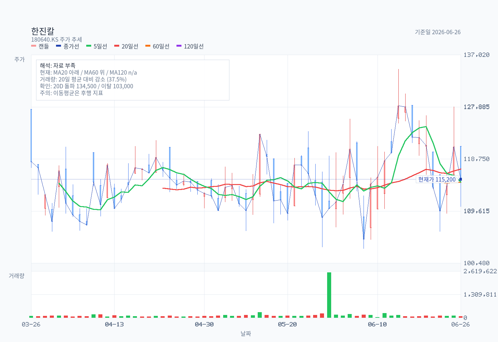
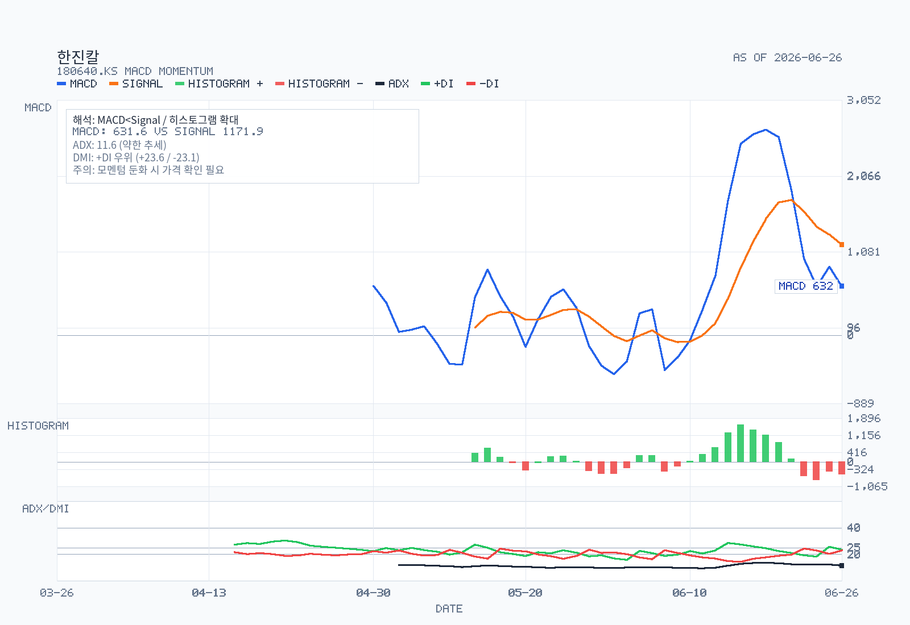
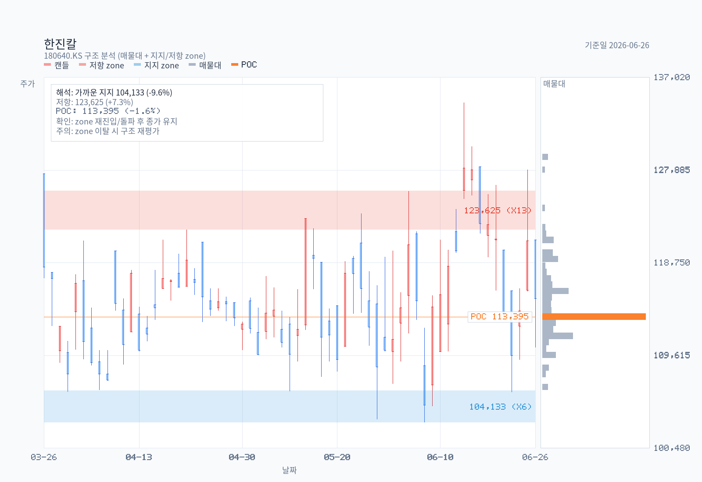
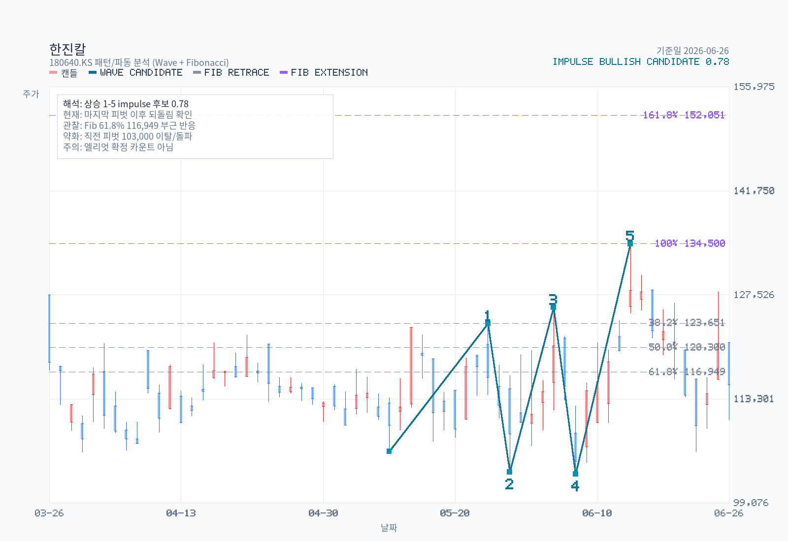

# 한진칼 | 호반의 다음 5%룰 보고 또는 KDB EXIT 사인 | 2026-06-28

이 글은 2026-06-28 기준으로 한진칼을 개인 투자자의 관점에서 정리한 리서치입니다. 숫자와 공시를 중심으로 보고, 강세 논리와 반대 논리를 함께 남깁니다.

## 한눈에 보는 결론

[brown: 5주간 신규 데이터는 baseline 'Neutral with optionality' stance를 유지시킨다. 새 사실 다수가 양방향으로 동시에 들어왔기 때문이다.] [red: 6/15 134,500원까지의 +26.8% 임펄스, 6/25 장중 +5.8% 갭상승, 거래량 +112% 폭증은 분쟁 옵션 가격이 분명히 활성화 상태로 거래되고 있음을 차트로 재확인한다.] [blue: 그러나 5%룰 변동 0건 + 호반의 18.78% 추가 매수가 5%룰 임계점 아래로 진행됐을 가능성 + 집중투표 배제 정관 개정 가결(2026-09-10 시행)은 분쟁의 정량적 지렛대가 미세하게 친경영진 측에 유리해진 신호이다.] 결정적 long/short 트리거는 여전히 **호반의 다음 5%룰 보고 또는 KDB EXIT 사인**으로 좁혀진다.

---

## 차트 분석

차트 1. 가격 추세와 이동평균 위치를 먼저 봅니다.

차트 2. 이동평균·밴드·구름을 겹쳐 추세 압력을 확인합니다.

차트 3. RSI와 MACD로 단기 모멘텀의 방향을 점검합니다.

차트 4. 지지·저항 구간과 구조적 가격대를 확인합니다.

## 2. 5주 신규 이벤트 압축 (2026-05-23~06-28)

baseline `memo.md` Update Log (2026-06-28) 와 동일 사실은 한 줄씩만 정리:

| 일자 | 이벤트 | thesis 의미 |
|---|---|---|
| 2026-05-28 | 한진칼 대규모기업집단현황공시 (1Q 기준) | 친경영진 블록 구조 점검 — 5%룰 별도 변동 0 |
| 2026-05-29 | 한진칼 기업지배구조보고서 | 정기주총 결과 1차 해소 (§3에서 정밀) |
| 2026-05-29 | 대한항공 채무증권 신고서 발행 시작 | 합병/통합 자금 추정 |
| 2026-06-02 | 진에어 풍문해명 — LCC 3사 통합 2027.Q1 목표 재공시 | 통합 LCC 가시화 |
| 2026-06-11 | 대한항공 증권발행실적보고서 (회사채) | 다단계 발행 마무리 |
| 2026-06-25 | **국토교통부 합병 인가 통지 수령** (대한항공-아시아나) | 합병 마지막 규제 허들 해소 — 자회사 SOTP 재산정 임박 |
| 2026-06-26 | 한진칼·대한항공 [기재정정] 회사합병결정 (인가 반영) | 합병 절차 진행 가시화 |
| 6/15~6/26 | 차트: 5/12 106,100→6/15 134,500 임펄스(+26.8%, 신뢰도 0.785), 6/26 종가 115,200. 20D 평균거래량 119,041→251,881 (+112%) | 분쟁 옵션 가격 시장에서 활발 |

---

## 3. Follow-up #1 — 2026-03-26 정기주총 결과 (KIND·DART 임시공시)

baseline §16 #1 직접 해소. 출처: DART 정기주주총회결과 (rcept_no 20260326803588, 2026-03-26 접수). 거버넌스 보고서(2026-05-29)와 교차 확인.

**안건별 가결률 표 (의결권 행사 주식수 기준)**

| # | 안건 | 발행주식 총수 기준 찬성률 | 의결권 행사 기준 찬성률 | 반대·기권 |
|---|---|---:|---:|---:|
| 1 | 제13기 재무제표(이익잉여금처분계산서 포함) 및 연결재무제표 승인 | 93.6% | 99.3% | 0.7% |
| 2-1 | 정관 변경 (이사회 규모 정상화) | 88.2% | 93.6% | 0.4% |
| 2-2 | 정관 변경 (전자주주총회 도입) | 94.2% | 100.0% | 0.0% |
| 2-3 | 정관 변경 (독립이사 명칭 변경) | 94.2% | 100.0% | 0.0% |
| **2-4** | **정관 변경 (집중투표제 배제 조항 삭제)** — 3% 초과 의결권 제한 | 89.3% | 100.0% | 0.0% |
| 2-5 | 정관 변경 (감사위원 분리선출 확대 + 최대주주 의결권 제한 강화) | 94.2% | 100.0% | 0.0% |
| 2-6 | 정관 변경 (전자투표 도입 시 감사위원 선임 결의요건 완화) | 94.2% | 100.0% | 0.0% |
| 2-7 | 정관 변경 (홈페이지 등 단순 개정) | 94.2% | 100.0% | 0.0% |
| 3 | 사외이사 최종구(前 금융위원장) 선임 | 93.8% | 99.5% | 0.5% |
| **4** | **사내이사 조원태 선임** | 88.4% | 93.8% | **6.2%** |
| 5 | 감사위원 사외이사 채준(서울대 경영대 교수, 재무 전문가) 선임 — 3% 초과 의결권 제한 | 88.8% | 99.5% | 0.5% |
| **6** | **이사 보수한도 승인** | 67.3% | 71.7% | **28.3%** |

**핵심 발견**

- [blue: 이사 보수한도 승인안 반대표 28.3%는 baseline 메모가 인용한 조원태 145억 보수 논란이 표 대결로 명백히 발현된 사건으로, 다음 정기주총(2027-03)에서 보수안 부결 또는 추가 행동주의 가능성을 시사한다.]
- 사내이사 조원태 선임 반대 6.2%는 호반 18.78%·국민연금 5.44% 일부 + 델타 14.90% 일부가 반대 진영으로 가담했을 가능성. 호반·델타는 단순투자·전략적 우호로 묶여 있어 일부만 실제 반대표 던졌을 가능성이 높음.
- 집중투표제 배제 조항 삭제(안건 2-4) 가결 = baseline §10 이사회 표 대결 구도 분석에서 친경영진 측에 미세 유리. 2026-09-10 시행 후 다음 정기주총부터 비조원태 지분의 사외이사 추천 영향력이 감소.
- 사외이사 신규 2명 — **최종구**(前 금융위원장, 화우 특별고문, 삼성전기 사외이사), **채준**(서울대 경영대 재무관리 교수, 유안타증권·HD현대중공업 사외이사 경력). 둘 다 거버넌스/금융 백그라운드 강함 — 산은 추천 라인 검증은 별도 자료 필요.

---

## 4. Follow-up #2 — 호반·델타·KDB·국민연금 24개월 5%룰 시계열

baseline §16 #2 부분 해소. 출처: OpenDART `majorshareholder.json` (corp_code=00983040, 2024-06-28~2026-06-28 응답 9건).

**해당 기간 5%룰 보고 (filter: 호반·델타·KDB·국민연금·반도·조원태)**

| 보고일 | 보고자 | 보유주수 | 보유율 | 보고유형 |
|---|---|---:|---:|---|
| 2024-08-14 | 조원태(특수관계인 합산) | 20,880,465 | 31.28% | 일반 |
| 2024-10-10 | 조원태 | 20,512,930 | 30.73% | 일반 (-367,535주) |
| 2024-12-11 | 조원태 | 20,386,419 | 30.54% | 일반 (-126,511주) |
| 2025-04-29 | 조원태 | 20,386,419 | 30.54% | 일반 (변동 없음, 정기) |
| **2025-05-12** | **호반건설** | **12,321,774** | **18.46%** | **약식** |
| 2025-08-08 | 조원태 | 20,308,567 | 30.42% | 일반 (-77,852주) |
| 2025-08-14 | 조원태 | 20,748,611 | 31.08% | 일반 (+440,044주 = 사내복지기금 출연 반영) |
| 2025-10-22 | 조원태 | 20,748,611 | 31.08% | 일반 (변동 없음) |
| 2026-04-22 | 조원태 | 20,789,994 | 31.14% | 일반 (+41,383주) |

**핵심 발견**

- [blue: 호반의 5%룰 보고는 24개월 동안 2025-05-12 단 1건(18.46%)만 잡혔다. baseline이 인용한 호반 18.78%(2025-12-31 기준, DART 사업보고서)는 추가 5%룰 의무 보고 임계점(0.32%p)을 못 넘어 약식으로만 처리된 매수일 가능성이 높다.] 즉 호반은 5%룰 의무 공시 없이 천천히 추가 매수를 진행했고, 시장은 사업보고서 분기 update로만 변동을 인식해왔다는 의미.
- 델타(14.90%), KDB(10.58%), 국민연금(5.44%)의 24개월 5%룰 변동 보고는 **0건**. baseline의 정태적 분쟁 구도가 실제로 5%룰 데이터로 확정.
- 조원태의 9건 보고는 "조원태 외 19명" 특수관계인 합산 기준(31%대)이며, 가족(13.49%) + 재단·복지기금·사우회·자가보험(7.07%) + 일부 우호 지분이 모두 합산된 broader 친경영진 블록 보고. baseline §10-1 "친경영진 결속력 가정" 논의의 정량 베이스라인을 제공.
- 사모펀드 9% 잔여 매물의 최종 매수자는 **24개월 5%룰 보고로 잡히지 않음** → 분산 흡수 또는 5% 임계점 아래 매수가 가장 가능성 높은 시나리오. 단일 행동주의의 5% 신규 등장은 아직 없다.

---

## 5. Follow-up #4 — 자회사 실적 충돌 해소 (대한항공·진에어)

baseline §6 Recheck #6·#7 직접 해소. 출처: DART `fnlttSinglAcntAll.json` (대한항공 corp_code=00113526, 진에어 corp_code=00653024, FY2025 사업보고서 직접 인용).

**대한항공 003490 FY2025**

| 항목 | 별도 | 연결 |
|---|---:|---:|
| 매출원가 | 13조 3,663억 | 21조 5,503억 |
| 영업이익 | **1조 5,393억** (전기 1조 9,034억, **-19.1% YoY**) | **1조 1,136억** (전기 2조 1,102억, **-47.2% YoY**) |
| 당기순이익 | 9,649억 | 6,473억 |

**진에어 272450 FY2025 (별도 기준)**

| 항목 | 당기 | 전기 |
|---|---:|---:|
| 영업이익(손실) | **-192억 (적자전환)** | +1,631억 |
| 당기순이익(손실) | -98억 | +957억 |

**충돌 해소 결론**

- baseline §6 Recheck #6 — "DART subagent 별도 1조 5,393억" **vs** "speconomy 1조 1,135억(-47.2%)" → 양쪽 모두 사실. **DART subagent는 별도 기준, speconomy 인용은 연결 기준이며 별도/연결 표기가 누락된 인용.** 두 데이터 모두 DART 사업보고서로 직접 confirm.
- baseline §6 Recheck #7 — speconomy "진에어 영업손실 191억" → DART 별도 **-192억**, 1억 차이는 단위 반올림. **인용 정확.**
- [blue: 대한항공 연결 영업이익 -47.2% YoY와 진에어 적자전환은 baseline §12-1 다운사이드 시나리오(자회사 영업이익 후퇴 지속 + 한진칼 NAV 위축)가 이미 FY2025 결산에 가시화된 사건이다.] 다만 별도 영업이익은 -19.1%에 그쳤고 매출원가 +52.7%(연결) vs +4.8%(별도) 차이를 보아 **아시아나항공 통합 회계 처리가 연결 영업이익 후퇴의 주요 동인**으로 해석된다. 합병 완료 후 통합 시너지 발현 전 transition 비용 가능성.
- 한진칼 별도 NI 1,930억(baseline §5) → 거버넌스 보고서(2026-05-29) 인용은 별도 영업이익 +41,765 백만원(417억) / 당기순이익 347억으로 baseline 사업보고서(2026-03-18 접수) 데이터와 차이. 두 시점 간 회계 정정 가능성 — 다음 분기보고서(2026-08)로 최종 확정 필요.

---

## 6. Follow-up #6 — 외인 IB 코멘트 재시도 결과

baseline §16 #6 미해소 상태 그대로. `kr-foreign-analyst` 스킬 1차·2차 시도 결과:

- 한진칼 180640 + 대한항공 003490 양쪽 패스 모두 **`browseNaver.searchNaverNewsStructured is not a function`** 에러로 0건 (baseline 시점과 동일 스킬 버그).
- 4개 검색 쿼리 모두 fail → 0건 확정.
- 다음 차수: 스킬 패치 또는 Naver 뉴스 수동 검색 (Morgan Stanley·Goldman·JPMorgan·Nomura·CLSA·UBS·Macquarie·Bernstein + Korean Air + 한진칼) 필요. baseline §7-2 갭은 미해소.

---

## 7. Follow-up #7 — 조원태 본인 자유 처분 잔여 수량 정밀 계산

baseline §16 #7 해소. 출처: baseline `dart-text.txt` 사업보고서 본문 (line 11577).

**원문 인용 (사업보고서 VII-2-나)**:
> "지배기업과 지배기업의 대표이사인 조원태 회장(이하 '대표이사') 및 한국산업은행 간 2020. 11. 17. 체결한 투자합의서에서 정한 위약벌 및 손해배상채무를 담보하기 위하여 대표이사는 본인이 보유하고 있는 당사 주식 **3,858,869주를 한국산업은행에 담보로 제공**하고 있습니다. 한국산업은행은 투자합의서가 정한 위약 사유가 발생하는 경우 처분위임계약에 따라 해당 주식에 대한 처분권을 행사하거나 대표이사의 당사 주식을 동반 매각할 수 있는 권리(drag-along right)를 가집니다."

**계산**

| 항목 | 주식수 | 비고 |
|---|---:|---|
| 조원태 본인 보유 (사업보고서 시점 2025-12-31) | 3,858,869 | baseline 인용 3,856,135와 미세 차이(2,734주) — 시점 차이 추정 |
| 산은 근질권 담보 (위약벌·손해배상) | 3,858,869 | **본인 보유 전량** 단일 담보 |
| 추가 시중 4개 금융기관 담보 (농협·우리·하나은행·하나증권, baseline 인용) | ~2,000,000 | 위 산은 담보와 **중복 설정** 또는 위약벌 발생 전제 행사 순위 차이 |
| **순 자유 처분 잔여 (현 시점)** | **0주** | 산은 근질권이 본인 보유 전량에 설정됨 |

**thesis 의미**

- [blue: 조원태 본인 보유 3,858,869주(약 5.78%) 전량이 산은 근질권에 묶여 있어 자유 처분 가능 잔여가 사실상 0이다.] 분쟁 시 조원태 측이 동원할 수 있는 본인 명의 신규 의결권은 없으며, 추가 매수·증여·신주 발행만이 친경영진 측 옵션이다.
- 마진콜 트리거 가격: 산은 담보는 위약벌(5,000억) + 손해배상 담보 목적이므로 일반 LTV 기반 마진콜이 아닌 **투자합의서 위반 조건 발생** 시에만 처분권 행사. 즉 시장 가격 하락만으로는 트리거 안 됨 (전형적인 LTV 담보와 구조 다름).
- 시중 4개 금융기관 담보 ~200만주(약 3%p)는 baseline §11 Catalysts의 만기 도래 항목(농협 7/16, 우리 8/4, 하나은행 9/5, 하나증권 4/15) — **이 부분은 시장가 LTV 기반**으로 추정되어 추가 마진콜 노이즈 위험은 잔존.
- 보너스 발견: **산은 EB 3,000억은 만기 도래로 상환 완료** (사업보고서 본문 line 11575 인용 — "교환사채 3천억원은 당기 중 만기가 도래하여 상환 완료"). 즉 KDB의 한진칼 익스포저는 신주인수 5,000억(10.58% 지분)만 잔존하며 EB 통한 추가 보유분은 없다. baseline §11에는 누락된 사실로, **KDB EXIT 시 매수자/매각가 시나리오에서 EB 변수는 제거**.

---

## 8. Follow-up #8 — 국민연금 의결권 행사 기준

baseline §16 #8 부분 해소. 출처: 다수 언론·NPS 운용본부 자료 (WebSearch 2026-06-28).

**NPS 의결권 행사 패턴 (2024~2025)**

- 2024년 대한항공 정기주총: NPS는 **조원태 사내이사 재선임과 임원보수안 양쪽에 반대표** 행사. 다만 주주제안·경영참여로 전환하지 않고 원칙 기반 의결권 행사로 한정.
- NPS 전체 반대표 비중: 임원/감사 **보수안 45.2%** (가장 높음), 임원/감사 선임 32.3%, 정관변경 11.0%, 기타 11.5%. 한진칼 정기주총(2026-03-26) 보수한도 반대 28.3%·조원태 선임 반대 6.2% 패턴은 이 비중 분포와 일관.
- 2025년 NPS 의결권 행사 기업 599곳 중 기금운용본부 직접 57% / 위탁운용사 43% — 한진칼 같은 거버넌스 이슈 종목은 통상 본부 직접 행사.

**한진칼 적용 시나리오**

- 2027-03 정기주총: NPS 5.44% 지분이 (a) 조원태 또는 친경영진 사내이사 재선임 (b) 추가 보수한도 인상안 (c) 합병 후 통합 시너지 관련 자본 정책 (d) 사외이사 신규 선임에서 반대 행사 가능성 매우 높음.
- [blue: NPS의 145억 보수 논란 + 자회사 적자전환 가시화 + 거버넌스 점수 약화(MSCI 편출, 여성 사외이사 감소) 종합 환경에서, 다음 정기주총의 보수한도 반대 비중은 28.3% 이상으로 확대될 가능성이 높다.] 단 NPS 단독으로는 부결 임계점(33.3% 또는 사안별 임계)에 미달 — 호반·델타 일부 동조가 결합돼야 부결 가능.

---

## 9. Still Open (다음 차수 follow-up)

| # | 항목 | 미해소 사유 | 다음 차수 방법 |
|---|---|---|---|
| #3 | 반도건설 잔여지분 처리 | DART 5%룰 24개월 시계열에 반도 보고 0건 (이미 매도 종결 추정) | 반도건설 IR·언론 직접 조회 |
| #5 | 3-5년 historical valuation bands | 분기별 P/E·P/B·EV/EBITDA + SOTP fair value 시계열 미빌드 | 별도 데이터 작업 (Yahoo Finance + DART 재무 timeseries) |
| §6 #6 | 외인 IB 코멘트 | kr-foreign-analyst 스킬 버그 2회 동일 에러 | 스킬 패치 또는 Naver 뉴스 수동 검색 |

---

## 10. Refreshed Stance

[brown: 현재 stance는 baseline 'Neutral with optionality (관망, 분쟁 옵션 가격 추적)' 그대로 유지된다.] 6개 follow-up 해소가 가져온 핵심 정보 — 정기주총 보수한도 반대 28.3%, 호반 5%룰 보고 24개월 1건뿐, 대한항공 연결 -47.2% / 진에어 적자전환 가시화, 조원태 본인 보유 전량 산은 담보, KDB EB 3,000억 상환 완료 — 는 **양쪽으로 동시에 작용**한다.

[red: 차트 임펄스 + 거래량 폭증 + 보수안 28.3% 반대 + 집중투표제 배제 가결로 다음 정기주총 표 대결 구도 활성화 = 분쟁 옵션 가격이 명백히 살아있는 환경. 호반의 19% 돌파 또는 KDB EXIT 1회 사건만으로도 단기 +20~30% 갭상승 시나리오 유효.]

[blue: 그러나 호반의 5%룰 의무 공시 임계점 아래 매수 패턴은 분쟁 의지가 약하거나 그린메일 전략일 가능성을 시사하며, 자회사 영업이익 본격 후퇴 + 한진칼 별도/연결 데이터 불일치 + 산은 EB 상환으로 KDB 익스포저 축소는 holdco discount 정상화 시나리오의 정량적 근거를 강화한다.]

**다음 결정적 트리거 (우선순위)**

1. 호반의 추가 5%룰 보고 (특히 보유 목적 "단순투자→경영참여" 변경 시) — **단기 +20~30% 즉시 반영**
2. KDB 보유 10.58% EXIT 사인 (매각 시기·매수자) — 격차 즉시 역전 가능
3. 2026-08 한진칼 반기보고서 — 합병 인가 후 첫 분기 통합 영향, 별도/연결 영업이익 데이터 불일치 해소
4. 2027-03 다음 정기주총 — 집중투표제 배제 시행 후 첫 표 대결, 보수안 반대 비중 30% 돌파 여부

---

## 출처

- [DART 한진칼 majorshareholder.json — 5%룰 시계열 9건 (24개월)](https://opendart.fss.or.kr/api/majorstock.json?corp_code=00983040) (조회 2026-06-28)
- [DART 한진칼 정기주주총회결과 (2026-03-26 접수)](https://dart.fss.or.kr/dsaf001/main.do?rcpNo=20260326803588) (2026-03-26)
- [DART 한진칼 기업지배구조보고서 (2026-05-29 접수)](https://dart.fss.or.kr/dsaf001/main.do?rcpNo=20260529801416) (2026-05-29)
- [DART 한진칼 [기재정정] 회사합병결정 — 국토부 인가 통지 수령 (2026-06-26)](https://dart.fss.or.kr/dsaf001/main.do?rcpNo=20260626800031) (2026-06-26)
- [DART 대한항공 증권신고서(합병) (2026-06-25)](https://dart.fss.or.kr/dsaf001/main.do?rcpNo=20260625000630) (2026-06-25)
- [DART 대한항공 사업보고서 FY2025 (2026-03-18 접수)](https://dart.fss.or.kr/dsaf001/main.do?rcpNo=20260318001125) (2026-03-18)
- [DART 진에어 사업보고서 FY2025 (2026-03-18 접수)](https://dart.fss.or.kr/dsaf001/main.do?rcpNo=20260318000946) (2026-03-18)
- [DART 진에어 풍문해명 — LCC 3사 통합 2027.Q1 목표 (2026-06-02)](https://dart.fss.or.kr/dsaf001/main.do?rcpNo=20260602800567) (2026-06-02)
- [한진칼 차트 (Yahoo Finance, 2026-03-26~2026-06-26)](https://finance.yahoo.com/quote/180640.KS/history) (조회 2026-06-28)
- [국민연금 의결권 행사 패턴 — 이투데이 '국민연금의 조용한 압박'](https://www.etoday.co.kr/news/view/2574000) (조회 2026-06-28)
- [국민연금기금운용본부 — 의결권 행사 가이드라인](https://fund.nps.or.kr/impa/edwmpblnt/getOHEF0006M0.do?tmpltdataSn=5881) (조회 2026-06-28)

---

*본 fullmemo는 2026-06-28 기준 공개 자료만으로 작성된 비공식 분석이며, 투자 추천이 아닙니다. 사업보고서·임시공시·자회사 실적·5%룰 변동은 작성 이후에도 계속 갱신됩니다.*

---

기준일: 2026-06-28

본 글은 공개된 자료를 바탕으로 작성한 개인 리서치이며, 특정 종목의 매수·매도를 권유하지 않습니다. 투자 판단과 그 결과에 대한 책임은 투자자 본인에게 있습니다.

> **RESEARCH COMPLETE · AI-ASSISTED EQUITY INTELLIGENCE**
> Codex (or Claude) × Stock Research Skill · Crafted by **ray5273**
> ✓ 차트·수급
> [GitHub](https://github.com/ray5273/stock-analysis-skill) · Open Research Workflow
