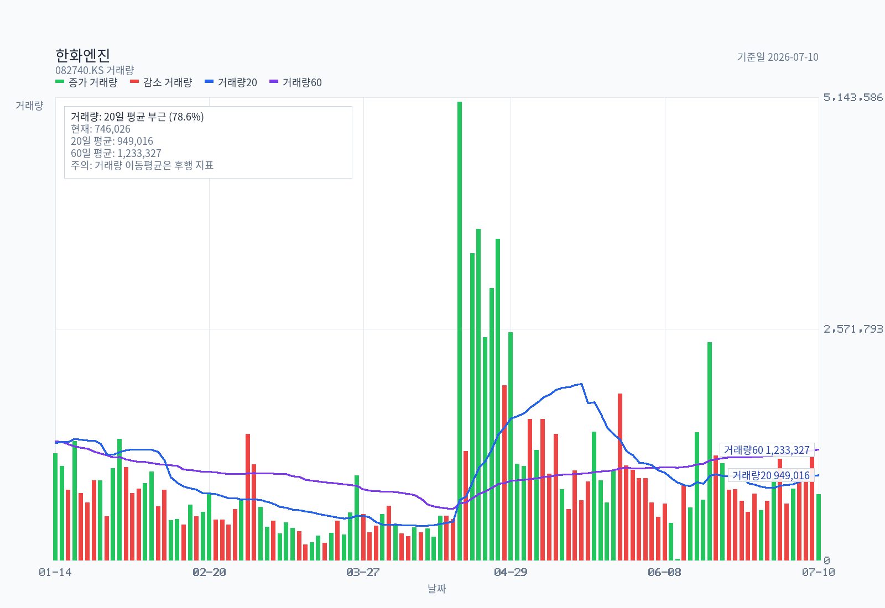
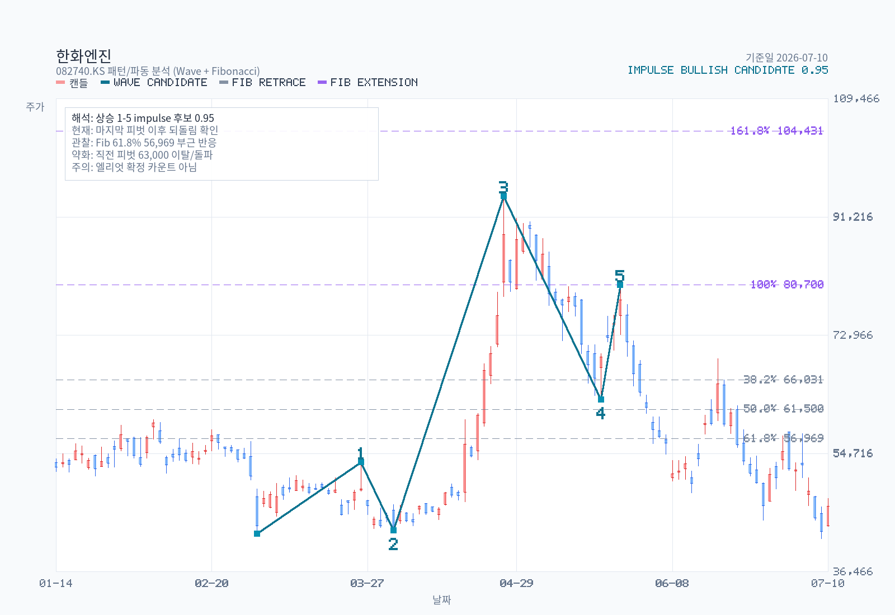

# Advanced Chart Analysis: 082740.KS

- Name: 한화엔진
- Latest date: 2026-07-10
- Latest close: 46600.00
- Moving-average structure: mixed
- Today's moving averages: MA5 47140.00, MA20 53007.50, MA60 63094.17, MA120 57016.67, MA200 52192.00
- Bollinger read: lower-half
- Ichimoku read: below-cloud
- RSI state: neutral
- MACD state: bearish / below-zero
- ADX state: weak-trend / bearish / flat
- Volume regime: normal
- Chart-only flow: bearish continuation

## Moving Averages on Latest Date

| Date | MA5 | MA20 | MA60 | MA120 | MA200 |
| --- | --- | --- | --- | --- | --- |
| 2026-07-10 | 47140.00 | 53007.50 | 63094.17 | 57016.67 | 52192.00 |

## Volume Moving Averages on Latest Date

| Date | Volume | VolMA20 | VolMA60 | Volume / VolMA20 |
| --- | --- | --- | --- | --- |
| 2026-07-10 | 746026 | 949016 | 1233327 | 78.6% |

## Chart Images

The main chart uses OHLC candlesticks with upper and lower wicks, plus MA5, MA20, MA60, MA120, MA200, and volume bars. The separate volume chart enlarges participation detail with volume bars plus VolMA20 / VolMA60 lines. The overlay chart separates Bollinger Bands, Ichimoku cloud lines, and RSI14, and reserves 26 forward slots for the projected cloud. The momentum chart focuses on MACD, signal, histogram, and ADX/DMI so crossovers, momentum acceleration, and trend strength are easier to see. The structure chart pairs candles with a horizontal volume-by-price gutter (POC highlighted) and ATR-tolerance clustered support/resistance zones drawn as horizontal price bands (up to 3 each, within ±30% of current price). The pattern chart adds recent swing-pivot wave candidates and Fibonacci retracement/extension levels; labels are drawn only for candidates with confidence >= 0.55, while all candidates are exported to a sibling `-waves.csv`. The full zone roster — including broken or distance-filtered zones — is exported to a sibling `-zones.csv`.

## Support / Resistance Zones (Structure Chart)

| Type | Zone | Center | Touches | Last Touch | Score | Status |
| --- | --- | --- | --- | --- | --- | --- |
| resistance | 48,600 ~ 51,600 | 50,467 | 34 | 2026-07-07 | 0.897 | active |
| resistance | 51,300 ~ 53,300 | 52,300 | 31 | 2026-07-06 | 0.860 | active |
| resistance | 58,000 ~ 59,900 | 58,767 | 17 | 2026-07-02 | 0.549 | active |
| support | 42,300 ~ 44,350 | 43,167 | 12 | 2026-07-10 | 0.413 | active |

Full zone roster (including broken / distance-filtered): `한화엔진-chart-structure-zones.csv`

## Pattern / Wave Candidates

Selected drawable candidate: impulse / bullish / confidence 0.947.

| Kind | Direction | Status | Confidence | Points |
| --- | --- | --- | --- | --- |
| impulse | bullish | drawable | 0.947 | start:2026-03-04@42,300 → 1:2026-03-26@53,300 → 2:2026-04-02@42,850 → 3:2026-04-27@94,400 → 4:2026-05-20@63,000 → 5:2026-05-26@80,700 |
| impulse | bearish | drawable | 0.943 | start:2026-04-27@94,400 → 1:2026-05-20@63,000 → 2:2026-05-26@80,700 → 3:2026-06-11@48,600 → 4:2026-06-17@69,300 → 5:2026-06-26@44,350 |
| corrective | bearish-correction | drawable | 0.913 | A:2026-06-11@48,600 → B:2026-06-17@69,300 → C:2026-06-26@44,350 |
| corrective | bullish-correction | drawable | 0.860 | A:2026-06-17@69,300 → B:2026-06-26@44,350 → C:2026-07-02@58,000 |
| impulse | bearish | drawable | 0.859 | start:2026-02-04@59,900 → 1:2026-02-06@51,600 → 2:2026-02-20@58,400 → 3:2026-03-04@42,300 → 4:2026-03-26@53,300 → 5:2026-04-02@42,850 |

Full wave roster: `한화엔진-chart-pattern-waves.csv`

## Indicators

| Metric | Value |
| --- | --- |
| MA 5 | 47140.00 |
| MA 20 | 53007.50 |
| MA 60 | 63094.17 |
| MA 120 | 57016.67 |
| MA 200 | 52192.00 |
| Bollinger Upper | 64366.17 |
| Bollinger Middle | 53007.50 |
| Bollinger Lower | 41648.83 |
| Bollinger Width | 42.86% |
| Tenkan | 49750.00 |
| Kijun | 55400.00 |
| Current Cloud A | 71875.00 |
| Current Cloud B | 68625.00 |
| Future Cloud A | 52575.00 |
| Future Cloud B | 67950.00 |
| RSI 14 | 37.02 |
| MACD | -3957.67 |
| Signal | -3549.40 |
| Histogram | -408.28 |
| MACD State | bearish / below-zero |
| Histogram State | contracting |
| ADX 14 | 14.26 |
| +DI | 21.00 |
| -DI | 28.45 |
| ADX State | weak-trend / bearish / flat |
| Avg Volume 20 | 949016 |
| Avg Volume 60 | 1233327 |
| Volume vs Avg 20 | 78.6% |
| 20D Breakout Level | 69300.00 |
| 20D Breakdown Level | 41500.00 |

## Read

- Trend structure: moving averages are mixed, so trend confirmation is still limited.
- Today's moving averages: MA5 47,140 / MA20 53,008 / MA60 63,094 / MA120 57,017 / MA200 52,192.
- Volatility: price is in the lower half of the Bollinger range, and band width is stable.
- Cloud read: price is below the current cloud, tenkan is below kijun, and the projected cloud is bearish.
- Momentum and participation: RSI14 is neutral at 37.02; MACD remains below signal, and MACD is below zero; histogram momentum is contracting; ADX still reads as a weak-trend environment, and trend strength is flat; volume is close to the 20-day average.
- Practical checklist: nearest support watch is 41,649; first recovery check is 49,750, then 53,008; 20-day breakout level sits at 69,300; 20-day breakdown level sits at 41,500; chart-only flow still reads as bearish continuation.
