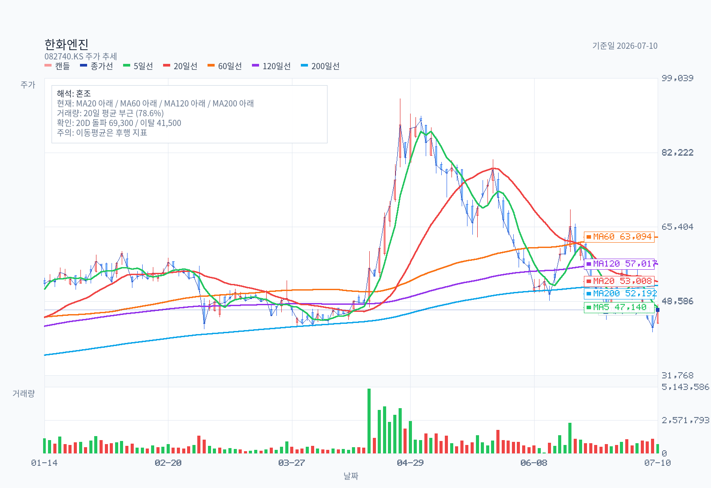
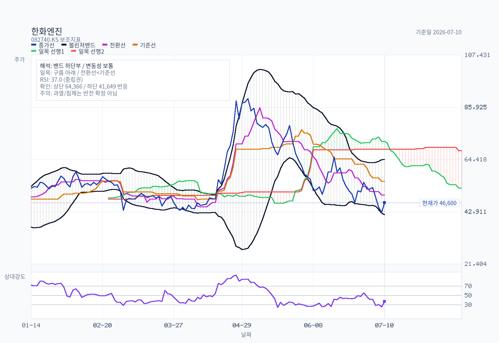
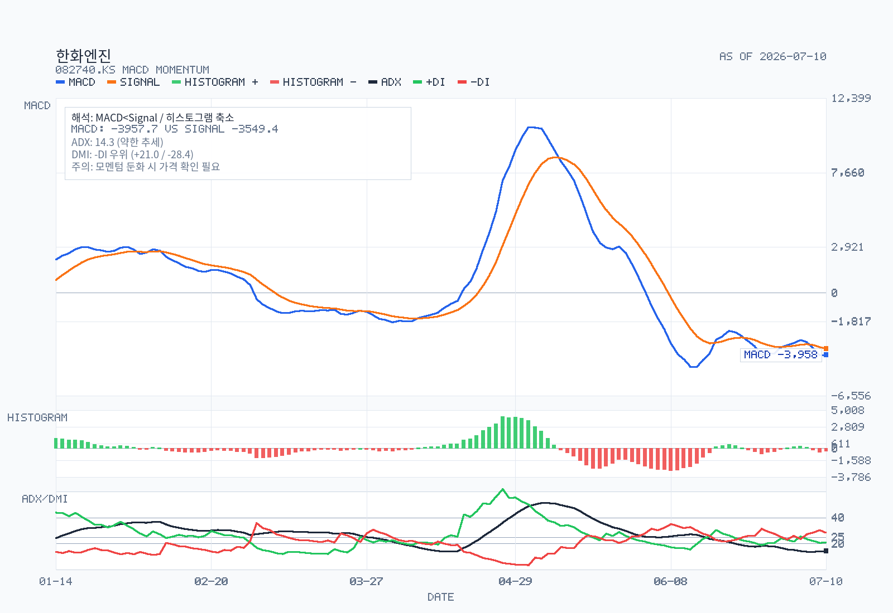
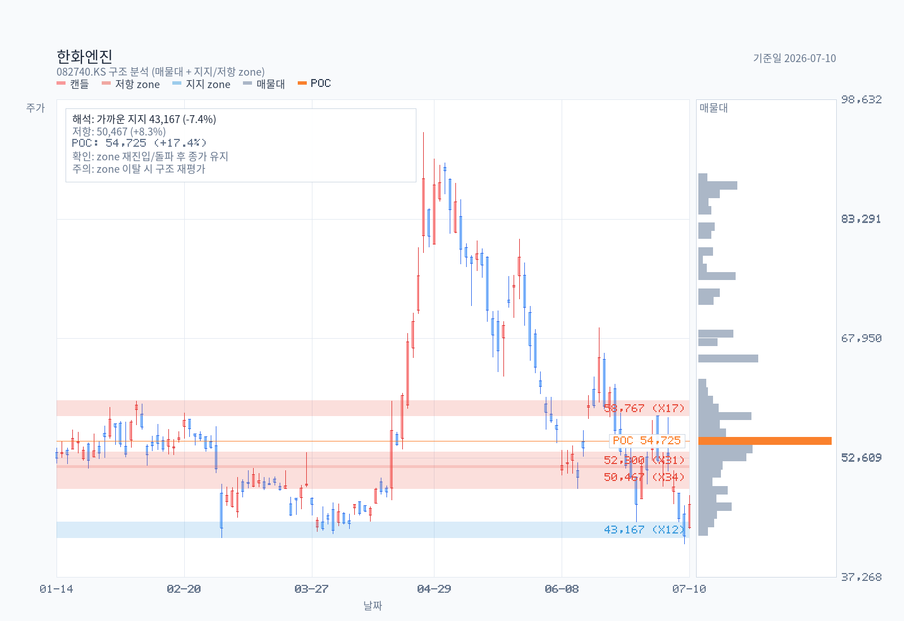

# 한화엔진(082740) 12–24개월 신규 매수 판단 메모

- 기준일: 2026-07-12
- 최근 업데이트일: 2026-07-12
- 가격 기준: 2026-07-10 KRX 종가 46,600원 (기준일 직전 거래일)
- 시장 / 대상: KOSPI 보통주 / 한화엔진
- 산출 모드: full decision memo

## Summary Judgment

핵심 질문은 — 대규모 수주잔고가 실제 이익과 현금흐름으로 이어지는가.

한화엔진은 **수주잔고와 1분기 수익성은 매력적이지만, 지금은 12–24개월 신규 매수를 서두르기보다 `실적 확인형 분할 접근`이 맞다**는 결론이다. 2026년 1분기 수주잔고 5.24조원과 영업이익률 14.9%는 강한 근거지만, 현 주가는 2025 실적 기준 PER 22.4배·PBR 7.0배 수준이며, 제품별 마진·AM 반복성·수주잔고의 연도별 매출화는 공시로 확인되지 않았다.

가격도 2026-07-10 기준 MA5·20·60·120·200 아래이고 Minervini 규칙은 실패다. 따라서 좋은 사업 사이클을 인정하되, 2Q26 이후 수익성·가동률·CAPEX 집행과 한화오션 집중도를 확인하면서 접근하는 것이 현재의 안전마진이다.

## Decision Frame

| 판단축 | 현재 판정 | 투자 판단을 바꾸는 확인 항목 |
| --- | --- | --- |
| 수주 가시성 | 긍정적 | 1Q26 수주잔고 5.24조원. 다만 납기별 매출화·마진은 미공시다. |
| 이익 질 | 개선 확인, 지속성 미확정 | 1Q26 OPM 14.9%가 2Q~하반기에도 유지되는지, 고사양 믹스인지 확인. |
| 고객/그룹 구조 | 기회와 리스크 공존 | 한화오션 매출 40.3%까지 상승. 거래조건·채권 회수·외부 고객 확대가 핵심이다. |
| 신사업·CAPEX | 옵션이나 즉시 실적 근거 없음 | ESS는 3/31 완료, SEAM은 4/1 클로징. PPA·순부채·수익기여를 다음 공시에서 검증. |
| 밸류에이션·수급 | 부담 / 기술적 보류 | 2025 PER 22.4배, PBR 7.0배; 추세 회복 및 이익 상향이 필요한 가격이다. |

## Business and Thesis

한화엔진은 대형 선박용 저속엔진 제작, 엔진 부품·서비스(AM), SCR, 디젤발전 사업을 하는 한화그룹 계열 운영회사다. 투자 논리의 중심은 고선가·친환경 선박 발주가 엔진 인도와 이익으로 전환되는 구간, 그리고 부족한 생산능력을 증설로 풀 수 있는지다.

확인된 강점은 엔진 수주잔고다. 2026년 1분기 말 공식 수주잔고는 5조 2,430억원으로 2025년 연결 매출의 3.02배다. 그러나 이것은 납기와 원가, 환율, 취소를 반영한 이익 가시성 지표가 아니라 단순 매출 대비 계산이다. 이 메모는 수주잔고 전부를 3년 매출이나 고마진으로 간주하지 않는다.

## Revenue Mix

| 축 | 공시 확인값 | 판단 |
| --- | --- | --- |
| 제품 | 2025 선박엔진·SCR 1조 2,126억원(88.4%), AM·디젤발전·임대 등 1,585억원(11.6%) | 핵심은 엔진 사이클. AM 단독 매출·마진·반복 비중은 not separately disclosed. |
| 친환경 제품 | DF 엔진은 일반 디젤보다 높은 가격대, 메탄올 조립시설 개조 증설 확인 | 가격 프리미엄은 확인되지만 로열티·원가·제품별 OPM은 미공개. |
| 지역 | 1Q26 직접수출+Local 수출 3,286억원(95.2%) | 환율·해외 조선 수요 노출이 크다. |
| 고객 | 2025 한화오션 36.8%, 삼성중공업 거제조선소 34.7%; 1Q26 한화오션 40.3% | 두 고객 비중이 높아 조선 호황의 수혜이자 집중 위험이다. |

## What The Latest Results Say

- 2025년 연결 매출 1조 3,711억원, 영업이익 1,301억원(9.5%), 순이익 1,738억원. 비교 공시의 2024 매출은 별도 기준이라 연결 YoY를 기계적으로 계산하지 않는다.
- 1Q26 연결 매출 3,452억원, 영업이익 514억원(14.9%), 순이익 529억원이다. 연간 OPM보다 높은 분기 마진은 긍정적이지만, 제품·계약별 이익은 미공개라 한 분기만으로 구조적 마진을 단정할 수 없다.
- 2025 영업현금흐름은 +3,303억원, 투자현금흐름은 -1,611억원, 기말 현금은 2,767억원이다. 1Q26 계약부채 6,658억원은 향후 매출의 선행 지표일 수 있으나 계약별 시점은 알 수 없다.
- 2025 가동률 100.7%, 진행 투자 415억원, 제28~30기 투자계획 3,504억원은 병목 해소 가능성을 보여준다. 반면 실제 CAPEX 집행·가동률·현금전환이 확인되기 전에는 ROIC 개선으로 읽지 않는다.

## DART Recheck

| 주장 | 상태 | 확인값 또는 판단 | 출처 | 비고 |
| --- | --- | --- | --- | --- |
| 조선 호황 수주가 매출을 지지 | confirmed | 1Q26 수주잔고 5.24조원 | 2026-05-14 분기보고서 | 납기별 매출·마진은 미공시 |
| DF·메탄올·SCR가 구조적으로 마진을 높임 | partially supported | DF 가격 프리미엄·메탄올 설비·SCR 수주 확인 | 2025 사업보고서 | 제품별 원가·로열티·마진 미공개 |
| AM이 반복 매출 방어막 | partially supported | 부품·서비스 및 예방정비 패키지 전략 확인 | 2025 사업보고서·1Q26 보고서 | AM 단독 매출/반복률 미공개 |
| 한화오션은 기회이자 집중 위험 | confirmed | 2025 매출처 36.8%, 1Q26 40.3%; 특수관계자 주석 매출 5,538억원 | 2025 사업보고서·1Q26 보고서 | 표별 정의 차이는 혼용 금지 |
| SEAM·ESS가 1Q26 실적을 이미 키웠다 | contradicted | ESS 완료 3/31, SEAM 클로징 4/1 | 1Q26 보고서 | 1Q 손익 기여를 주장할 근거 없음 |
| 증설이 현금흐름 훼손 없이 병목을 푼다 | needs follow-up | 가동률 100.7%, 3개년 투자계획 3,504억원 | 2025 사업보고서 | 실제 집행·수율·ROIC 미확인 |

## Street / Alternative Views

최근 한경 컨센서스 메타데이터에는 SK증권(2026-07-08, BUY/90,000원), IBK투자증권(2026-05-26, BUY/87,000원), 메리츠(2026-04-27, BUY/90,000원) 등이 보인다. 이는 시장이 엔진 수요와 수익성 지속을 긍정적으로 본다는 신호지만, **모든 PDF 원문과 랜딩 URL이 누락되어 가정·추정치·목표가 평균은 검증할 수 없다.** 따라서 목표가를 밸류에이션 앵커로 사용하지 않는다.

비트레이딩 반복 커버리지 요건을 충족한 네이버 블로그는 0건이다. 해외 IB는 날짜·증권사·의견·목표가를 함께 인용한 한국 언론 기사를 찾지 못했으며, 검색 래퍼 오류로 0건을 실제 검토했다. 이는 부재의 증명이 아니라 `unverified coverage gap`이다.

## Current Valuation Snapshot

| 항목 | 값 | 기준 / 해석 |
| --- | ---: | --- |
| 종가 / 시가총액 | 46,600원 / 3조 8,886억원 | 2026-07-10 시장정보 |
| Trailing PER | 22.38배 | 최근 결산 EPS 2,082원 기반 시장지표 |
| P/B | 6.99배 | 최근 결산 BPS 6,666원 기반 시장지표 |
| Forward PER | 약 20.2배 | 2026E EPS 2,306원 시장 컨센서스 화면을 이용한 단순 계산; 1차 자료 아님 |
| EV/EBITDA | not cleanly available | 동일 기준의 확인 가능한 최신 데이터 미확보 |
| FCF yield | not cleanly available | 계약부채·운전자본 영향이 큰 한 해 OCF만으로 제시하지 않음 |
| Peer: HD현대마린엔진 | 구조상 가장 가까운 비교대상 | 저속엔진·DF 노출은 유사하나 고객군·그룹 내 수요·생산능력·실적 인식이 달라 단일 멀티플 비교는 제한적 |

## Historical Valuation Bands

3~5년 동일 기준의 PER·PBR·EV/EBITDA 시계열을 이번 원천 세트에서 신뢰성 있게 조립하지 못했다. 서로 다른 기준일·별도/연결·추정치가 섞인 밴드를 만들면 오히려 잘못된 정밀도를 주므로 생략한다. 후속 업데이트에서는 FnGuide/WiseReport의 동일 기준 월말 데이터와 감사 연결 실적을 맞춘 뒤 밴드와 HD현대마린엔진 비교표를 추가한다.

## Chart and Positioning

### Rule Screen

- Minervini Trend Template: `fail`
- KRX 52주 신고가 리더십 점수: `48/100 (D)`
- 통합 KRX RS percentile: `88.9`

| 체크 | 상태 | 값 |
| --- | --- | --- |
| 현재가 > SMA50/150/200 | fail | 46,600원 / 63,349원 / 54,477원 / 52,192원 |
| SMA150 > SMA200 | pass | 54,477원 > 52,192원 |
| SMA50 > SMA150·SMA200 | pass | 63,349원 > 54,477원·52,192원 |
| 52주 저가 대비 130% 이상 | pass | 185.7% |
| 52주 고가의 75% 이상 | fail | 52.1% |
| RS percentile 70 이상 | pass | 88.9 |

최신 종가는 MA5/20/60/120/200(47,140/53,008/63,094/57,017/52,192) 아래다. RSI14는 37.0, MACD는 0선 아래이며 ADX 14.3으로 하락 추세 강도는 약하다. 거래량은 20일 평균의 78.6%다. 42,300~44,350원이 지지, 48,600~51,600원이 첫 저항이며 20일 이탈 확인선은 41,500원이다. 구조 차트 전체 zone은 [`한화엔진-chart-structure-zones.csv`](../assets/한화엔진-chart-structure-zones.csv)에 있다.

차트만의 결론은 **bearish continuation**이다. 사업 논리가 맞더라도 48,600~51,600원 회복·안착 전에는 추세 매수 신호로 보기 어렵다.

## Governance and Structure

- 최대주주는 한화임팩트로 2025-12-31 기준 32.77%를 보유한다. 한화오션은 계열 내 주요 고객이어서 그룹 시너지가 가능한 반면, 가격·물량·채권 조건이 소수 관계회사에 좌우될 수 있다.
- 2025 사업보고서의 이사회는 7명(사내 3명, 기타비상무 1명, 사외 3명)이다. CEO/이사회 의장 분리 여부와 개별 자본배분 정책은 이번 데이터 세트에서 별도 확정하지 않았으며 다음 정기 공시에서 재검증할 항목이다.
- 시장정보 기준 자사주는 21,607주(0.03%)로 희석/소각의 핵심 변수는 아니다. 배당·자사주 정책을 ‘주주환원 프리미엄’으로 부를 충분한 최신 근거도 확보하지 못했다.

## Catalysts

1. 2Q26 이후 OPM이 1Q의 14.9%에 근접해 유지되고 수주잔고가 질적으로 소진되는 경우.
2. 100%를 넘는 가동률 속 증설이 납기·생산량·현금전환의 개선으로 확인되는 경우.
3. 한화오션 외 고객 수주·매출 비중 확대 또는 계열거래 조건의 투명성 개선.
4. SEAM의 인수가격 배분, 순부채, 서비스망 및 AM 시너지의 정량 공개.
5. 친환경 DF·메탄올 엔진/SCR 믹스가 제품별 또는 계약군별 이익으로 확인되는 경우.

## Risks and Disconfirming Evidence

1. 조선 발주·신조선가 하락이나 중국 생산능력 확대가 신규 수주 가격과 마진을 압박할 수 있다.
2. 매출의 상당 비중이 한화오션·삼성중공업 거제조선소에 집중돼 고객의 조업·발주 변화가 크게 전이된다.
3. 환위험은 자연헤지 후 통화선도·스왑으로 관리하지만, 1Q26 통화선도 매도 USD 17.64억의 명목액과 파생평가 총액은 환율 급변 시 변동성을 키울 수 있다.
4. 향후 CAPEX 3,504억원이 수요 피크 이후 집행되면 현금흐름·ROIC에 부담이 될 수 있다.
5. 하자보수충당부채 116.6억원, 피고 소송 4건 171억원 및 선수금환급/계약이행 관련 보증은 규모·결과를 계속 점검해야 한다.

## Uncomfortable Questions

1. 5.24조원 수주잔고 중 어느 연도에 얼마가 매출화되고, 그 구간의 원가·환율·로열티는 이미 잠겼는가?
2. DF·메탄올·SCR의 가격 프리미엄은 실제 제품별 공헌이익으로 남는가, 아니면 라이선스·원자재·증설비로 상쇄되는가?
3. AM은 정말 사이클을 완충할 반복 매출인가, 아니면 엔진 인도량에 뒤따르는 변동성 큰 부품 매출인가?
4. 한화오션 비중 상승은 그룹 시너지의 결과인가, 외부 고객 다변화가 약해지는 신호인가?
5. 100% 가동률에서의 3,504억원 투자와 SEAM 인수는 부족한 공급을 해결하는 고ROIC 성장인가, 사이클 후반의 자본집약적 확장인가?

## Decision-Changing Issues

| 순위 | 이슈 | 매수 판단이 강해지는 조건 / 약해지는 조건 |
| ---: | --- | --- |
| 1 | 2Q~하반기 이익률 | OPM 10%대 중반 유지 및 원인 설명이면 강화; 단발성 믹스·환율이면 약화 |
| 2 | 수주잔고의 매출화 | 납기·취소·가격 조건이 공개돼 2027~28 가시성이 높아지면 강화 |
| 3 | 고객 집중 | 외부 고객 확장/조건 투명화면 강화; 한화오션 비중·채권만 상승하면 약화 |
| 4 | CAPEX·SEAM 현금전환 | 생산능력·AM 수익과 ROIC가 확인되면 강화; 순부채·현금유출이 커지면 약화 |
| 5 | 밸류에이션·기술 추세 | 이익 상향과 51,600원 회복이 동반되면 진입 위험 완화; 실적 하향과 41,500원 이탈이면 보류 |

## Structured Stance

현재 스탠스는 **`관찰 우선 / 조건부 분할매수`**다. 수주잔고·1Q 수익성·친환경 엔진과 서비스 옵션은 12–24개월의 상승 논리를 만들 수 있다. 그러나 현 멀티플에는 상당한 기대가 반영돼 있고, 가장 중요한 마진·AM·백로그의 질이 공시로 분해되지 않았다.

신규 매수의 조건은 (1) 다음 두 분기에서 높은 마진이 재현되고, (2) CAPEX와 SEAM이 현금흐름을 훼손하지 않으며, (3) 한화오션 집중이 더 심화되지 않는다는 확인이다. 반대로 수주 가격·수요 둔화로 마진이 빠르게 2025 수준 이하로 정상화되거나, 41,500원 이탈과 실적 추정 하향이 동시에 일어나면 매수 논리는 무효화된다.

## Follow-up Research Prompts

1. 다음 분기보고서에서 수주잔고의 납기·통화·취소 조건을 추출한다. — 매출과 이익의 시간 배분을 결정한다.
2. DF·메탄올·SCR 계약의 가격·라이선스·원가를 IR 질의 또는 주석으로 검증한다. — 구조적 OPM 주장 검증에 필요하다.
3. AM의 부품·서비스 매출, 반복 계약 수, 서비스망별 매출을 요청한다. — 방어적 사업이라는 가정의 핵심이다.
4. 한화오션과 삼성중공업의 매출·채권·수주 비중을 분기별로 표준화한다. — 고객 집중과 그룹거래 리스크를 구분한다.
5. 신설 엔진 생산설비의 2026년 9월 계획 진척, 실제 CAPEX, 생산능력·가동률을 확인한다. — 병목 해소와 ROIC를 판단한다.
6. SEAM의 인수가격 배분·순부채·연결 손익과 ESS 영업양수 후 수주를 확인한다. — 신사업 옵션의 실제 비용과 시너지를 판단한다.
7. HD현대마린엔진과 동일 기준의 월말 PER/PBR/EV/EBITDA·수주·가동률을 모아 피어 밴드를 만든다. — 현재 프리미엄/할인의 정당성을 평가한다.

## Update Log

### 2026-07-12

- 신규 메모 작성. 2025 사업보고서와 2026년 1분기 분기보고서를 DART 재검증했고, 2년 OHLCV·룰 스크린·국내 리포트 메타데이터·네이버 블로그·외국계 IB 조사 결과를 반영했다.
- 외부 견해의 PDF 원문, 비트레이딩 블로거, 검증 가능한 해외 IB 보도는 확보하지 못한 공백을 결론의 제한 조건으로 반영했다.

## Sources

- [DART 2025 사업보고서](https://dart.fss.or.kr/dsaf001/main.do?rcpNo=20260318000939), 2026-03-18.
- [DART 2026년 1분기 분기보고서](https://dart.fss.or.kr/dsaf001/main.do?rcpNo=20260514001038), 2026-05-14.
- [WiseReport 기업모니터](https://comp.wisereport.co.kr/company/c1010001.aspx?cmp_cd=082740&cn=), 시장지표 2026-07-10 확인.
- [한화엔진 DART 분석](dart-analysis.md), [Data Pack](data-pack.md), [차트 분석](chart-analysis.md), [룰 스크린](trend-rules.md).
- [국내 리포트 메타데이터](analyst-report-insight.md), [Naver 조사](naver-insights.md), [외국계 IB 조사](foreign-views.md).
