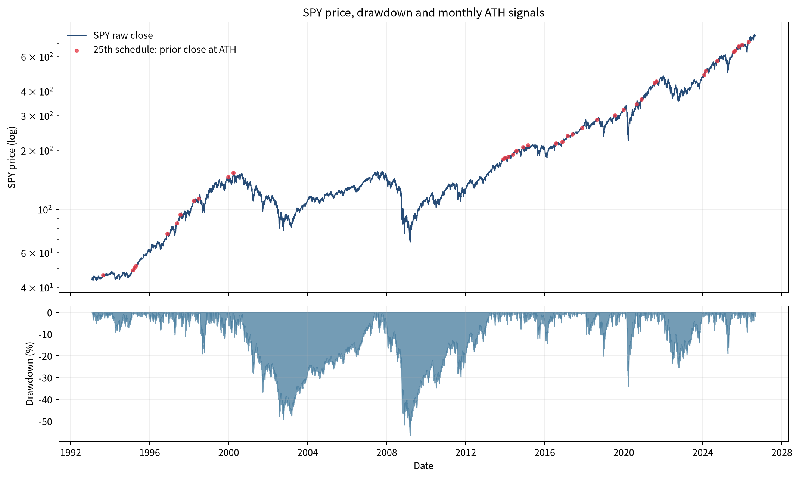
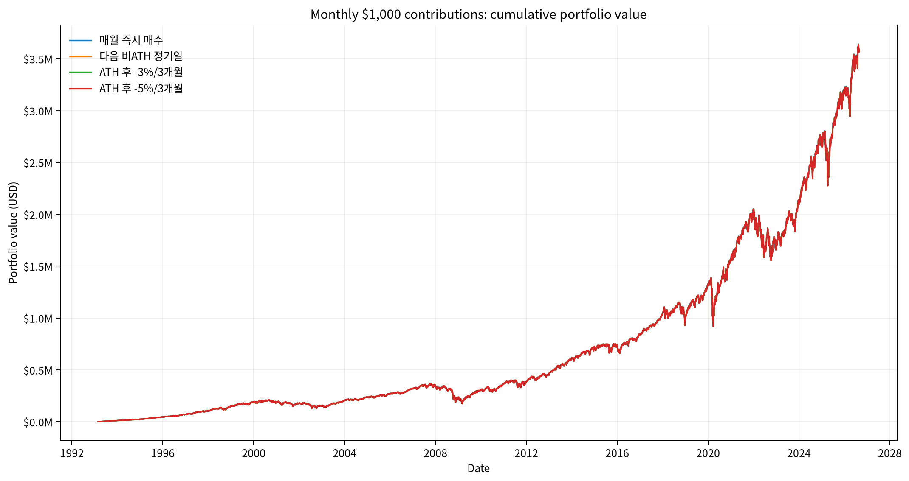
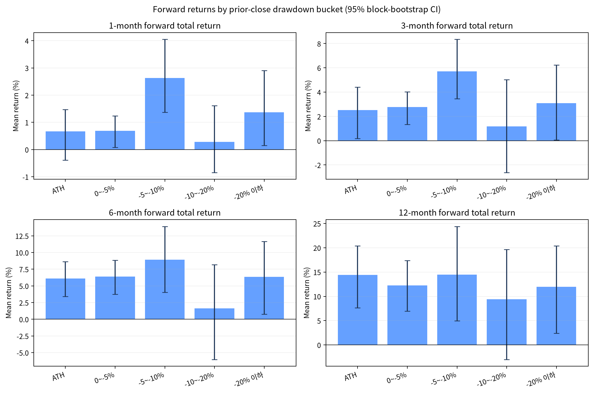
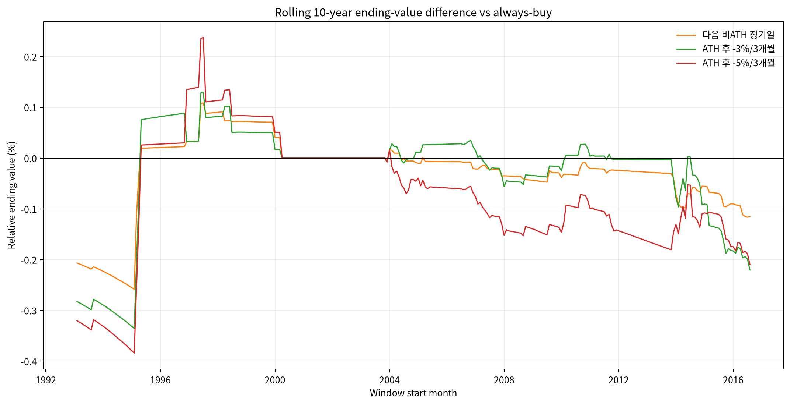
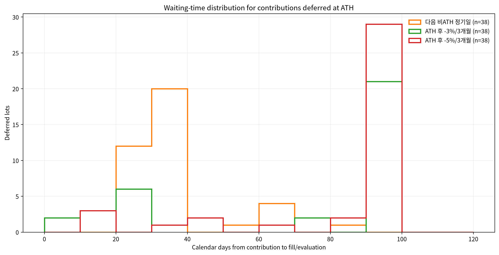

# SPY 사상최고가(ATH) 정기매수 백테스트

- 기준일: 2026-08-25
- 작성일: 2026-08-26
- 대상: SPY (NYSE Arca), USD 기준, 세전
- 분석기간: 1993-01-29 ~ 2026-08-25

## 결론

월 1,000달러를 25일 규칙으로 납입한 기본 시나리오에서 **항상 즉시 매수**의 최종자산은 $3,586,007, XIRR은 10.86%였다. ATH 회피 전략 중 최종자산이 가장 큰 다음 비ATH 정기일도 항상 매수 대비 -$4,543 (-0.13%)였다.

정기매수 신호 403건 중 ATH는 38건(9.4%)이었다. ATH 신호의 12개월 후 평균 총수익률은 14.39%, 중앙값은 16.86%, 승률은 85.7%였다. 따라서 ‘ATH에서 산 돈의 이후 수익률’과 ‘ATH를 피하며 현금으로 기다리는 실행 전략’은 별개이며, 실제 의사결정에는 후자의 현금 대기까지 포함한 결과를 우선해야 한다.

3개월 국채 현금수익과 편도 5bp 비용을 함께 적용해도 세 이연 전략은 항상 매수보다 0.09%~0.15% 낮았다. 283개 10년 롤링 창에서도 이연 전략의 항상 매수 초과 승률은 최고 39.6%에 그쳤다. 관찰된 장기 격차 자체는 작지만, ATH 회피에 일관된 우위가 있다는 증거는 없었다.

이 결과는 특정 투자자에게 맞춘 매매 권유가 아니라 과거 자료를 사용한 역사적 시뮬레이션이다.

## 기본 백테스트 결과

기본값은 현금수익률 0%, 거래비용 0%, 월 납입액 1,000달러다. 모든 전략은 같은 납입일과 납입액을 사용하며, 평가일까지 미체결인 돈은 현금으로 포함했다.

| 전략 | 최종자산 | 항상 매수 대비 | XIRR | 총수익 단위 | 평균/최대 대기 | 평균 현금비중 | MDD |
|---|---:|---:|---:|---:|---:|---:|---:|
| 매월 즉시 매수 | $3,586,007 | +$0 (0.00%) | 10.86% | 4,682.02 | 0.0/0일 | 0.00% | -55.20% |
| 다음 비ATH 정기일 | $3,581,464 | -$4,543 (-0.13%) | 10.85% | 4,676.09 | 3.4/87일 | 0.11% | -55.20% |
| ATH 후 -3%/3개월 | $3,580,018 | -$5,989 (-0.17%) | 10.85% | 4,674.20 | 6.2/96일 | 0.20% | -55.20% |
| ATH 후 -5%/3개월 | $3,578,516 | -$7,491 (-0.21%) | 10.85% | 4,672.24 | 7.7/96일 | 0.22% | -55.20% |

`총수익 단위`는 Yahoo 수정계수로 정규화한 단위이며 실제 증권계좌의 주식 수와 동일하지 않다. JSON에는 최종 시점 SPY 환산주식 수도 별도로 기록했다. MDD는 외부 납입을 제거한 일별 단위가치 기준이다.

## ATH와 낙폭 구간별 이후 수익률

상태는 25일 실행일 직전 완료 종가로 분류했다. 수익률은 신호일 수정종가에서 목표 달력월 이후 첫 거래일 수정종가까지의 배당 재투자 총수익률 프록시다. 괄호는 12개 월별 관측치 블록을 사용한 원형 이동블록 부트스트랩 평균의 95% 신뢰구간이다.

| 구간 | 1개월 평균 [95% CI] / 중앙값 / 승률 / N | 3개월 | 6개월 | 12개월 |
|---|---|---|---|---|
| ATH | 0.66% [-0.39%, 1.47%] / 1.03% / 68.4% / 38 | 2.52% [0.18%, 4.41%] / 3.82% / 78.9% / 38 | 6.11% [3.42%, 8.64%] / 6.35% / 81.1% / 37 | 14.39% [7.62%, 20.38%] / 16.86% / 85.7% / 35 |
| 0~-5% | 0.69% [0.07%, 1.24%] / 1.32% / 64.6% / 164 | 2.78% [1.34%, 4.02%] / 3.67% / 75.9% / 162 | 6.40% [3.76%, 8.85%] / 7.68% / 77.6% / 161 | 12.24% [6.96%, 17.35%] / 14.95% / 82.2% / 157 |
| -5~-10% | 2.63% [1.37%, 4.05%] / 2.63% / 73.9% / 46 | 5.72% [3.46%, 8.34%] / 5.75% / 84.8% / 46 | 8.92% [4.02%, 13.92%] / 10.63% / 82.2% / 45 | 14.46% [4.99%, 24.40%] / 18.94% / 73.3% / 45 |
| -10~-20% | 0.28% [-0.84%, 1.61%] / 1.21% / 60.6% / 66 | 1.19% [-2.62%, 5.02%] / 3.14% / 60.6% / 66 | 1.63% [-6.02%, 8.17%] / 3.21% / 63.6% / 66 | 9.40% [-2.98%, 19.65%] / 14.00% / 77.3% / 66 |
| -20% 이하 | 1.37% [0.15%, 2.91%] / 2.09% / 64.8% / 88 | 3.10% [0.07%, 6.24%] / 4.42% / 65.9% / 88 | 6.37% [0.74%, 11.66%] / 6.94% / 73.9% / 88 | 11.99% [2.38%, 20.41%] / 12.03% / 83.0% / 88 |

## 민감도 분석

현금수익률 민감도는 FRED DGS3MO 일별 3개월 미 국채 고정만기 수익률을 직전 관측치로 보간해 Actual/365로 복리 적용했다. 5bp는 매수 체결금액에 부과한 편도 비용이며 평가 시 가상 매도비용은 차감하지 않았다.

| 시나리오 | 전략 | 최종자산 | 항상 매수 대비 | XIRR |
|---|---|---:|---:|---:|
| 현금 0% · 비용 0bp | 매월 즉시 매수 | $3,586,007 | +$0 (0.00%) | 10.86% |
| 현금 0% · 비용 0bp | 다음 비ATH 정기일 | $3,581,464 | -$4,543 (-0.13%) | 10.85% |
| 현금 0% · 비용 0bp | ATH 후 -3%/3개월 | $3,580,018 | -$5,989 (-0.17%) | 10.85% |
| 현금 0% · 비용 0bp | ATH 후 -5%/3개월 | $3,578,516 | -$7,491 (-0.21%) | 10.85% |
| DGS3MO 현금 · 비용 0bp | 매월 즉시 매수 | $3,586,007 | +$0 (0.00%) | 10.86% |
| DGS3MO 현금 · 비용 0bp | 다음 비ATH 정기일 | $3,582,663 | -$3,344 (-0.09%) | 10.86% |
| DGS3MO 현금 · 비용 0bp | ATH 후 -3%/3개월 | $3,581,958 | -$4,049 (-0.11%) | 10.86% |
| DGS3MO 현금 · 비용 0bp | ATH 후 -5%/3개월 | $3,580,785 | -$5,222 (-0.15%) | 10.85% |
| 현금 0% · 비용 5bp | 매월 즉시 매수 | $3,584,214 | +$0 (0.00%) | 10.86% |
| 현금 0% · 비용 5bp | 다음 비ATH 정기일 | $3,579,673 | -$4,541 (-0.13%) | 10.85% |
| 현금 0% · 비용 5bp | ATH 후 -3%/3개월 | $3,578,228 | -$5,986 (-0.17%) | 10.85% |
| 현금 0% · 비용 5bp | ATH 후 -5%/3개월 | $3,576,727 | -$7,487 (-0.21%) | 10.85% |
| DGS3MO 현금 · 비용 5bp | 매월 즉시 매수 | $3,584,214 | +$0 (0.00%) | 10.86% |
| DGS3MO 현금 · 비용 5bp | 다음 비ATH 정기일 | $3,580,872 | -$3,342 (-0.09%) | 10.85% |
| DGS3MO 현금 · 비용 5bp | ATH 후 -3%/3개월 | $3,580,167 | -$4,047 (-0.11%) | 10.85% |
| DGS3MO 현금 · 비용 5bp | ATH 후 -5%/3개월 | $3,578,994 | -$5,220 (-0.15%) | 10.85% |

## 매수일·시작시점 강건성

달력일 비교는 모든 날짜가 동일한 1993-02~2026-07 납입월을 갖도록 맞추고 2026-08-25에 평가했다. 최종자산 자체와 같은 날짜의 항상 매수 대비 상대성과를 함께 표시했다.

| 전략 | 최종자산 중앙값 | 최종자산 최저~최고 | 같은 날 항상 매수 대비 중앙값 [범위] | 최선/최악 달력일 |
|---|---:|---:|---:|---:|
| 매월 즉시 매수 | $3,591,586 | $3,580,351 ~ $3,608,606 | 기준 | 1일 / 27일 |
| 다음 비ATH 정기일 | $3,586,585 | $3,578,146 ~ $3,605,111 | -0.07% [-0.28%, 0.10%] | 1일 / 28일 |
| ATH 후 -3%/3개월 | $3,584,328 | $3,572,429 ~ $3,599,657 | -0.18% [-0.42%, -0.07%] | 1일 / 17일 |
| ATH 후 -5%/3개월 | $3,582,092 | $3,571,882 ~ $3,600,600 | -0.22% [-0.43%, -0.07%] | 1일 / 17일 |

10년 롤링은 매월 시작해 120회 납입한 창을 사용했다. ATH 여부의 역사적 고점은 각 창에서 재설정하지 않고 SPY 상장 이후 누적 고점을 사용했다.

| 전략 | 10년 창 수 | 항상 매수 초과 승률 | 상대성과 중앙값 | 최저~최고 |
|---|---:|---:|---:|---:|
| 매월 즉시 매수 | 283 | 기준 | 0.00% | 0.00% ~ 0.00% |
| 다음 비ATH 정기일 | 283 | 23.0% | -0.01% | -0.26% ~ 0.11% |
| ATH 후 -3%/3개월 | 283 | 39.6% | 0.00% | -0.34% ~ 0.13% |
| ATH 후 -5%/3개월 | 283 | 21.2% | -0.07% | -0.38% ~ 0.24% |

## 실행 규칙

- SPY는 State Street가 S&P 500 지수의 가격·수익률 성과를 비용 전 대체로 추종하도록 설계한 ETF다. 공식 상장일은 1993-01-22지만 Yahoo의 첫 완료 일봉인 1993-01-29부터 가격 이력을 사용하며, 첫 납입은 1993-02-25다.
- 매월 달력 25일 당일 거래가 없으면 다음 거래일로 이월한다. 그 실행일 직전 완료 거래일의 배당 미조정 종가가 그때까지의 최고 종가 이상이면 ATH다.
- 모든 정기 납입은 직전 완료 종가로 신호를 판단하고 다음 거래 가능한 시가에 체결한다. 시가는 해당 일자의 `수정종가/종가` 비율로 정규화해 배당 재투자 총수익률 프록시 단위를 산다.
- 다음 비ATH 전략은 ATH 신호 납입금을 현금으로 두고 이후 비ATH인 정기매수일 시가에 누적 매수한다.
- -3%/-5% 전략은 각 ATH 납입 로트의 당시 역사적 최고 종가를 앵커로 고정한다. 이후 완료 종가가 임계값에 도달하면 다음 거래일 시가에 사고, 도달하지 않으면 납입일 3개월 후 첫 완료 종가를 확인한 다음 거래일 시가에 강제 매수한다.
- 소수점 단위 매수를 허용했다. 세금, 환율, 한국 세제, 매도비용, 슬리피지와 시장충격은 제외했으며 USD 세전 결과만 결론에 사용했다.

## 검증

태스크 로컬 단위 테스트로 (1) 25일 휴장 이월, (2) ATH 판정, (3) 수정가격 배당 재투자, (4) 3개월 강제매수의 다음 거래일 체결, (5) 누적 현금의 중복·누락, (6) 모든 전략의 동일 납입 흐름을 검증했다. 결과 JSON의 `validation`에 실행 명령과 통과 수를 기록했다.

## 한계

- Yahoo 수정주가는 투자 가능한 총수익 프록시지만 기관급 공식 S&P 500 총수익지수 원장이 아니다. 데이터 제공자의 과거 수정계수 변경 가능성도 있다.
- SPY는 1993년 이전 S&P 500 역사를 포함하지 않으므로 더 긴 세대·금리 국면을 대표하지 않는다.
- ATH 상태별 표본은 독립·동일분포가 아니다. 블록 부트스트랩은 월별 군집을 일부 보완하지만 인과관계를 증명하지 않는다.
- 3개월 국채 민감도는 직접 국채 또는 ETF의 실제 가격·스프레드·세금을 복제하지 않는 단순 현금수익 가정이다.
- 달력일 28개와 다수 롤링 창은 사전 정의한 강건성 점검이며, 가장 좋은 날짜나 창만 골라 미래 수익을 예측해서는 안 된다.

## 데이터 출처

- [State Street SPY 공식 페이지](https://www.ssga.com/us/en/individual/etfs/state-street-spdr-sp-500-etf-trust-spy) — 펀드 목적과 상장일 확인.
- [Yahoo Finance SPY chart API](https://query2.finance.yahoo.com/v8/finance/chart/SPY?period1=725846400&period2=1787788800&interval=1d&events=div%2Csplits%2CcapitalGains&includeAdjustedClose=true) — 일별 미수정 OHLC와 수정종가. 조회 UTC 2026-08-26T14:32:23.220605+00:00, SHA-256 `becbd38d2c3b776b5ff9a281b537b5675cbe44afdb464aa2e07b3a2156214926`.
- [FRED DGS3MO](https://fred.stlouisfed.org/graph/fredgraph.csv?id=DGS3MO) — 3개월 미 국채 고정만기 수익률 민감도. 조회 UTC 2026-08-26T14:32:24.037790+00:00, SHA-256 `df4f08ee113e216ffc8217368877c7237f02b32224e49807cb5d669c874953e3`.

상세 월별 현금흐름, 신호·체결일, 로트별 원장, 전체 지표, 1~28일 결과와 모든 10년 롤링 창은 [memo.json](memo.json)에 있다.
